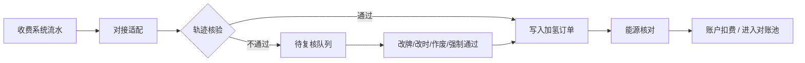

# 结果论证 · 加氢站收费系统对接 + 轨迹核验入库

> 场景锚点：佛山南海羚牛加氢站（自营/在管）拟从收费系统拉数入 OneOS。  
> 材料来源：能源侧沟通纪要（未对接站拍照识别 vs 已对接自动采集；收费系统车牌手输风险）。  
> 知识库置信度：architecture（能源条线 / 业财门禁）；轨迹核验细则标 **待拍板**。  
> 日期：2026-07-30

---

## 1. 一句话结论

**收费系统对接可以做，但不能「对接即入库」；必须以「订单时间 + 车牌 × 车辆 GPS 轨迹」做入库前门禁，核验通过才进加氢订单池，失败进人工复核，再复用现有修改确认 / 核对 / 对账链路。**

---

## 2. 要解决的问题（靶子）

| 问题 | 说明 |
|------|------|
| 效率 | 自营站已有收费系统，继续纯拍照/手工台账重复劳动 |
| 质量 | 收费系统车牌多为人工录入，错牌风险高，直接入库会污染加氢订单与后续氢费 |
| 闭环 | 数据最终仍须进入同一「加氢订单」列表，才能走能源核对、账户扣费、站端对账付款 |

---

## 3. 现行三条采集路径（对齐后）

与知识库「签约站上报/PLC · 非签约补录」不冲突：沟通里的「对接」指**系统自动采集能力**，不是法律签约标签。

```text
路径 A · 未系统对接站
  OneOS 站账号 → H5 加氢订单页
  → 拍车牌 + 设备面板 → 识别生成记录
  → 仍须每日上传手工台账（稽核：先台账，有差再对照片）

路径 B · 已自动对接站（PLC / 既有直连）
  → 自动采集 → 同一加氢订单列表

路径 C · 拟议（羚牛站）：收费系统对接 + 轨迹核验（本论证）
  → 拉收费流水 → 轨迹核验门禁 → 通过则入库 / 失败则待复核
  → 同一加氢订单列表 → 既有修改确认与核对/对账
```

**结果主张**：羚牛站走路径 C，**汇合点仍是「加氢订单列表」**，不另开一套平行台账。

---

## 4. 为何必须加「轨迹核验」（核心论证）

| 论点 | 论证 |
|------|------|
| 源数据不可信 | 收费系统车牌手输 → 错牌是结构性风险，不是偶发脏数据 |
| 对接 alone 不够 | 自动入库只会把错牌批量放大到订单池、氢费明细、扣费与对账 |
| 轨迹是客观旁证 | 「订单时间 + 车牌」与车机/平台 GPS 轨迹交叉：该时该车是否在站附近 → 可拦大部分错牌 |
| 对齐业财门禁 | 业财基准：**仅已核对的加氢/氢费明细才可扣账户**；入库前核验 = 把脏数据挡在「可核对」之前，避免假性可扣费 |
| 用词纪律 | V2 现行：**核对 ≠ 对账**。轨迹核验属**入库/核对前置质检**，不是站端/客户「对账结清」 |

---

## 5. 目标闭环（起点 → 运作 → 结果）



| 阶段 | 做什么 | 算不算办完 |
|------|--------|------------|
| 对接 | 拉流水、字段映射、幂等去重 | 只解决「有数」 |
| 轨迹核验 | 时间窗 + 车牌 ↔ GPS | 只解决「数是否像真加氢」 |
| 入库 | 写入加氢订单（与 A/B 同源列表） | 进入可核对状态 |
| 复核确认 | 失败单修改并确认（可挂审批） | 例外闭环 |
| 核对 / 对账 | 复用现网能源规则 | 扣费与资金闭环 |

**「结果」定义（可验收）**：收费流水进入 OneOS 后，**错牌可被轨迹拦住或进入待复核；通过单与现有订单同池；扣费仍须过「已核对」门禁；不对未核验/未核对流水假性结清。**

---

## 6. 对沟通中两个问题的直接答复

### Q1：后续「修改确认与审批」能否接入现有系统逻辑？

**能，且应该接，不要另起炉灶。**

| 现有能力 | 建议挂载 |
|----------|----------|
| 加氢订单修改 / 人工纠错 | 轨迹核验失败 → 待复核单的改牌、改时间、作废 |
| 能源「核对」 | 仅核验通过（或复核强制通过并留痕）的订单可进入核对 |
| 站端对账 → 采购付款审批 | 仍走加氢站对账单 → 审批 → 付款明细关联；**不因对接方式改变资金闭环** |

审批若现网已有「订单更正 / 例外放行」类流程，直接复用；没有则做轻量「复核确认」状态机，**审批对象是例外放行，不是每一笔对接流水**。

### Q2：「对接 + 轨迹核验 + 入库」能否再拆？

**必须拆，建议三期/三包，可并行设计、分批上线。**

| 包 | 范围 | 独立验收 |
|----|------|----------|
| P1 对接适配 | 收费系统拉数、字段、幂等、失败重试、站维度开关 | 流水进「待核验」池即可 |
| P2 轨迹核验 | 时间窗/半径规则、通过/失败、失败原因码 | 可统计拦截率；失败不入库 |
| P3 入库与复核 | 通过写入订单；失败待复核；强制通过留痕；进既有核对 | 与路径 A/B 订单同列表可筛 |

拆包好处：收费系统接口与车机轨迹可用性可解耦；规则未拍板时不堵对接联调。

---

## 7. 明确不做 / 边界

- **不做**：对接成功即视为已核对、已对账、可扣费  
- **不做**：另建一套「收费系统台账」替代加氢订单  
- **不做**：用轨迹核验替代站端/客户对账与付款审批  
- **不默认取消**：未对接站的拍照识别 + 日手工台账（路径 A 仍保留，直至站切到 B/C）  
- **车牌展示**：系统内一律 `浙A88888F` 形态，禁止中间间隔点  

---

## 8. 待拍板（未定前不写死实现）

1. 轨迹匹配：**时间窗**（如订单前后 ±N 分钟）与**地理半径**（站围栏或固定米数）  
2. 无 GPS / 弱定位：拦截、挂起，还是降级人工？  
3. 「强制通过」权限：能源？站长？是否必须审批？  
4. 羚牛站在主数据里标「签约站 + 收费对接」还是独立「对接方式」枚举  
5. 与现有稽核（先台账后照片）的关系：C 路径上线后，该站是否仍要日手工台账  

---

## 9. 给排期 / 研发的边界建议（分身落需求用）

**做什么**

1. 站维度开启「收费系统对接」  
2. 入库前轨迹核验门禁 + 待复核  
3. 通过单写入既有加氢订单列表，核对/扣费/对账复用  

**不做什么**

1. 不绕过「已核对才扣费」  
2. 不把核验叫成对账  
3. 不一期绑死未拍板的半径/时间窗（先配置化 + 默认草案）  

---

## 10. 引用（大脑）

| 卡 | 路径 | 置信度 |
|----|------|--------|
| 能源条线 | `lines/energy.md` | architecture |
| 加氢订单 H5 | `modules/oneos-h5-h2-order.md` | architecture |
| 车辆氢费明细 | `modules/vehicle-h2-fee-ledger.md` | architecture |
| 加氢站管理 | `modules/oneos-web-h2-station-site.md` | architecture |
| 业财门禁 | `foundations/biz-finance-integration.md` | architecture |
| 用词裁决 | `00-source-corpus.md` / README：氢费核对 ≠ 对账 | confirmed（口径） |
