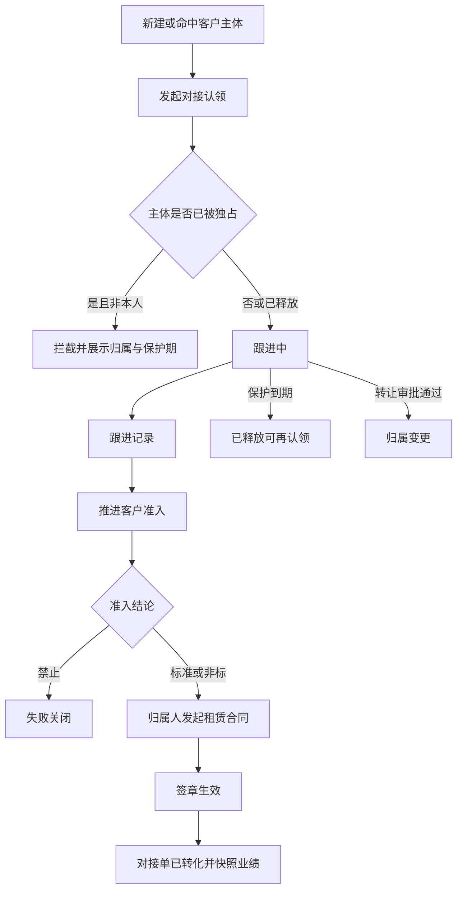

# 客户对接过程管理 · 产品需求说明（全模块）

## 1. 一句话与目标

**一句话**  
在租赁合同创建前，用「客户对接单」锁定业务员对客户主体的对接归属与跟进过程，杜绝多人对同一客户抢单导致的业绩与对接纠纷。

**要解决的问题**  
- 现网客户管理只管档案与准入，合同只校验准入，不校验「谁有权对接」  
- 多业务员同时对接同一客户，产生业绩争议与客户体验混乱  

**本期目标**  
1. 按客户主体认领独占对接，撞单可拦截并可追溯  
2. 跟进过程可记录；可推进客户准入；仅有效归属人可发起租赁合同  
3. 保护期到期释放、转让审批、合同生效锁定业绩归属  

**非目标（本期不做）**  
- 通用营销自动化、公海积分、复杂线索池  
- 改动 E 签宝、提车付清、账单宽限等业财资金门禁  
- 把跟进记录当作收付款凭证  

**视图决策**  
主任务：认领/跟进/释放/建合同门禁。  
**仅列表 + 详情全页。** 看板不做（状态是保护进度非可拖拽业务阶段）。主从不做（转让审批与跟进时间线适合详情全页，主从右栏易半成品）。

## 2. 模块边界（最重要）

| 业务线 / 子域 | 做什么 | 不做什么 |
|---------------|--------|----------|
| 对接认领 | 按主体独占、撞单拦截、保护期 | 不按车型拆多主对接人（一期） |
| 跟进过程 | 拜访/报价/意向记录 | 不替代客户主数据维护 |
| 准入衔接 | 催办/发起准入；读准入结论 | 不做法务/财务/安全三维评分本身 |
| 合同门禁 | 建合同校验归属人 | 不改合同签章与履约规则 |
| 业绩 | 合同生效快照归属人 | 不做薪酬核算细则 |

**外部依赖（产品口径）**  

| 依赖方 | 交互方式 | 产品要求 |
|--------|----------|----------|
| 客户管理 | 绑定同一客户主体 | 信用代码/个人证件唯一；准入结论可读 |
| 租赁合同 | 新建前置门禁 | 准入允许 AND 对接归属有效且为本账号（或已批协作） |
| 工作台 | 催办任务 | 保护将尽、待准入、待转让审批 |
| 业务部业绩台账 | 合同生效写入归属 | 以生效时对接归属人为准 |

**关键约束**  
- 一客户主体同一时间仅一名主对接人；协作人只读跟进、不可抢建合同  
- 可先认领再准入；建合同必须准入通过  
- 保护期默认 30 自然日，可延期一次（主管批）  
- 合同生效 → 对接单「已转化」归档，不再释放  

## 3. 用户与角色

| 角色 | 主要目标 |
|------|----------|
| 业务员 | 认领客户、写跟进、推进准入、在归属有效期内建合同 |
| 业务主管 / 业管 | 仲裁撞单、审批转让与延期、强制维持或变更归属 |
| 法务 / 财务 / 安全 | 仍在客户管理完成准入评级（本模块只衔接） |

## 4. 用户故事与故事点（业务条线说明口径）

合计约 **13 SP**。

### Epic A · 认领与撞单（约 5 SP）

#### A1 · 对接认领
- **角色**：业务员  
- **起点**：命中或新建客户主体（信用代码优先）  
- **怎么运作**：  
  1. 发起对接认领  
  2. 系统校验主体是否已被有效独占  
  3. 无冲突则生成对接单（跟进中），写入归属人与保护截止日  
- **关键结果**：`可`独占跟进 / `禁止`他人再认领  
- **闭环**：台账可见「跟进中」对接单  

#### A2 · 撞单拦截
- **角色**：业务员 / 主管  
- **起点**：对已独占主体再次认领  
- **怎么运作**：拦截并展示现归属人、保护截止日；可申请主管仲裁  
- **闭环**：维持原归属或审批后转让  

### Epic B · 跟进、准入与转化（约 5 SP）

#### B1 · 跟进记录
- **角色**：业务员  
- **起点**：打开本人跟进中对接单  
- **怎么运作**：登记拜访/报价/意向等过程；时间线可查  
- **闭环**：过程可追溯，纠纷时可举证  

#### B2 · 准入衔接与建合同
- **角色**：业务员  
- **起点**：跟进中需签约  
- **怎么运作**：催办或发起客户准入；准入标准/非标后，仅归属人发起租赁合同；禁止签约则对接关闭为失败  
- **闭环**：合同生效 → 对接单已转化；业绩归属快照写入  

### Epic C · 释放、延期与转让（约 3 SP）

#### C1 · 保护期与释放
- **角色**：系统 / 业务员  
- **起点**：保护期将尽或到期未转化  
- **怎么运作**：工作台催办；到期自动释放可再认领；可申请延期一次  
- **闭环**：释放后他人才可认领  

#### C2 · 转让审批
- **角色**：业务员 / 主管  
- **起点**：需变更归属人  
- **怎么运作**：发起转让 → 主管审批 → 归属人变更，保护期可重置或延续（按审批意见）  
- **闭环**：新归属人可继续跟进与建合同  

## 5. 功能模块说明（正向 / 逆向）

### 5.1 对接台账

**正向**  
1. Pill Tabs 按状态分流：全部 / 跟进中 / 待准入 / 已转化 / 已释放 / 失败  
2. 搜索客户名、对接单号、信用代码、归属人；更多筛选：保护期、区域  
3. 查询/重置后收起更多筛选；点单号进详情  

**逆向 / 边界**  

| 情况 | 系统表现 |
|------|----------|
| 无数据 | 空态提示去认领 |
| 非本人跟进中单 | 可看摘要，不可写跟进/建合同（非协作人） |

### 5.2 认领与详情

**正向**  
1. 「新建对接」选择/录入主体 → 认领成功进详情  
2. 详情：上下文卡（客户、归属、保护期、准入态）+ 跟进时间线 + 操作（写跟进、催准入、申请延期、转让、发起合同）  

**逆向 / 边界**  

| 情况 | 系统表现 |
|------|----------|
| 主体已被独占 | 认领失败弹窗，展示归属与保护期 |
| 无对接单建合同 | 拦截（历史在途豁免名单一期单独维护） |
| 准入禁止 | 不可建合同；可关单失败 |
| 非归属人点发起合同 | 拦截 |
| 保护过期 | 状态已释放；操作收敛 |

## 6. 关键业务逻辑（必须对齐）

### 状态

| 状态 | 含义 |
|------|------|
| 跟进中 | 独占有效，可写跟进 |
| 待准入 | 已催办/发起准入，等待结论 |
| 已转化 | 合同已生效归档 |
| 已释放 | 保护到期或主动放弃，可被再认领 |
| 失败 | 准入禁止或业务关闭 |
| 转让审批中 | 等待主管 |

### 门禁

1. 认领：同主体不得并存两张「跟进中/待准入/转让审批中」有效单  
2. 建合同：`准入 ∈ {标准, 非标}` AND `对接有效 AND 操作人=主对接人`  
3. 业绩：合同生效瞬间快照主对接人，事后转让不影响已生效合同业绩  

### 风险

- 信用代码未填导致撞单漏拦 → 企业客户强制信用代码；个人客户强制证件号  
- 保护期过短/过长 → 默认 30 日可配置，延期需审批  
- 历史无对接合同 → 一期豁免名单，二期清零  

## 7. 总览流程图

## 8. 验收清单

- [ ] 同信用代码二次认领被拦，并展示现归属人与保护截止日  
- [ ] 归属人可写跟进、催准入；非归属人不可建合同  
- [ ] 准入禁止后不可建合同，可关单失败  
- [ ] 保护到期自动释放后，他人可认领  
- [ ] 转让审批通过后新归属人可建合同  
- [ ] 合同生效（演示）后对接单变为已转化  
- [ ] 台账仅列表+详情，无假三视角；详情页头扁平返回+单号紫胶囊  

## 9. 交付口径

| 项 | 说明 |
|----|------|
| 原型 | `/prototypes/customer-engagement/index.html` |
| 设计基底 | OneOS V2 |
| 知识库 | `customer-engagement` 模块卡；租赁条线标准步骤已插入对接过程 |
| 开放问题 | 历史合同豁免名单范围；延期是否重置保护期（默认延续剩余+批准天数） |

## 10. 功能变更记录

### V0.1.0 · 2026-07-30（初稿）

- 新增签约前客户对接单：主体独占认领、跟进、准入衔接、建合同门禁、保护释放与转让、转化归档与业绩快照  
