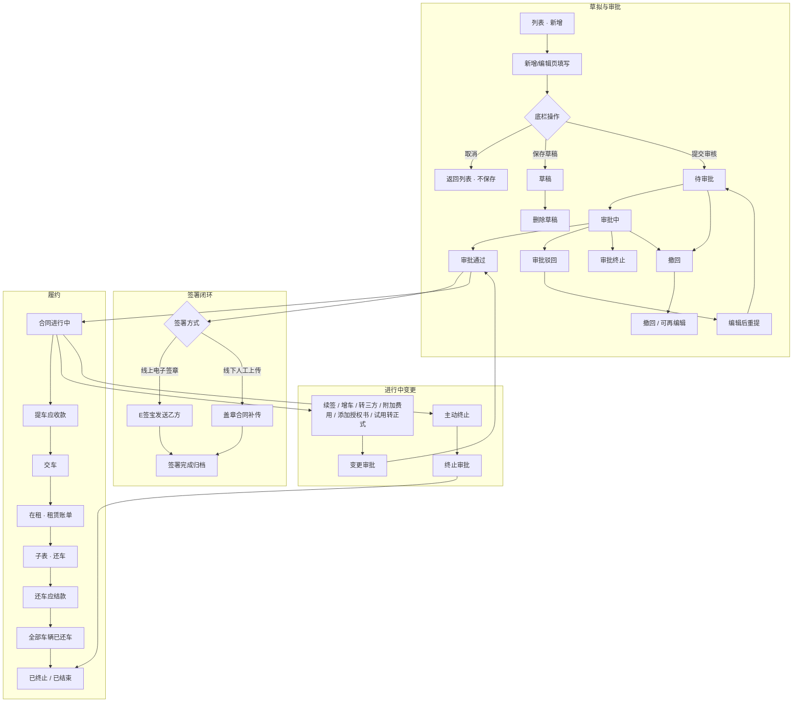
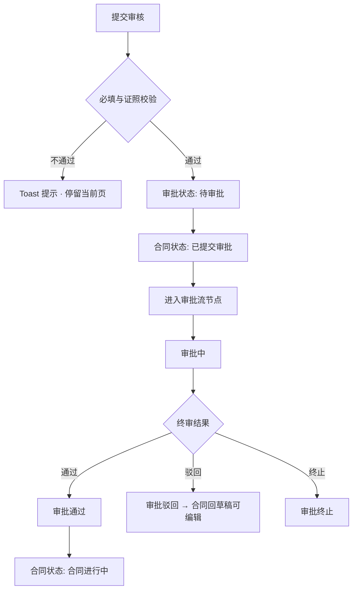
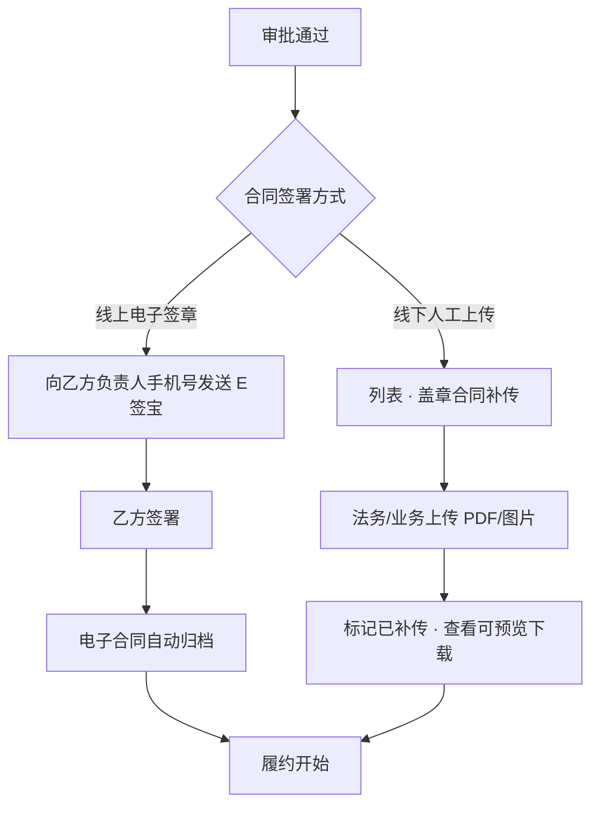
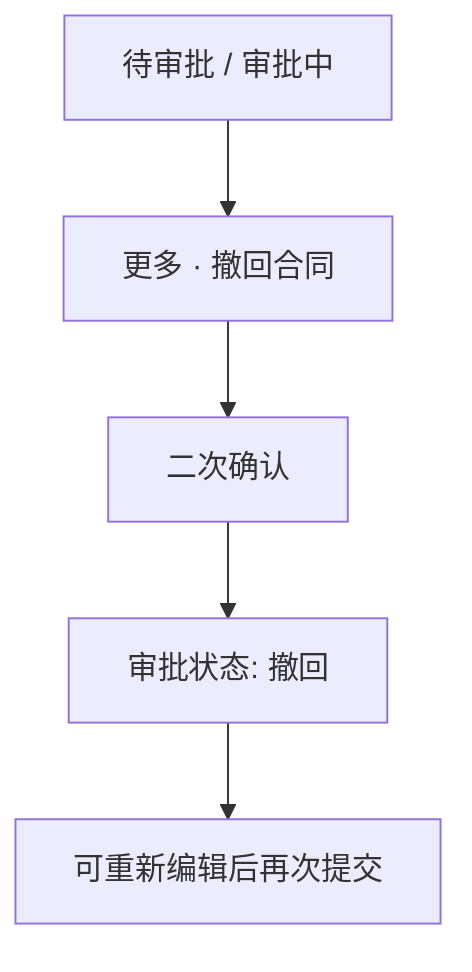
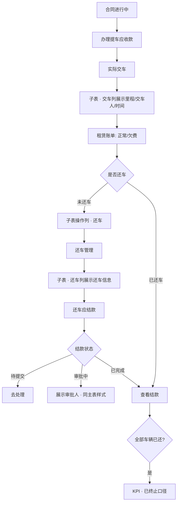
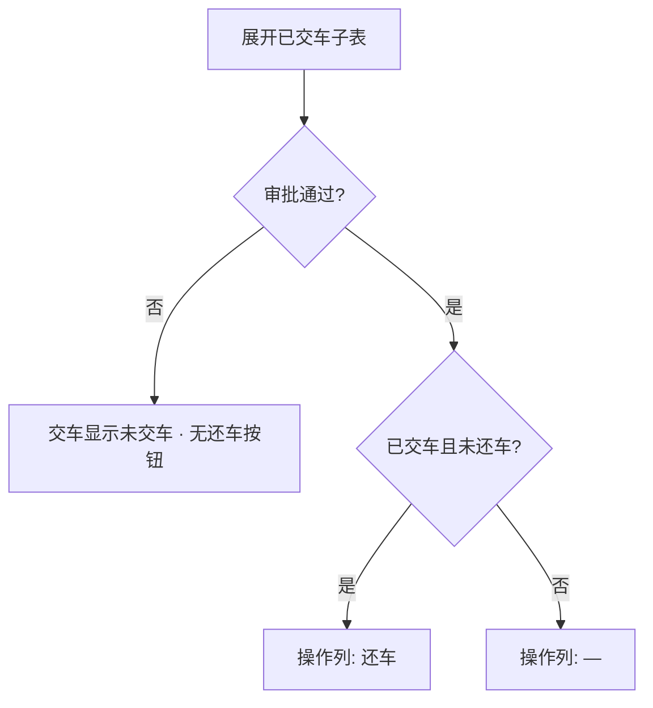
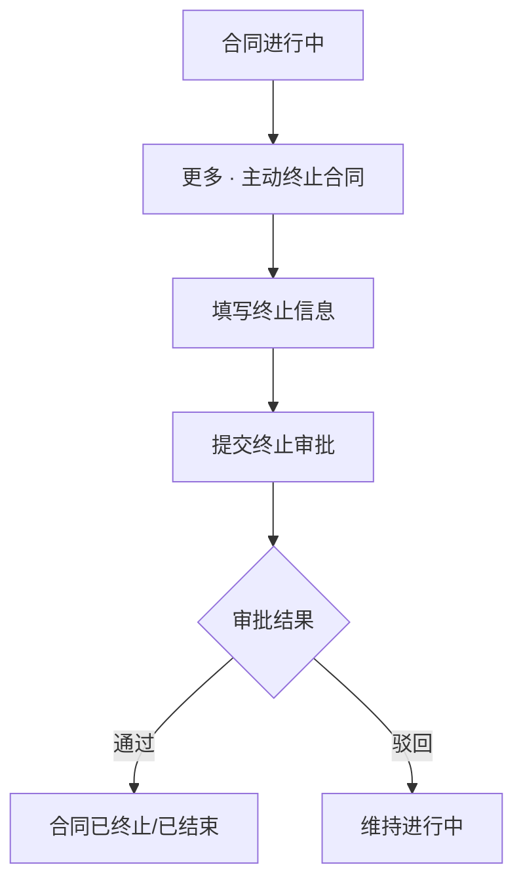
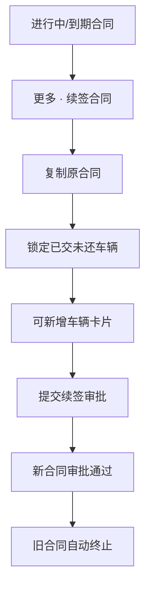
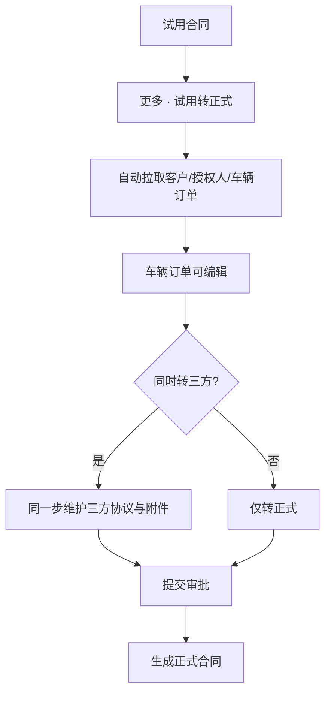
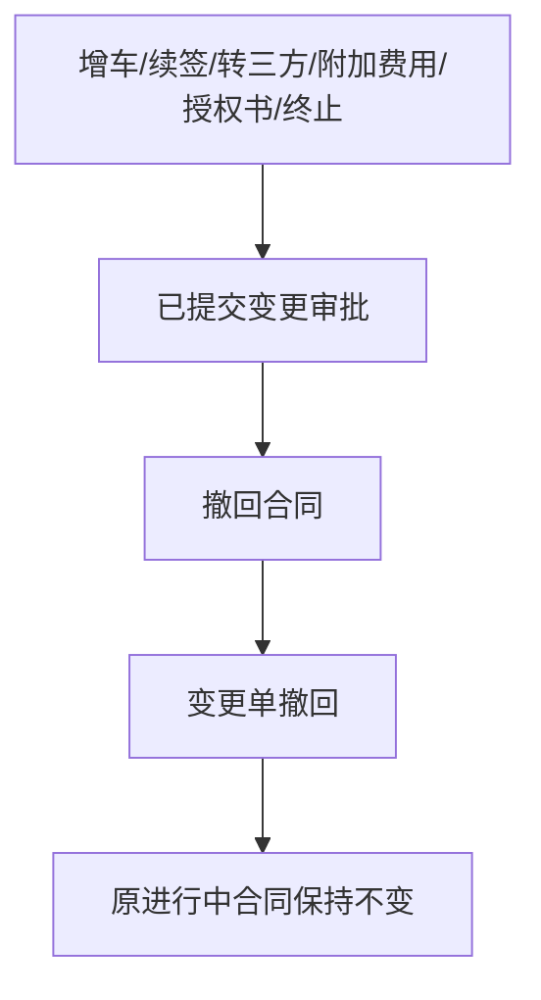

# 租赁合同管理 · 操作流程图

> 以「新增合同」为起点，覆盖主流程正向操作与可逆/异常逆向操作。  
> 与列表操作列、子表交还车、签署闭环对齐原型实现。

---

## 1. 总览：从新增到履约结束



---

## 2. 新增合同 · 正向流程

### 2.1 保存草稿


### 2.2 提交审核 → 审批通过



### 2.3 签署闭环（审批通过后）



---

## 3. 新增合同 · 逆向流程

### 3.1 取消草拟（不保存）


### 3.2 删除草稿


### 3.3 撤回已提交审批



### 3.4 审批驳回后重提


---

## 4. 履约正向：交车 → 还车 → 结清

> **前置条件**：仅 `审批通过` 的合同才产生交车/还车履约数据。



### 4.1 子表还车操作条件



---

## 5. 履约逆向与异常

### 5.1 非审批通过合同不出现交车


### 5.2 主动终止合同



### 5.3 续签 / 转三方导致旧合同终止


---

## 6. 进行中变更 · 正向流程

### 6.1 新增车辆


### 6.2 续签合同



### 6.3 试用转正式



### 6.4 转三方合同


### 6.5 附加费用


### 6.6 添加授权委托书


---

## 7. 进行中变更 · 逆向流程

### 7.1 变更审批撤回



### 7.2 变更审批驳回

```mermaid
flowchart LR
  A[变更审批驳回] --> B[合同状态回变更/草稿口径]
  B --> C[业务修改后重新提交]
```

---

## 8. 交车安排编辑（列表与子表）

### 8.1 正向：修改交车安排

```mermaid
flowchart TD
  A[列表 · 交车安排列] --> B{可编辑?}
  B -->|未锁定| C[编辑区域/日期]
  C --> D[同步所有未交车车辆]
  D --> E[回写提车应收款 · 刷新待办]
  B -->|已锁定| F[提示在提车应收款中调整]
```

### 8.2 子表：单车交车时间

```mermaid
flowchart LR
  A[未交车车辆行] --> B[编辑本车交车时间]
  B --> C[仅影响当前车辆]
  C --> D[不影响已交车车辆]
```

---

## 9. 操作与状态对照表

| 操作 | 显示条件 | 正向结果 | 逆向/回退 |
|---|---|---|---|
| 新增 | 工具栏 | 进入新增页 | 取消不保存 |
| 保存草稿 | 新增/编辑页 | 草稿 | 删除草稿 |
| 提交审核 | 新增/编辑页 | 进入审批 | 撤回 |
| 编辑 | 草稿/驳回 | 修改后重提 | — |
| 删除 | 草稿 | 记录删除 | — |
| 撤回 | 待审批/审批中 | 审批撤回 | 可再提交 |
| 盖章补传 | 审批通过+线下 | 附件归档 | — |
| 交车 | 审批通过后履约 | 在租 | — |
| 还车 | 子表·已交未还 | 还车应结款 | — |
| 续签 | 进行中/到期 | 新合同+旧合同终止 | 撤回变更审批 |
| 增车 | 进行中 | 变更审批 | 驳回/撤回 |
| 转三方 | 进行中 | 变更审批 | 驳回/撤回 |
| 试用转正式 | 试用合同 | 新正式合同 | 驳回/撤回 |
| 附加费用 | 进行中 | 费用入账审批 | 驳回/撤回 |
| 添加授权书 | 进行中 | 授权书审批 | 驳回/撤回 |
| 主动终止 | 进行中 | 终止审批 | 驳回 |

---

## 10. 修订记录

| 版本 | 日期 | 说明 |
|---|---|---|
| v1.0 | 2026-07-12 | 从新增合同起梳理正向/逆向全流程；对齐审批通过后交还与子表还车规则 |
