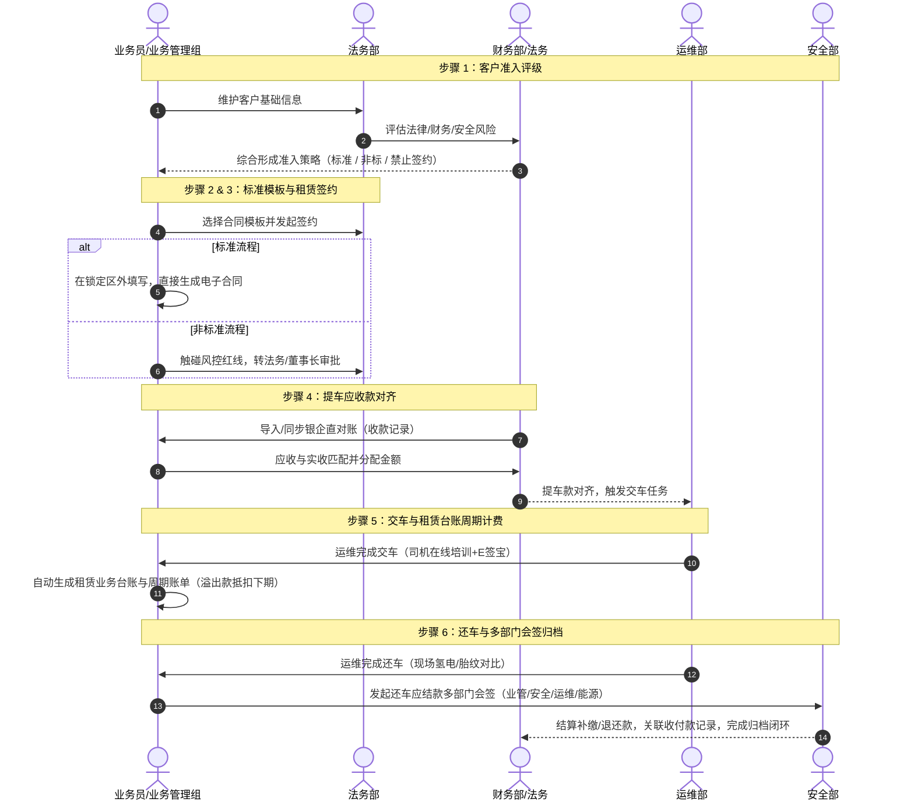
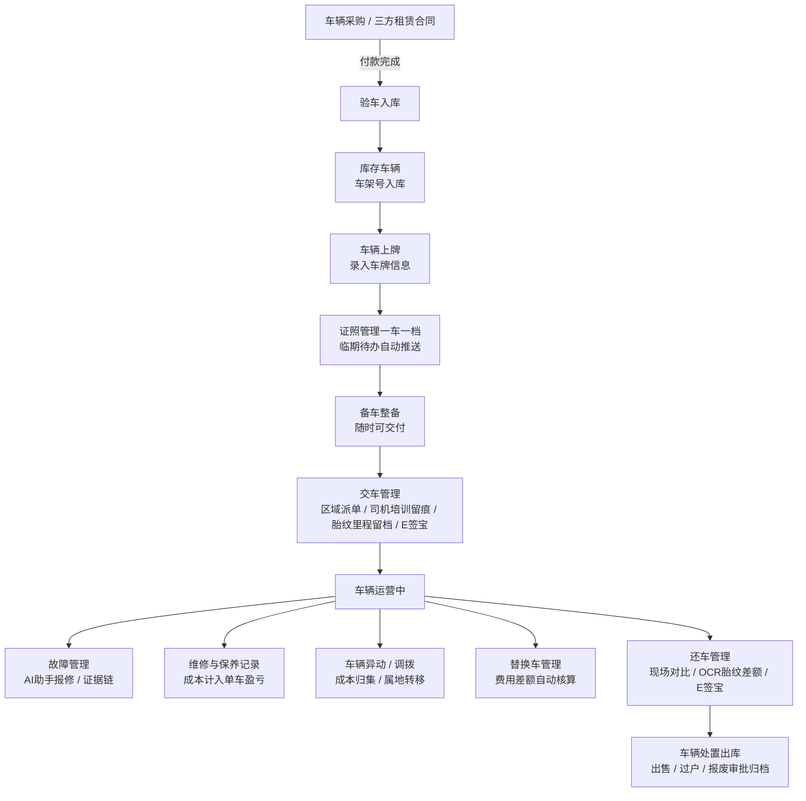
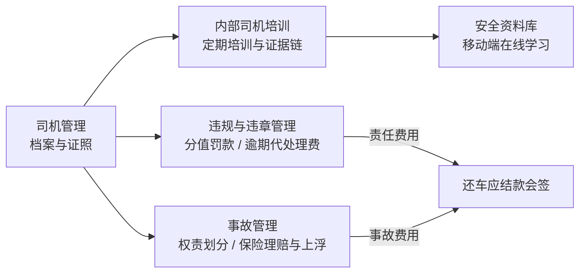
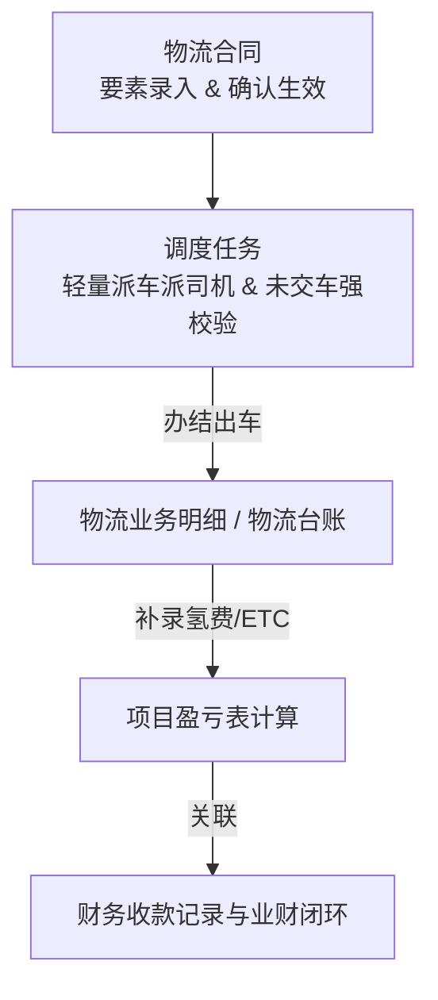

# OneOS V2 全局设计规范与业务架构基准 · 产品需求说明 (PRD)

## 1. 模块与规范定位

| 项 | 说明 |
|---|---|
| 模块名称 | OneOS V2 (统一运营管理平台 V2 基准) |
| 所属系统 | ONE-OS 统一平台 |
| 生效目录 | `src/prototypes/oneos-v2/` 及 OneOS V2 关联子模块 |
| 视觉风格 | **Stripe Fintech UI**（Stripe Violet `#533AFD`） + **Linear** 极简微结构 |
| 页面母版 | 台账三视角：`LeaseContractHub.tsx`；表单双布局：A 侧栏 `FaultDispositionForm`（§4.8）/ B 横向整屏 B1（§4.9） |
| 迁页清单 | `.spec/migration-from-1.2.md`（租赁条线优先） |
| 主题能力 | **100% 浅色 (Light Mode) / 暗色 (Dark Mode) 无缝切换** |
| 三大核心视图 | **1. 列表模式 (List)** · **2. 看板模式 (Kanban)** · **3. 主从/表单模式 (Split Master-Detail)** |
| 业务基准覆盖 | **5 大业务条线闭环** (租赁、能源、运维、安全、物流) + **3 大数据底座** (资产、盈亏、里程) |
| 研发 SOP | **文档/流程图/关系图先梳理 -> 产品对齐 -> 原型生成与 AutoPRD 同步** |

---

## 2. OneOS V2 UI/UX 设计规范与布局规则

1. **三视图无缝切换**：顶栏提供三视角按键（列表 / 看板 / 主从），支持业务人员自由选择适合当前任务（批量搜索、状态流转、单据精细处理）的模式。
2. **看板卡片快捷联动**：看板模式下每张卡片右上角提供「快速操作」，点击平滑无缝跳转至【主从/表单模式】。
3. **主从表单分布**：左侧 340px 选单与右侧详情/表单区联动，支持多单据连贯办理与 Sub-tabs 明细展开。
4. **全端顶栏与侧栏**：高度 52px 顶栏整合 `⌘K` 全局搜索框、Sparkles 版本日志、主题切换与全屏按键；侧栏折叠与 Stripe Violet 高亮条提示。
5. **统一表单控件**：Input / 单选 / 多选 / 单日 / 区间（「至」+ 双月）/ 时间 使用 `src/common/oneos-v2-form`（`O2*`）；预览 `/prototypes/oneos-v2-form-kit` 或本入口 `?view=form-kit`。新迁页必须用 V2 控件；旧 vm 可暂留原筛选组件。
6. **结构化工单表单页母版（定稿 · 方案 A）**：单单据深度填报且需右栏时采用「左主表单三段卡 + 右 340px 指派/SLA」；母版 `FaultDispositionForm`；预览 `/prototypes/oneos-v2?view=form` 或展厅「PC 表单母版」；细则见 `DESIGN.md` §4.8。
7. **表单双布局（定稿）**：单单据填报页须二选一——**A 侧栏工作台**（有指派/SLA/审批右栏）或 **B 横向整屏 B1**（无右栏、主区 100% 铺满且保留 PC 20–24px 页边距）；生成前声明 `layout: sidebar | fullBleed`；同一页禁止混用（`DESIGN.md` §4.9）。
8. **列表操作列（定稿）**：常用「编辑 / 处理（处置）」外侧展示（最多 2 个）；低频「查看记录」等进 ⋮ 更多；统一 `OperationActions`（`DESIGN.md` §3.16）。
9. **按钮（定稿）**：统一 `V2Button`（primary / secondary / outline / ghost / danger / back）；同一操作区仅一个主按钮；主色走 CSS 变量（`DESIGN.md` §3.0）。
10. **图片上传（定稿）**：统一 `V2ImageUpload`——Web 支持点击 + 拖拽虚线区与缩略图「新增」；H5 以拍照 / 相册双入口为主（触控 ≥44px），不以拖拽为主（`DESIGN.md` §3.17）。

---

## 3. 全局系统关系图与五大条线架构

### 3.1 全局五大条线与三大底座关系图

```mermaid
flowchart TD
    subgraph CoreFoundations [三大数据底座]
        VA[车辆资产台账<br/>一车一档 / 状态 / 证照 / 里程]
        PL[条线盈亏表<br/>项目级 / 部门级收入与成本]
        MP[里程履约看板<br/>阶段任务 / 计划 vs 实测]
    end

    subgraph Line1 [1. 租赁业务条线 (Lease)]
        L1[客户管理] --> L2[标准合同模板]
        L2 --> L3[租赁合同]
        L3 --> L4[提车应收款]
        L4 --> L5[租赁业务台账]
        L5 --> L6[还车应结款]
    end

    subgraph Line2 [2. 能源业务条线 (Energy)]
        E1[供应商管理] --> E2[加氢站管理]
        E2 --> E3[加氢订单主动/PLC]
        E3 --> E4[车辆氢费明细]
        E4 --> E5[氢费账户与对账]
        E5 --> E6[上下游扩展]
    end

    subgraph Line3 [3. 运维管理条线 (Ops)]
        O1[采购/三方合同] --> O2[验车入库]
        O2 --> O3[上牌与证照]
        O3 --> O4[备车与交还车]
        O4 --> O5[故障与维保]
        O5 --> O6[异动/调拨/处置出库]
    end

    subgraph Line4 [4. 安全管理条线 (Safety)]
        S1[司机管理与培训] --> S2[安全资料库]
        S2 --> S3[违规与违章记录]
        S3 --> S4[事故定责与保险]
    end

    subgraph Line5 [5. 物流业务条线 (Logistics)]
        F1[物流合同] --> F2[轻量调度派车]
        F2 --> F3[物流业务明细/台账]
    end

    subgraph FinIntegration [业财一体化集成层]
        YS[YS 财务系统 / 银企直联]
        PR[收款记录 / 付款记录]
        ES[e 签宝电子签]
    end

    %% 跨条线与底座勾连
    Line1 -->|写入车辆履约态| VA
    Line3 -->|更新车辆全生命周期| VA
    Line2 -->|能源成本回填| PL
    Line3 -->|维保/异动成本| PL
    Line5 -->|物流营收与成本| PL
    Line1 -->|首期与周期账单| PR
    Line2 -->|预付款与充值| PR
    S4 -->|责任费用| L6
    O4 -->|交还车里程| MP
    FinIntegration <-->|双向核销与状态回写| PR
```

---

## 4. 五大业务条线闭环流程图

### 4.1 租赁业务条线闭环 (Lease Business Line)



### 4.2 能源业务条线闭环 (Energy Business Line)

```mermaid
flowchart TD
    E_Supp[供应商管理<br/>结算要素与资质] --> E_Site[加氢站管理<br/>签约站 vs 非签约站]
    
    subgraph 签约站路径 (主动/PLC)
        E_Site -->|分配账号| E_Order[加氢订单 H5 / PC / PLC]
        E_Order -->|主动上报 / PLC自动采集| E_Rec1[加氢记录<br/>自动入库]
    end

    subgraph 非签约站路径 (手工补录)
        E_Site -->|线下加氢| E_Fee[车辆氢费明细]
        E_Fee -->|能源部人工补录| E_Rec2[加氢记录<br/>OCR/围栏辅助]
    end

    E_Rec1 --> E_Reconcile[能源部对账与标记已对账]
    E_Rec2 --> E_Reconcile

    E_Reconcile --> E_Acct[客户氢费账户与对账单]
    E_Acct -->|关联财务收款记录| E_Fin[财务实收核销]
    E_Fin -->|回写| E_Done[加氢记录标记『已付款』闭环]
```

### 4.3 运维管理条线闭环 (Ops Business Line)



### 4.4 安全管理条线闭环 (Safety Business Line)



### 4.5 物流业务条线闭环 (Logistics Business Line)



---

## 5. 当前项目原型与 5 大业务条线映射矩阵

| 业务条线 | 步骤/模块 | 当前映射原型 ID (`/prototypes/`) | 对应原型名称 | 状态/需求完整度 | 核心优化与下一步动作 |
|---|---|---|---|---|---|
| **租赁条线** | 1. 客户管理 | `customer-management` | 客户管理 | 已对齐 (v1.2) | 支持三部门评级联动及非标流程触发标识 |
| | 2. 标准合同 | `contract-template-management` | 标准合同管理 | 已对齐 (v2.0) | Docx 忠实度渲染、风控红线与锁定区判定 |
| | 3. 租赁合同 | `lease-contract-management` | 租赁合同 | 已对齐 (v2.1) | 支持标准/非标/禁止三路径与续签/变更 |
| | 4. 提车应收 | `vehicle-pickup-receivable` | 提车应收款 | 已对齐 (v1.5) | 实收关联对齐、触发运维交车任务生成 |
| | 5. 租赁台账 | `lease-business-ledger` / `lease-business-detail` | 租赁业务台账 | 已对齐 (v1.6) | 周期账单自动计算、溢出款抵扣下期算法 |
| | 6. 还车应结 | `vehicle-return-settlement` | 还车应结款 | 已对齐 (v1.3) | 多部门（业管/安全/运维/能源）会签审批 |
| **能源条线** | 1. 供应商 | `supplier-management` | 供应商管理 | 已对齐 (v1.1) | 加氢站/充电站供应商属性绑定与直连 |
| | 2. 加氢站 | `oneos-web-h2-station-site` | 站点信息 | 已对齐 (v1.2) | 签约站/非签约站分类、账号与预付款余额 |
| | 3. 加氢订单 | `oneos-h5-h2-order` | 加氢订单 (H5) | 已对齐 (v1.4) | 签约站主动上报、PLC 自动采集与预约单 |
| | 4. 氢费明细 | `vehicle-h2-fee-ledger` | 车辆氢费明细 | 已对齐 (v1.5) | 非签约站补录、系统级 OCR 与围栏提示 |
| | 5. 氢费账户 | `payment-records` | 收款记录 / 账户 | 已对齐 (v1.2) | 客户预付款账户对账单与 YS 收款关联 |
| **运维条线** | 1~2. 采购/三方 | `vehicle-purchase-contract` | 车辆采购合同 | 已对齐 (v1.3) | 采购合同关联付款与验车任务下发 |
| | 3. 验车入库 | `vehicle-inspection` | 验车入库 | 已对齐 (v1.2) | 现场验车核对、验完自动标记库存 |
| | 4~9. 运维综合 | `oneos-web-ops` | 车辆运维综合 | 已对齐 (v2.0) | 覆盖上牌/证照/备车/交还车/替换/年审/调拨 |
| | 10. 故障处置 | `vehicle-fault-handling` | 故障处置 | **已对齐 V2 视觉** | 三视图对标母版；SLA/证据链/归档硬门槛不变 |
| | 12. 维保明细 | `vehicle-maintenance-ledger` | 车辆维修明细 | 已对齐 (v1.1) | 维修保养费用录入与单车盈亏分摊 |
| | 15. 资产处置 | `vehicle-management` | 车辆资产 | 已对齐 (v2.2) | 出售/过户/报废审批及一车一档全景 |
| **安全条线** | 1~6. 安全综合 | `vehicle-management` / 扩展 | 车辆资产 & 安全 | 建设中 | 整合司机档案、培训证据链、违章事故定责 |
| **物流条线** | 1. 物流合同 | `self-operated-contract` | 物流合同 | 已对齐 (v1.2) | 生效后可派车提示与调度勾连 |
| | 2. 调度任务 | `self-operated-dispatch-task` | 调度任务 | 已对齐 (v1.3) | 轻量派车派司机、未交车强校验、办结落账 |
| | 3. 物流台账 | `self-operated-business-ledger` / `business-dept-ledger` | 物流业务明细 / 项目盈亏 | 已对齐 (v1.6) | 办结落账、氢费/ETC 补录与项目盈亏表 |
| **数据底座** | 底座 1 | `oneos-h5-vehicle-assets` | 车辆资产 H5 | 已对齐 (v1.3) | 移动端只读查车、里程任务进度与异常角标 |
| | 底座 2 | `business-dept-ledger` | 项目盈亏情况 | 已对齐 (v1.6) | 跨板块业绩、成本与盈亏钻取大表 |
| | 平台能力 | `message-center` | 消息中心 | 已对齐 (v1.2) | 5 端路由解析、多源通道与触达状态 |
| | 平台能力 | `oneos-web-workbench-new` | 全新工作台 | 已对齐 (v2.1) | 角色视角（高管/业管/运维/财务/安全/加氢站）切换 |

---

## 6. 需求研发 SOP 与流程规范

后续所有 OneOS V2 需求与原型迭代强制执行以下 **「三步走 SOP」**：

```
+-----------------------------------------------------------------------------------+
| 步骤 1：需求与关系梳理 (Requirement & Diagram Phase)                            |
|  - 更新本文档或对应原型 `.spec/requirements-prd.md`                               |
|  - 绘制完整业务流程图 (Mermaid) 与模块关系图                                        |
|  - 明确：责任部门、起点、怎么运作、闭环条件                                           |
+-----------------------------------------------------------------------------------+
                                        |
                                        v
+-----------------------------------------------------------------------------------+
| 步骤 2：产品需求对齐 (PM Alignment Gate)                                           |
|  - 呈现文档与流程图摘要，由产品经理（王冕）确认业务边界与逻辑                           |
|  - 确保不偏离「业务条线说明」与 OneOS V2 设计基准                                      |
+-----------------------------------------------------------------------------------+
                                        |
                                        v
+-----------------------------------------------------------------------------------+
| 步骤 3：原型生成与同步 (Prototype Implementation & AutoPRD Sync)                    |
|  - 依据对齐方案更新 `src/prototypes/<prototype-id>/` 页面与 OneOS V2 规范            |
|  - 同步更新 `annotation-source.json` 原型标注目录                                   |
|  - 执行 `npm run nav:sync` 并发布原型至 S3 对象存储                                  |
+-----------------------------------------------------------------------------------+
```
