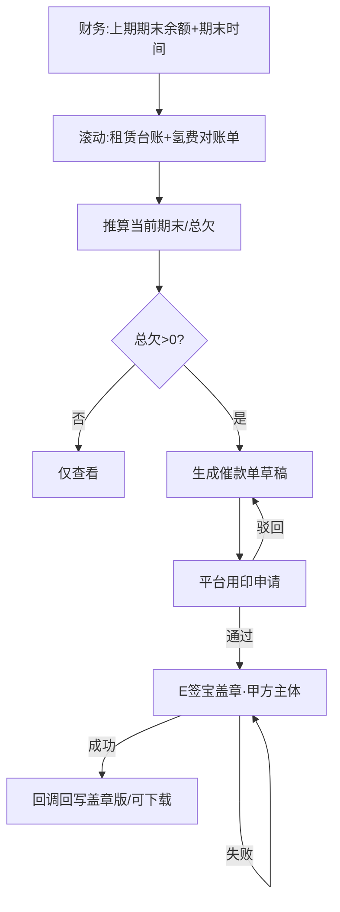

# 应收催款 · 产品需求说明（全模块）

## 1. 一句话与目标

**一句话**  
面向租赁应收逾期客户：以上期期末为锚点，结合租赁业务台账与氢费对账单自动推算当前期末与总欠款；一键生成催款函，经平台用印申请后由合同甲方主体走 E签宝出具盖章版。

**要解决的问题**  
- 期末余额靠人工拼表，口径不一、难追溯。  
- 催款函依赖人工套模板、线下/钉钉用印，周期长且难关停旧流程。  
- 盖章版缺少主体、用印与回写状态可追溯。

**本期目标**  
1. 以财务「上期期末余额 + 期末时间」为锚，联动租赁业务台账、氢费对账单，自动推算**当前期末余额**与总欠款。  
2. 按催款函母版生成催款单（租金/氢费相关明细、违约金、账户、限期）。  
3. 平台内完成用印申请（替代钉钉用印）；签章主体为合同**甲方**（羚牛子公司之一）；对接 E签宝：草稿 → 盖章中 → 已盖章；盖章版回写由技术在接入后配置回调。

**非目标（本期不做）**  
- 不改造财务全量宽表导入与总账对账系统。  
- 原型阶段不真实调用 E签宝生产与钉钉；用印/盖章为可演示状态机。  
- 不做诉讼卷宗编排；不保留钉钉用印作为并行主路径（迁移后关闭钉钉相关流程）。

## 2. 模块边界（最重要）

| 在范围内 | 不在范围内 |
|---|---|
| 上期期末锚点 + 当前期末推算展示 | 财务总账凭证录入 |
| 租赁业务台账、氢费对账单作为期间发生额来源 | 开票系统改造 |
| 催款函生成与预览 | 短信/邮件群发 |
| 平台用印申请（催款单场景） | 继续运营钉钉用印主流程 |
| E签宝盖章状态与盖章版归档（回调由技术配置） | CA 证书运维本身 |

**内容来源假设**  
- 催款函版式对齐博众样本。  
- 财务按客户/项目提供可引用的上期期末余额与期末时间。  
- 合同甲方主体可映射到羚牛子公司名录，用于 E签宝签章主体。

## 3. 角色

| 角色 | 诉求 |
|---|---|
| 财务 | 维护/确认上期期末锚点；核对推算结果；下载盖章版 |
| 业务 / 业管 | 看逾期与总欠；发起催款单与用印 |
| 用印审批人 | 在平台审批催款单用印（原钉钉节点迁入） |
| 法务（轻量） | 确认函件与甲方主体正确 |

## 4. 用户故事（起点 → 运作 → 闭环）

### US-1 推算并查看当前期末 / 总欠（5 点）

**起点** 财务已提供该客户「上期期末余额、期末时间」；租赁业务台账与氢费对账单可取期间发生额。  
**运作** 系统自期末时间之后滚动：叠加租赁台账与氢费对账单相关发生额，推算**当前期末余额**；台账展示各期期末与当前总欠。  
**闭环** 业管/财务确认推算结果无误，方可生成催款单。

### US-2 生成催款单（5 点）

**起点** 当前总欠 > 0。  
**运作** 按母版生成催款函，带出甲方主体、明细与合计（合计对齐当前总欠口径）。  
**闭环** 预览核对通过 → 催款单「草稿」。

### US-3 平台用印申请（5 点）

**起点** 催款单草稿。  
**运作** 在平台发起用印申请（权限与审批从钉钉迁移）；通过后具备提交 E签宝条件。  
**闭环** 用印通过；钉钉侧对应催款用印流程在迁移完成后关闭，不再双轨。

### US-4 E签宝盖章并归档（5 点）

**起点** 用印已通过。  
**运作** 以合同**甲方主体**为签章主体提交 E签宝；展示任务号与盖章中；成功后已盖章并可下载。盖章版文件回写路径/回调地址由技术在接入 E签宝后配置。  
**闭环** 台账可见盖章态与单号；财务取盖章版对外发出。

**故事点合计** 20

## 5. 正逆向流程

**正向**  
财务锚定上期期末 → 系统结合租赁台账 + 氢费对账单推算当前期末/总欠 → 生成催款草稿 → 平台用印申请通过 → E签宝（甲方主体）盖章 → 回调回写盖章版 → 下载发出。

**逆向**  
- 推算与财务认知不符：停在明细核对，不推用印/盖章；可待台账或对账单更正后重算。  
- 用印驳回：回到草稿，修改后重提用印。  
- 盖章失败：可在用印仍有效前提下重提 E签宝。  
- 总欠为 0：不强制催款。

## 6. 关键逻辑 / 状态 / 风险

### 取数与推算（定稿口径）

1. **锚点（财务提供）**：上期期末余额、上期期末时间。  
2. **期间发生额**：自「上期期末时间」之后，取  
   - 租赁业务台账中与该客户/合同相关的应收变动；  
   - 氢费对账单中与该客户/车辆相关的应收变动。  
3. **当前期末余额（自动推算）**：以上期期末余额为起点，滚动叠加上述期间发生额（回款、减免等若已体现在台账/对账单中，则按财务统一口径净额处理，不在催款模块另造一套总账）。  
4. **当前总欠款**：在催款场景下等于（或对齐）推算后的当前期末未收余额，并加计催款函所需的违约金等附加项（若有）。  
5. **催款函合计**：与对外主张的当前总欠一致。

### E签宝与用印（定稿口径）

1. **签章主体**：租赁合同**甲方**主体单位（通常为羚牛子公司之一），不得错用非合同甲方章。  
2. **用印权限**：催款单用印申请迁入本平台；迁移验收通过后**关闭钉钉相关用印流程**，避免双轨。  
3. **盖章版回写**：文件落库与回调地址在正式接入 E签宝后由**技术配置**；产品只要求状态可查、盖章版可下载，不规定技术回调实现细节。

### 状态

| 对象 | 状态 |
|---|---|
| 客户运行 | 正常 / 逾期 / 完结 |
| 用印申请 | 未申请 → 审批中 → 已通过 / 已驳回 |
| 催款单盖章 | 未生成 → 草稿 → 盖章中 → 已盖章（或盖章失败）；提交盖章前须用印已通过 |

### 风险

- 租赁台账与氢费对账单口径、入账时点不一致时，推算会漂移——需财务给出冲突处理规则。  
- 钉钉用印关停前若双轨并行，易出现重复用印；需明确切换日。  
- 多子公司甲方映射错误会导致错章——生成催款单时必须带出并确认甲方主体。

## 7. 流程图

## 8. 验收清单

- [ ] 详情可见「上期期末余额 / 期末时间」与推算「当前期末」来源说明（租赁台账 + 氢费对账单）  
- [ ] 博众样例总欠仍可演示 188,566.67（含违约金口径）  
- [ ] 催款单展示合同甲方签章主体  
- [ ] 用印：草稿可发起平台用印；通过后方可提交 E签宝  
- [ ] E签宝：任务号 → 盖章中 → 已盖章 + 可下载；文案标明回写由技术回调配置  
- [ ] 同页三视角，侧栏单项  

## 9. 交付口径

- 原型目录：`receivable-dunning`  
- 预览：`{baseUrl}/receivable-dunning/index.html`  
- 演示：博众（已盖章）、日邮（未生成，可走用印→盖章）、燊达（草稿）

## 10. 功能变更记录

（待本轮定稿后追加）
