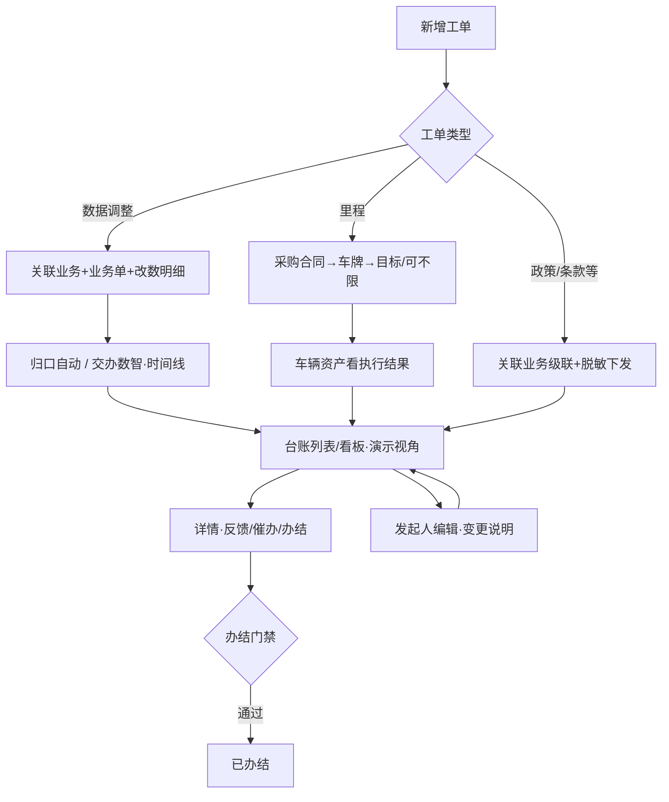

# 任务工单 · 产品需求说明（全模块）

## 1. 一句话与目标

任务工单承接三类事：① 业务/运维数据修改申请（原微信群迁移）；② 采购合同涉密条款按类型拆单跟进（执行端脱敏）；③ 采购入场或已落库车辆的里程执行目标下发，执行结果在车辆资产模块查看。

## 2. 模块边界（最重要）

**做什么**
- 台账「新增工单」同页全页表单；采购合同侧深链/预填可进确认向导（含批量）；**发布校验**：控件 Error 红框 + Toast + 锚点至首个未填项

- 双视角：列表 / 看板；同页全页详情与催办；**列表外侧可编辑（仅发起人）**；顶栏「演示视角」切换角色验证门禁
- **编辑已发布工单**：可改标题/要求/周期（含「不限」）/执行人/归口/绑车/里程目标与算力/改数明细；**锁定**工单号、类型、关联业务/业务单/采购合同；**仅发起人**且未办结可编；保存写入操作时间线「编辑保存」（可填变更说明）
- **角色门禁（原型用「演示视角」切换验证）**：编辑＝发起人；催办＝发起人/归口；提交执行反馈＝当前执行人；办结按类型规则（见关键逻辑）；领导视角只读
- **详情办结**：按规则展示「办结」；执行人可在详情提交反馈（内容+演示附件名）并写入反馈历史与时间线
- **计划完成「不限」**：长期跟进勾选后不填结束日、不算超时；列表/详情展示「不限」
- **业务数据调整类**：关联业务 + 业务单（单选）+ 任务名称 + 改数明细（修改字段 / 修改原因，可增删行）；归口自动指定；数智中心处理人锁定；审批交办用时间线演示
- **履约跟进类**：政策/条款/里程等按类型发给对应人；合同原文与金额对执行人隔离
- **里程类**：必选采购合同 → 带出合同下全部车牌（默认全选，可取消勾选）→ 统一填写计划起止（可勾不限）、里程目标、算力模式；一车一规则门禁；进度在车辆资产 · 里程任务查看
- 其它履约类新增绑车级联：工单类型 → 关联业务 → 业务单 → 带出车辆
- 数据调整类：关联业务（全量功能）+ 业务单（有样例时）+ 改数明细

**不做什么**
- 台账顶栏不提供「从采购合同发起」
- 台账/看板/详情不展示自动算力进度条
- 列表不展示「绑定车辆」列（详情页查看）
- 本期不做真实审批流状态机（方案甲：时间线文案演示）
- 不自动改库；不拆侧栏下级页
- 不做主从工作台视角（本模块仅列表 / 看板）
- 办结不以车辆资产里程进度为强制前置

**依赖**
- 采购合同深链；车辆资产 · 里程任务；工作台待办/小程序（原型演示）

## 3. 用户与角色

| 角色 | 职责 |
|---|---|
| 业务 / 运维发起人 | 提工单；编辑内容；催办；按规则办结 |
| 归口责任人（部门主管） | 系统指定或人选；催办督办；按规则办结 |
| 当前协同执行人 | 脱敏落实；提交执行反馈；符合规则时可办结 |
| 数智中心处理人 | 数据调整类处理与反馈（原型可锁定为指定人） |
| 领导 / 老板 | 台账/详情只读查进度与反馈，无编/催/结 |

## 4. 用户故事与故事点（起点→运作→闭环）

### US-A 数据调整申请（8）
- **起点**：特殊操作需改系统数据，新增工单选「业务数据调整类」。
- **怎么运作**：填写 **关联业务**（OneOS 全量功能，可搜索）、**业务单**（有样例单时必选）、**任务名称**；**改数明细**每行 **修改字段 + 修改原因**（可新增/删除，≥1）；系统自动指定归口、交办数智中心（时间线演示主管审批后数智处理）。
- **闭环**：详情可查看改数明细与时间线；执行人/发起人/归口按规则可办结；领导可查。

### US-B 采购合同涉密拆单跟进（8）
- **起点**：合同侧发起或台账新增政策/条款/维保等类型。
- **怎么运作**：只下发脱敏任务要求；关联业务单；按类型分给对应负责人；不可见合同原文/金额。
- **闭环**：执行人在详情提交反馈（卡片历史，可多条；附件 PDF/图片预览，其他下载）；发起人/归口催办；发起人/归口可办结，执行人须先有 ≥1 条反馈方可办结。

### US-C 里程执行目标与结果查看（5）
- **起点**：采购来车或已落库车辆约定里程目标，发起里程工单。
- **怎么运作**：必选 **采购合同** → 反显车牌默认全选 → **统一**设置计划开始/完成（可「不限」）、里程目标、算力模式；一车一规则冲突拦截；发布后同步车辆资产 · 里程任务。
- **闭环**：执行结果在车辆资产侧查看；工单侧由发起人/归口办结（不以资产进度为前置）。

### US-D 非量化固定事宜下发（5）
- **起点**：政策兑现、条款跟进、通用协同等无法量化事项。
- **怎么运作**：任务名称 + 执行要求 + 执行人；周期可「不限」；无系统进度条。
- **闭环**：落实反馈供领导查询；办结规则同履约类。

### US-E 台账双视角督办（5）
- **起点**：进入任务工单台账。
- **怎么运作**：列表/看板；KPI 与筛选；快捷搜索仅工单号/任务名称；**演示视角**切换验证角色按钮；**仅工单编号可点进详情**；关联业务单号只读；列表不展示绑定车辆；周期过结束日标「超时 N 天」（「不限」与已办结不标）；看板卡低密度；详情 §4.8；反馈历史与操作时间线拆分。
- **闭环**：办结后不可催办/编辑；按钮按角色显示。

### US-F 已发布工单编辑（5）
- **起点**：列表发现下发内容有误或需调整周期/执行人/绑车等。
- **怎么运作**：仅发起人可见「编辑」；锁定类型与关联；可选「变更说明」写入时间线；周期可改「不限」。
- **闭环**：台账与详情可见最新内容；非发起人或已办结无编辑入口。

### US-G 角色门禁与详情闭环（8）
- **起点**：不同身份进入台账/详情。
- **怎么运作**：编辑仅发起人；催办仅发起人/归口；反馈仅当前执行人；办结：里程＝发起人/归口；数据调整＝执行人/发起人/归口；其它履约＝发起人/归口直接办，执行人须先有反馈。
- **闭环**：无权操作不展示或拦截提示；领导只读。

## 5. 功能模块说明（正向 / 逆向）

**正向**
1. 数据调整 / 履约拆单 / 里程下发 → 台账可见 → 反馈/催办/办结 → 闭环
2. 已发布未办结 → 发起人编辑（可写变更说明）→ 时间线留痕
3. 里程进度在车辆资产查看；工单侧办结不依赖该进度

**逆向 / 异常**
- 必填未填：字段级错误
- 里程一车一规则冲突：拦截并点名车牌（编辑时排除本单）
- 已办结/已关闭：不可编辑、不可催办、不可再反馈/办结
- 执行人办结履约类但尚无反馈：提示先提交反馈
- 非授权角色：无对应按钮或 Toast 提示
- 未选采购合同（里程）：不可绑车；未勾选车辆不可发布/保存
- 未选业务单（其它履约）：不可从全库任选绑车
- 执行人不可见合同金额与原文

## 6. 关键业务逻辑

- **关联业务**：对照 OneOS 侧栏目录、知识库与桌面 ONE-OS 功能页，按分组枚举全部业务功能（可搜索）；不含设计规范/旧版对照/手册类入口
- **关联业务** 与原「关联功能」合并为同一业务域选择；不再单独出现「关联功能」
- **业务数据调整类**
  - 必填：关联业务、任务名称、改数明细（修改字段 + 修改原因）；有系统样例单的模块须选业务单（单选），无样例时可仅选关联业务提交
  - 归口自动取发起人部门主管；数智中心处理人锁定
  - 发布时写入时间线：新增发布 → 系统指定归口 → 交办数智中心（审批演示）
- **里程履约类**：关联 **采购合同** → 带出合同全部车牌默认全选可取消 → 计划起止/目标/算力对勾选车统一生效；计划完成可「不限」
- **绑定车辆级联（非里程）**：类型 → 关联业务 → 业务单 → 带出车辆
- **当前协同执行人**：实际跟进与反馈责任人；可与归口责任人相同或另指
- **归口责任人**：部门级监督与闭环责任人；可催办、按规则办结
- **办结规则**
  - 里程：发起人或归口；**不以**车辆资产完成度为强制前置
  - 数据调整：当前执行人，或发起人/归口
  - 其它履约：发起人/归口可直接办结；执行人须已有 ≥1 条反馈
- **计划「不限」**：勾选后无固定完成日、不计算超时标签
- **一车一规则**：待处理/进行中/已超时里程工单同车不可重复绑规则
- **工单编号**：`WO-年份-四位流水`，同年递增，跨年重置

## 7. 总览流程图

## 8. 验收清单

- [ ] 模块定位三点可在 PRD / 说明中读到
- [ ] 数据调整：无「关联功能」；「关联业务」为 OneOS 全量功能分组列表（可搜索）；有样例单时必选业务单；改数明细为「修改字段」「修改原因」多行
- [ ] 发布后时间线含归口指定与交办数智中心演示文案
- [ ] 里程履约：选采购合同；车牌默认全选；统一起止与目标；一车一规则拦截；可勾「不限」
- [ ] 其它履约：绑车级联关联业务→业务单；未选业务单仅提示
- [ ] 列表工单编号可点进详情；关联业务单号只读不可跳转
- [ ] 列表无算力进度列、无绑定车辆列；里程结果指向车辆资产
- [ ] 列表执行周期：超时标签；「不限」展示且不算超时
- [ ] 列表外侧「编辑」仅发起人+未办结；催办进更多且仅发起人/归口
- [ ] 编辑页：锁定类型与关联；变更说明可选写时间线；可设计划不限
- [ ] 演示视角可切换发起人/执行人/归口/领导，按钮随之变化
- [ ] 详情：执行人可提交反馈；有办结按钮且受类型规则约束；领导无编催结
- [ ] 侧栏仍一项；新增/编辑/详情同页切换
- [ ] 新增：执行人/归口字段下各有角色说明
- [ ] 详情页：§4.8 页头；反馈历史卡片；附件预览规则
- [ ] 看板催办与角色门禁一致
- [ ] 顶栏无「主从工作台」入口

## 9. 交付口径

- 预览：`{baseUrl}/task-work-order/index.html`
- 标注目录挂载本 PRD

## 10. 功能变更记录

（本轮未定稿；定稿时再递增版本并追加。）
