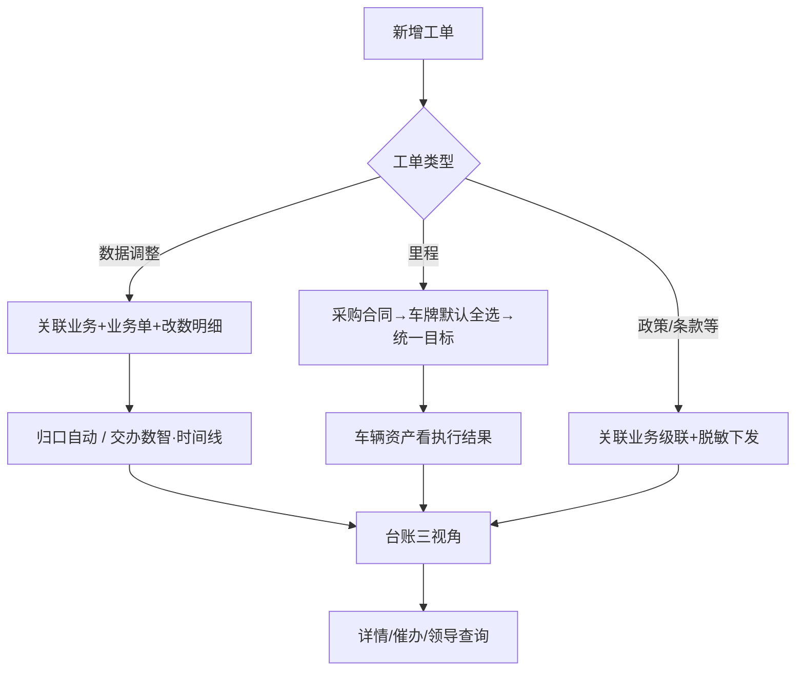

# 任务工单 · 产品需求说明（全模块）

## 1. 一句话与目标

任务工单承接三类事：① 业务/运维数据修改申请（原微信群迁移）；② 采购合同涉密条款按类型拆单跟进（执行端脱敏）；③ 采购入场或已落库车辆的里程执行目标下发，执行结果在车辆资产模块查看。

## 2. 模块边界（最重要）

**做什么**
- 台账「新增工单」同页全页表单；采购合同侧深链/预填可进确认向导（含批量）
- 三视角：列表 / 看板 / 主从；同页全页详情与催办
- **业务数据调整类**：关联业务 + 业务单（单选）+ 任务名称 + 改数明细（修改字段 / 修改原因，可增删行）；归口自动指定；数智中心处理人锁定；审批交办用时间线演示
- **履约跟进类**：政策/条款/里程等按类型发给对应人；合同原文与金额对执行人隔离
- **里程类**：必选采购合同 → 带出合同下全部车牌（默认全选，可取消勾选）→ 统一填写计划起止、里程目标、算力模式；一车一规则门禁；进度在车辆资产 · 里程任务查看
- 其它履约类新增绑车级联：工单类型 → 关联业务 → 业务单 → 带出车辆
- 数据调整类：关联业务（全量功能）+ 业务单（有样例时）+ 改数明细

**不做什么**
- 台账顶栏不提供「从采购合同发起」
- 台账/看板/详情不展示自动算力进度条
- 本期不做真实审批流状态机（方案甲：时间线文案演示）
- 不自动改库；不拆侧栏下级页

**依赖**
- 采购合同深链；车辆资产 · 里程任务；工作台待办/小程序（原型演示）

## 3. 用户与角色

| 角色 | 职责 |
|---|---|
| 业务 / 运维发起人 | 提数据调整或履约跟进工单 |
| 归口责任人（部门主管） | 系统自动指定；监督闭环 |
| 数智中心处理人 | 数据调整类处理与反馈（原型锁定王冕） |
| 条款/政策/里程执行人 | 脱敏任务落实并反馈 |
| 领导 / 老板 | 台账查询进度与反馈 |

## 4. 用户故事与故事点（起点→运作→闭环）

### US-A 数据调整申请（8）
- **起点**：特殊操作需改系统数据，新增工单选「业务数据调整类」。
- **怎么运作**：填写 **关联业务**（OneOS 全量功能，可搜索）、**业务单**（有样例单时必选）、**任务名称**；**改数明细**每行 **修改字段 + 修改原因**（可新增/删除，≥1）；系统自动指定归口、交办数智中心（时间线演示主管审批后数智处理）。
- **闭环**：详情可查看改数明细与时间线；领导可查。

### US-B 采购合同涉密拆单跟进（8）
- **起点**：合同侧发起或台账新增政策/条款/维保等类型。
- **怎么运作**：只下发脱敏任务要求；关联业务单；按类型分给对应负责人；不可见合同原文/金额。
- **闭环**：执行人反馈；发起人催办与督办。

### US-C 里程执行目标与结果查看（5）
- **起点**：采购来车或已落库车辆约定里程目标，发起里程工单。
- **怎么运作**：必选 **采购合同**（不用关联业务/业务单）→ 反显合同下全部车牌并默认全选（可取消勾选）→ **统一**设置计划开始/完成、里程目标、算力模式；一车一规则冲突拦截；发布后同步车辆资产 · 里程任务。
- **闭环**：执行结果在车辆资产侧查看；工单侧看状态与催办。

### US-D 非量化固定事宜下发（5）
- **起点**：政策兑现、条款跟进、通用协同等无法量化事项。
- **怎么运作**：任务名称 + 执行要求 + 执行人；无系统进度条。
- **闭环**：落实反馈供领导查询。

### US-E 台账三视角督办（5）
- **起点**：进入任务工单台账。
- **怎么运作**：列表/看板/主从；KPI 与筛选（含关联业务）；**关联业务单号 / 工单编号可点进同页全页详情**（主色下划线 +「查看 ›」，对齐车辆资产合同编号链接）；催办落时间线。
- **闭环**：空态规范；办结后不可催办。

## 5. 功能模块说明（正向 / 逆向）

**正向**
1. 数据调整 / 履约拆单 / 里程下发 → 台账可见 → 催办/反馈 → 闭环
2. 里程进度在车辆资产查看

**逆向 / 异常**
- 必填未填：字段级错误
- 里程一车一规则冲突：拦截并点名车牌
- 未选采购合同（里程）：不可绑车；未勾选车辆不可发布
- 未选业务单（其它履约）：不可从全库任选绑车
- 执行人不可见合同金额与原文

## 6. 关键业务逻辑

- **关联业务**：对照 OneOS 侧栏目录、知识库与桌面 ONE-OS 功能页，按分组枚举全部业务功能（可搜索）；不含设计规范/旧版对照/手册类入口
- **关联业务** 与原「关联功能」合并为同一业务域选择；不再单独出现「关联功能」
- **业务数据调整类**
  - 必填：关联业务、任务名称、改数明细（修改字段 + 修改原因）；有系统样例单的模块须选业务单（单选），无样例时可仅选关联业务提交
  - 归口自动取发起人部门主管；数智中心处理人锁定
  - 发布时写入时间线：新增发布 → 系统指定归口 → 交办数智中心（审批演示）
- **里程履约类**：关联 **采购合同**（非关联业务/业务单）→ 带出合同全部车牌默认全选可取消 → 计划起止/目标/算力对勾选车统一生效
- **绑定车辆级联（非里程）**：类型 → 关联业务 → 业务单 → 带出车辆
- **一车一规则**：待处理/进行中/已超时里程工单同车不可重复绑规则
- **工单编号**：`WO-年份-四位流水`，同年递增，跨年重置

## 7. 总览流程图

## 8. 验收清单

- [ ] 模块定位三点可在 PRD / 说明中读到
- [ ] 数据调整：无「关联功能」；「关联业务」为 OneOS 全量功能分组列表（可搜索）；有样例单时必选业务单；改数明细为「修改字段」「修改原因」多行
- [ ] 发布后时间线含归口指定与交办数智中心演示文案
- [ ] 里程履约：选采购合同（无关联业务/业务单）；车牌默认全选可取消；统一起止与目标；一车一规则拦截
- [ ] 其它履约：绑车级联关联业务→业务单；未选业务单仅提示
- [ ] 列表关联业务单号与工单编号可点进详情（主色下划线 + 查看引导）
- [ ] 列表无算力进度列；里程结果指向车辆资产
- [ ] 合同脱敏文案在详情可见
- [ ] 侧栏仍一项；新增/详情同页切换

## 9. 交付口径

- 预览：`{baseUrl}/task-work-order/index.html`
- 标注目录挂载本 PRD

## 10. 功能变更记录

（本轮未定稿；定稿时再递增版本并追加。）
