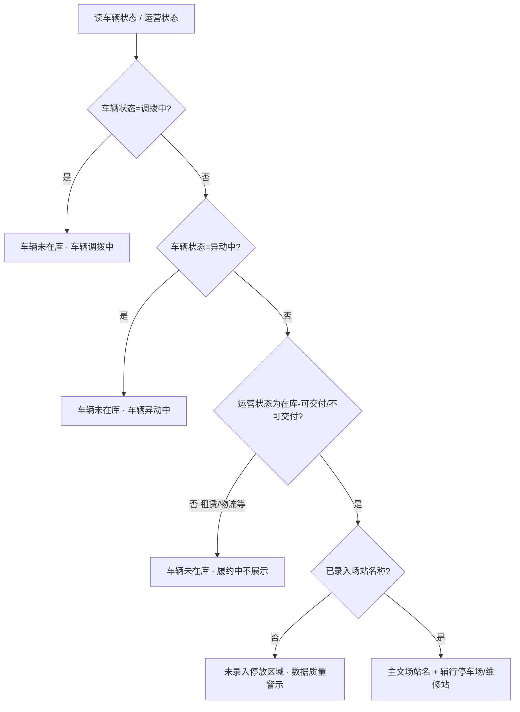

# 列表 · 停放区域

## 起点 → 运作 → 闭环

- **起点**：台账「停放区域」列
- **怎么运作**：按车辆是否在库，分三态展示场站或未在库原因
- **闭环**：确认当前场站（停车场 / 维修站），或理解为何不展示场站

## 判定顺序（须严格按序）

## 三态展示

| 形态 | 条件 | 主文 | 辅文 / 提示 |
|------|------|------|-------------|
| 有值 | 在库且已录入场站 | 场站名称 | 「停车场」或「维修站」图标+文案 |
| 未在库 | 租赁 / 物流履约，或车辆状态调拨中 / 异动中 | 车辆未在库 | 履约中不展示 / 车辆调拨中 / 车辆异动中 |
| 缺失 | 在库但未录入场站 | 未录入停放区域 | 疑似迁移缺漏，请核对（警示空卡） |

## 场站类型判定

按场站名称识别（与详情字段名口径一致）：

| 命中关键词 | 类型 | 列表辅行 |
|------------|------|----------|
| 维修站 / 服务站 / 修理厂 / 检测站 | 维修站 | 维修站 |
| 其余有效名称 | 停车场 | 停车场 |

含「维修站停车场」「服务站停车场」等复合名时，**优先按维修站**认定。

## 与详情 / 运维的关系

| 场景 | 口径 |
|------|------|
| 详情基本信息 | 在库有场站时，字段名直接切为「停车场」或「维修站」；本列表列名固定为「停放区域」，类型放辅行 |
| 运维自动匹配 | 依据**最后停放区域**持久字段，与本列当前展示解耦；交车后列表停放可清空，库中仍应保留最后停放区域 |

## 悬停说明（产品文案）

- 调拨中：调拨通过审批且调拨方完成调拨信息记录后，车辆视为未在库，不展示停放区域
- 异动中：异动通过审批并开始执行后，车辆视为未在库，不展示停放区域
- 履约中：车辆不在库（如租赁 / 物流交付中），列表不展示停放区域
- 缺失：在库车辆通常应有停车场或维修站；此处为空多为旧系统迁移缺漏或未补录
