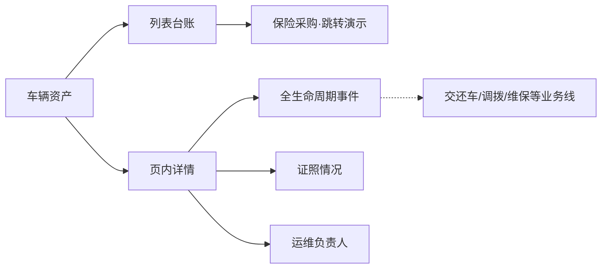
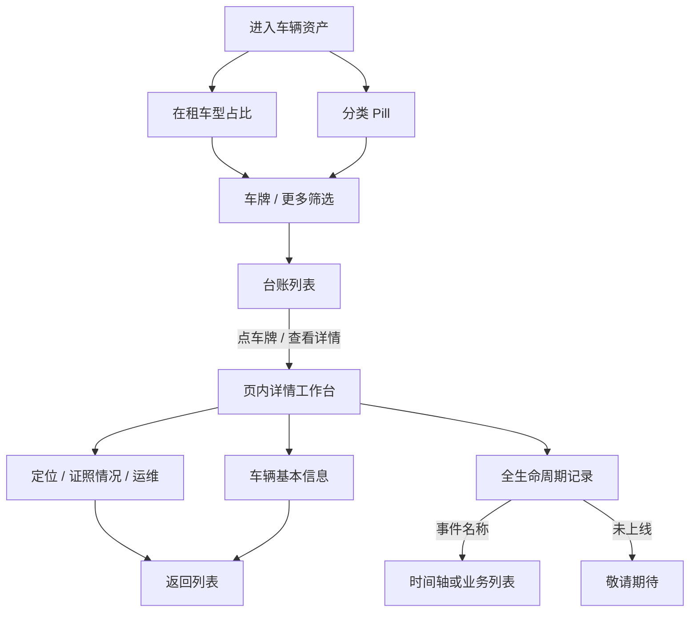

# 车辆资产 · 产品需求说明（全模块）

> OneOS V2 重做版。业务口径对齐 OneOS 1.2「车辆管理」列表 + 详情；**单页原型**：侧栏仅「车辆资产」一项，列表台账与页内详情同页切换，不提供看板 / 主从，不拆下级页面。

## 1. 一句话与目标

**一句话**  
在 PC Web 提供车辆台账的多维筛选、分类扫读与一车一档详情维护能力，支撑运营、运维与管理日常查车与档案协同。

**要解决的问题**  
- 车辆分散在多业务状态（租赁 / 物流 / 在库 / 非运营 / 退出），缺少统一台账扫读入口  
- 证照、保险、停放、运维负责人等信息分散，异常车辆难以及时发现  
- 一车全生命周期事件缺少聚合视图，详情与列表跳转割裂  

**本期目标**  
1. 完成车辆资产列表台账：分类 Pill、在租车型占比、高阶筛选、列设置、导入导出演示  
2. 完成页内详情工作台：基本信息、全生命周期记录、定位 / 证照情况 / 运维指派侧栏  
3. 固化运营状态、车辆状态、停放区域、运维匹配、临期规则等关键业务口径  

**非目标（本期不做）**  
- 看板模式、主从模式及顶栏「视图模式」切换  
- 侧栏「车辆列表 / 车辆详情」下级页面拆分  
- 列表「上次交车 / 上次还车」列及真实跳转交还车管理  
- 独立 H5 手机端产品（PC 响应式不在此列）  
- 批量导入真实落库、跨模块真实跳转（原型 Toast 演示）  
- 列设置写入用户账户的正式持久化（原型会话内有效，正式环境必做）  

## 2. 模块边界（最重要）

| 业务线 / 子域 | 做什么 | 不做什么 |
|---------------|--------|----------|
| 列表台账 | 分类扫读、多维筛选、在租车型占比、列设置、导出 / 导入演示、进详情 | 看板编排、交还车列表列 |
| 详情档案 | 基本信息、型号参数只读、档案日期维护、合规摘要 | 独立「基本信息 / 证照 / 型号」业务 Tab |
| 生命周期 | 时间轴 + 事件名称筛选；已上线事件列表；未上线敬请期待 | 本模块内办结交还 / 调拨 / 维保全流程 |
| 证照情况 | 侧栏索引 + 预览字段 / 图片 | 证照办证审批 |
| 运维指派 | 按最后停放区域匹配与手动调整 | 用户管理中的区域主数据维护 |
| 权限 | **正式环境**按登录角色控制「编辑档案」仅 Admin | 原型**不**做页面角色切换 / 假登录；不得把原型里菜单可见当成「全员可改」 |

**外部依赖（产品口径）**  

| 依赖方 | 交互方式 | 产品要求 |
|--------|----------|----------|
| 保险采购 | 列表保险列点击 | 原型 Toast 演示跳转；正式环境进入保险采购 |
| 租赁合同 | 列表合同编号点击 | 新标签打开合同详情；正式环境按合同编号定位单据 |
| 交还车 / 调拨 / 维保等 | 生命周期事件来源 | 车辆状态由各业务线闭环驱动，本模块只读聚合 |
| 用户管理 · 区域与运维人员 | 运维匹配 | 人员负责省 / 市决定自动匹配范围 |
| 车机 / GPS | 定位与里程 | 车机优先于 GPS，再降级人工运营城市；**车机 / GPS 可点运营城市打开地图**（在线绿点、离线灰点，车辆始终居中，可缩放；在线移动时定时 GPS 刷新跟车）；**人工来源不可打开定位地图**（未接入），仅可维护运营城市；人工修改保存后记录修改时间为更新时间 |

**关键约束**  
- 一原型 = 侧栏一项；详情页内打开，返回不离开本模块  
- 运营状态界面五档；非运营车辆状态强制「在库-不可交付」且不计入库存 KPI  
- **【开发必读】编辑档案仅超级管理员（Admin）**：普通运维 / 车管**禁止**直接改车辆状态与档案兜底字段；状态由交还车 / 调拨 / 维保等业务线闭环驱动。原型为演示路径可能仍展示「编辑档案」入口，**正式开发必须以权限接口显隐，禁止照抄「人人可见可点」**；也**禁止**在业务页做「切换角色」演示控件当作产品能力。  

## 3. 用户与角色

| 角色 | 主要目标 |
|------|----------|
| 业务管理组 / 运营 | 按客户、合同、项目、运营状态查车，进入档案核对履约信息 |
| 运维部 | 全量查阅车辆与运维业务数据；按区域担任运维负责人后，对该车生成待办并执行年审 / 调拨 / 异动 / 交还车 / 替换等操作 |
| 采购部 | 关注保险临期 / 异常，从列表感知续保压力（跳转采购为演示） |
| 超级管理员（Admin） | 资产数据异常时兜底编辑档案；不替代业务线闭环 |

## 4. 用户故事与故事点（业务条线说明口径）

> 合计约 **42 SP**（可按团队基准调整）。

### Epic A · 列表查车与扫读（约 18 SP）

#### A1 · 分类 Pill 与台账扫读
- **角色**：运营 / 运维  
- **起点**：进入车辆资产，看到 6 个分类：全部车辆 / 租赁 / 物流 / 库存 / 非运营 / 退出运营  
- **怎么运作**：  
  1. 点击分类切换列表与计数  
  2. 横向滚动浏览冻结列（品牌型号、车牌）与业务列  
  3. 点车牌或操作菜单「查看详情」进入页内详情；点合同编号（「查看 ›」引导）新标签打开合同详情  
- **关键结果**：`可` 一眼区分在库与履约车辆；证照 / 保险异常**不**再占顶部 Pill  
- **闭环**：找到目标车或确认分类下无车；或从合同编号跳转核对履约合同  
- **排期**：US-01 · 规模 M · 「作为运营，我想按分类扫车辆，以便快速定位目标车」

#### A2 · 车牌与高阶筛选
- **角色**：运营 / 运维  
- **起点**：需要按车牌或组合条件缩小范围  
- **怎么运作**：  
  1. 在主筛选入口多选 / 粘贴车牌并立即查询  
  2. 打开「更多筛选」，在地理、车辆资产、业务项目、状态合规四组中多选条件（含证照状态、保险状态、中国大区、**在库细档**等，共 17 项；租赁 / 物流 / 退出主档由分类 Pill 承担，更多筛选不重复）  
  3. 查看实时「匹配 N 辆车」，点**首行或面板内**查询 / 重置 / 清空后收起面板并刷新  
- **关键结果**：`可` 与分类 Pill 叠加过滤；生效条件在「更多筛选」显示数量徽标  
- **闭环**：列表仅保留命中车辆，或重置回全部分类结果  
- **排期**：US-01b · 规模 M

#### A3 · 在租车型占比
- **角色**：运营 / 业务管理组  
- **起点**：需要了解当前在租车型结构  
- **怎么运作**：  
  1. 列表上方展示在租车型占比；**无**全部 / 租赁 / 物流业务线 Tab  
  2. 主区固定 **TOP3 + 第 4 卡「其他」**（汇总 TOP4 及以后品牌型号的在租辆数与占在租 %）；更多明细经「查看全部车型」排行表  
  3. 卡片**前方**展示在租辆数及「占在租 %」；**后方**构成条下必须带 **租赁 / 物流 / 库存文案 + 数字**（不得只留裸数字）  
  4. 点击 TOP3 → 按品牌 + 型号过滤；点击「其他」→ 列表直接显示 TOP4 及以后全部品牌型号（**不**写入更多筛选的品牌 / 型号多选）；均自动切「全部车辆」、不展开更多筛选；再点同一卡清除  
- **闭环**：台账已按所选品牌型号过滤，可继续下钻或清除筛选  
- **排期**：US-01c · 规模 M

#### A4 · 异常扫读（证照 / 保险）
- **角色**：运维 / 采购  
- **起点**：需要找出证照异常或保险异常车辆  
- **怎么运作**：  
  1. 打开更多筛选，选择证照状态「异常」和 / 或保险状态「异常 / 临期」  
  2. 查询后在列表证照列、保险列扫读到期色与状态胶囊  
- **关键结果**：`禁止` 在运营状态文案后拼接「保险异常」等后缀  
- **闭环**：锁定异常车辆并进入详情或跳转保险采购（演示）  
- **排期**：US-02 · 规模 S

#### A5 · 列设置与导出导入
- **角色**：运营 / Admin  
- **起点**：列过多或需要批量导入台账  
- **怎么运作**：  
  1. 列表设置：显隐、中间列拖拽调序、恢复默认；左右冻结列不可隐藏 / 拖离  
  2. 表头拖拽调列宽  
  3. 导出：演示当前列表条数；导入：三步（Excel 模板 → 重复策略 → 预检确认），主键为车辆识别代码；模板「车辆来源」为下拉枚举（自有 / 外租 / 挂靠）  
- **关键结果**：账户级列偏好为正式环境能力；原型会话内生效  
- **闭环**：台账按个人偏好展示；导入结果以演示提示结束  
- **排期**：US-01d · 规模 M

### Epic B · 一车一档详情（约 16 SP）

#### B1 · 车辆基本信息与型号参数
- **角色**：运营 / 运维  
- **起点**：从列表进入页内详情  
- **怎么运作**：  
  1. 顶栏返回列表 +「车辆档案工作台」+ 车牌紫色胶囊；副标题品牌型号  
  2. 基本信息默认两行：车牌（后随车辆状态标签）、品牌车型（查看）、VIN；登记所有权、运营公司、停放区域（在库有场站时字段名切换为「停车场」或「维修站」，取值场站名称）  
  3. 展开全部基本参数后维护出厂年份 / 采购入库日期（空值「暂未维护 · 去补充」）；强制报废只读；不单独再列「停车场」字段  
  4. 点品牌车型「查看」打开型号参数只读弹层（基本情况 / 轮胎 / 电气 / 供氢 / 其他 / 保养规则）  
- **关键结果**：`禁止` 再提供顶部「基本信息 / 型号参数」业务 Tab  
- **闭环**：确认档案字段或补齐入库日期后返回列表  
- **排期**：US-03 · 规模 M

#### B2 · 定位、证照情况、运维指派
- **角色**：运维  
- **起点**：详情右侧侧栏  
- **怎么运作**：  
  1. 定位信息按车机 → GPS → 人工分态；基本信息展开时侧栏同步拉高  
  2. 证照情况：图例 + 条目；点击预览字段与图片；空值统一「未上传」；沪牌行驶证加年审有效期  
  3. 运维负责人展示 / 调整；操作记录可追溯；切换生命周期事件时侧栏不隐藏  
- **闭环**：定位可读、证照可预览、运维指派已保存  
- **排期**：US-03b · 规模 M

#### B3 · 全生命周期记录
- **角色**：运营 / 运维  
- **起点**：详情主区「车辆全生命周期记录」  
- **怎么运作**：  
  1. 默认事件名称 = 全部，展示倒序时间轴（可搜索 / 展开）  
  2. 右上角「事件名称」主筛选切换：已上线事件进业务列表；验车 / 维修 / 保养 / 过户 / 销售 / 报废显示「暂未上线，敬请期待」  
  3. 概览关键事件总数**仅高频操作**（交车 / 还车 / 保险 / 维保等）；入库 / 过户 / 销售 / 报废 / 出库等互斥低频项不进指标条，改由时间轴查看；点击跳转；不展示「当前视图」  
- **关键结果**：`禁止` 套内层轨迹卡片；`禁止` 顶部业务 Tab 切换生命周期  
- **闭环**：定位到目标事件或确认该阶段未上线  
- **排期**：US-03c · 规模 L

### Epic C · 运维与权限（约 8 SP）

#### C1 · 运维负责人自动匹配与手动指派
- **角色**：运维部  
- **起点**：列表运维列或详情侧栏  
- **怎么运作**：  
  1. 按运维用户**区域**命中车辆最后交车 / 停车场 / 维修站所在省市，自动匹配运维负责人；仅配省份时覆盖该省全部地市  
  2. 无最后停放区域：「无运维负责人 · **去设置**」；有区域无匹配：「暂无匹配运维 · **去设置**」；「去设置」为主色可点引导  
  3. 点击整卡打开弹窗，指定**一名或多名**运维负责人；**查询不设门槛**（全运维可读全量车辆与运维业务数据），**待办与操作仅该车负责人可执行**（年审、调拨、异动、交还车、替换等）  
  4. 保存后 Toast，并写入操作记录  
- **闭环**：车辆具备可跟进的运维负责人，业务待办有人可办  
- **排期**：US-04 · 规模 M

#### C2 · Admin 兜底编辑档案（正式环境权限 · 非原型页内模拟）
- **角色**：超级管理员（Admin）  
- **起点**：列表操作 ⋯ 菜单「编辑档案」（**仅 Admin 可见**）  
- **怎么运作**：  
  1. 登录权限判定为 Admin 时展示入口；非 Admin **不展示、不可进入**  
  2. 仅用于资产数据异常时的兜底修改；日常车辆状态由交还车 / 调拨 / 维保等业务线闭环驱动并留痕  
- **关键结果**：`禁止` 普通运维 / 车管改车辆状态；`禁止` 把原型页内「人人能点编辑」当成正式需求；`禁止` 用页面角色切换器代替真实权限  
- **原型说明**：本原型**刻意不在页面上做 Admin 开关**，避免开发误做成产品功能；菜单若可见仅供走通编辑弹层路径，**验收以权限接口为准**  
- **闭环**：异常档案被纠正并留痕（正式环境）  
- **排期**：US-05 · 规模 S

## 5. 功能模块说明（正向 / 逆向）

### 5.1 列表 · 分类与台账

**正向**  
1. 进入车辆资产 → 见在租车型占比与分类 Pill  
2. 切换分类 / 筛选 → 分页浏览台账  
3. 点车牌进入详情  

**逆向 / 边界**  

| 情况 | 系统表现 |
|------|----------|
| 筛选无命中 | 空态「暂无匹配车辆」 |
| 非运营车辆 | 计入非运营 Pill；不计入库存 |
| 列过多 | 横向滚动；左右列冻结 |

### 5.2 列表 · 筛选与异常

**正向**  
1. 车牌主入口多选 / 粘贴查询  
2. 更多筛选组合条件（含在库细档，不含与 Pill 重复的租赁/物流/退出），预览匹配数后查询；**首行工具链也可直接查询 / 重置**  

**逆向 / 边界**  

| 情况 | 系统表现 |
|------|----------|
| 仅改条件未点查询 | 列表保持上次已应用条件（车牌主入口即时查询除外） |
| 查询 / 重置 / 清空（首行或面板） | 收起更多筛选面板并刷新 |

### 5.3 列表 · 导入导出与列设置

**正向**  
1. 导出当前列表（演示）  
2. 导入：下载 `.xlsx` 模板（「车辆来源」Excel 数据有效性下拉：自有 / 外租 / 挂靠）→ 选重复策略 → 预检确认  
3. 列表设置确认后立即作用于表头表体  

**逆向 / 边界**  

| 情况 | 系统表现 |
|------|----------|
| 重复策略 | 跳过 / 覆盖 / 报错（主键：车辆识别代码） |
| 恢复默认 | 同时还原显隐、顺序、列宽 |
| 正式环境列偏好 | 按用户账户持久化；原型可不落盘 |

### 5.4 详情 · 基本信息与侧栏

**正向**  
1. 返回 + 工作台标题 + 车牌紫色胶囊；副标题品牌型号；右上运维 CTA  
2. 浏览 / 展开基本信息；查看型号参数；预览证照；调整运维  

**逆向 / 边界**  

| 情况 | 系统表现 |
|------|----------|
| 档案日期未维护 | 「暂未维护 · 去补充」，弹窗可补录 |
| 证照字段 / 图片空 | 预览显示「未上传」 |
| 非在库停放 | 不展示在库停车场语义（与列表「车辆未在库」口径一致） |

### 5.5 详情 · 全生命周期

**正向**  
1. 默认时间轴  
2. 事件名称筛选切换列表或敬请期待  
3. 次数指标跳转事件  

**逆向 / 边界**  

| 情况 | 系统表现 |
|------|----------|
| 未上线事件 | 「暂未上线，敬请期待」 |
| 时间轴无命中搜索 | 空态提示调整关键词或切换事件 |
| 跨模块动作 | Toast 演示，不真实跳转 |

## 6. 关键业务逻辑（必须对齐）

### 6.1 运营状态

界面五档：**租赁 / 物流 / 在库-可交付 / 在库-不可交付 / 退出运营**。  
兼容历史「可运营 / 待运营 / 代运营」及过渡文案「库存可交付 / 库存不可交付」映射到在库两档；筛选与库存 KPI 兼容新旧值。  
台账类型为「非运营车辆」时，运营状态强制「在库-不可交付」，不计入库存 KPI。  
列表 / 详情运营状态胶囊**悬停**展示该档定义（非运营另提示固定态说明）。

### 6.2 车辆状态标签

列表与详情车牌后展示：待验车 / 未备车 / 已备车 / 待交车 / 已交车 / 待还车 / 呆滞车 / 报废中 / 维修中 / 销售中 / 过户中 / 替换中 / 调拨中 / 异动中 / 三方退租中 / 无。  
其中待验车、呆滞车、维修中、销售中、过户中、三方退租中另标「暂未上线」。悬停展示状态说明。

### 6.3 停放区域与「未在库」

- 在库且已录入：取场站名称；按名称识别类型——命中「维修站 / 服务站 / 修理厂 / 检测站」为维修站，否则为停车场（复合名优先维修站）  
- 列表：主文场站名称，辅行「停车场 / 维修站」；详情：字段名直接显示「停车场」或「维修站」，不再单独列「停车场」字段  
- 在库未录入：警示「未录入停放区域」  
- 租赁 / 物流履约中：只读「车辆未在库 / 履约中不展示」  
- 车辆状态调拨中 / 异动中：只读「车辆未在库」+ 对应辅文  

### 6.4 运维负责人（匹配与权限）

**是谁**  
与运维用户**区域**字段对应：命中车辆**最后交车 / 停车场 / 维修站**所在省市的运维，可作为该车运维负责人（可一名或多名）。自动匹配依据为**最后停放区域**持久字段（与列表停放展示解耦）；交车后列表停放可清空，若未保留最后停放区域则无法自动匹配。

**权限（查 / 写分离）**

| 能力 | 规则 |
|------|------|
| 数据查询 | **不设门槛**：所有运维可查看全部车辆数据，及调拨、异动、交车、还车、替换车、年审等业务数据 |
| 待办与操作 | **仅该车运维负责人**可生成待办并对该车执行年审、调拨、异动、交车、还车、替换车等相关业务操作 |

### 6.5 车辆区域权限流转（产品原则）

1. 区域运维默认双人互备  
2. 在库：以停车场 / 维修站所属区域认定运维负责人匹配范围  
3. 交车：由交车任务发出区域办理；成功时记录交车前区域  
4. 出租在用：**不**按车辆实时地理位置变更运维区域，保持交车前区域  
5. 调拨：接收方确认后操作权接棒至新区域负责人  
6. 还车：指定还车区域入库后，操作权交棒至入库场站所属区域负责人  
7. 全程查询权不受区域限制（见 §6.4）  

### 6.6 列表保险 · 状态规则

列表「保险」列共三行：**第 1 行**保险状态（正常 / 临期 / 异常）；**第 2 行**交强险到期；**第 3 行**商业险到期（两险种分行展示，不并排）。临期 / 已过期时日期与「剩余 / 已过期 N 天」用预警 / 危险色（与证照列对齐）。

| 状态 | 判定规则 |
|------|----------|
| **异常** | 交强或商业任一未购买，或任一已过期；或档案标记异常 |
| **临期** | 非异常前提下，交强或商业任一到期日在 **30 天内**（含当日） |
| **正常** | 交强与商业均在保，且均不在 30 天临期窗口内 |

临期**不阻断交车**，仅提示采购 / 运维关注续保。未购买文案为「未购买」。

### 6.6b 列表证照 · 沪牌特例（与通用规则不同）

> 仅沪牌生效；非沪牌仍按行驶证检验有效期。

| 能力 | 非沪牌（通用） | 沪牌（特例） |
|------|----------------|--------------|
| 证照状态正常 / 异常 | 台账状态，缺省按行驶证检验有效期是否过期 | **只按等级评定时间**：未评定或已过期 → 异常；未过期 → 正常。**不**看行驶证检验有效期 |
| 剩余 / 过期天数 | 行驶证检验有效期 | **等级评定时间** |

展示：第 2 行「行驶证」+ 检验日；沪牌第 3 行「等级评定」+ 评定日 + 剩余天数（状态胶囊悬停可提示沪牌特例）。

### 6.7 里程考核任务

政策补贴里程考核 ≠ 合同里程考核。完成% 封顶 100%；无任务空态「暂无车辆里程考核 / 无政策考核任务」。

**剩余里程与预计天数（列表辅行）**  
1. **工单初始里程**：创建任务时填写；默认取当时**车机**里程，取不到用 **GPS**，都取不到由**人工**维护  
2. **已跑** = 当前实际里程 − 工单初始里程  
3. **剩余** = 任务目标里程 − 已跑  
4. **预计完成天数** = 剩余 ÷ 近 **7** 个活跃日日均（活跃日：当日行驶 **＞ 20 km**）；无活跃日则「暂无法预计」

**预判口径（列表标签）**  
1. **预计可跑里程** = 近 7 活跃日日均 × 任务工单截止剩余天数  
2. 与任务**剩余**对比：  
   - 预计可跑 **少于** 剩余 → **预计无法完成**  
   - 预计可跑 − 剩余 **≤ 200 km** → **有完成风险**  
   - 预计可跑 − 剩余 **> 200 km** → **预计可完成**  
3. 无足够活跃日 → 辅行「暂无法预计」，不打预判色标  

### 6.8 生命周期事件上线范围

| 事件名称 | 展示 |
|----------|------|
| 全部 | 倒序时间轴 |
| 交车 / 还车 / 替换 / 异动 / 年审 / 调拨 / 故障 / 违章 / 事故 | 业务列表 |
| 交强险 / 商业险 | 保险采购记录（按险种锁定） |
| 入库 / 出库 | 事件清单 |
| 验车 / 维修 / 保养 / 过户 / 销售 / 报废 | 暂未上线，敬请期待 |

关键事件总数仅展示**高频操作**卡片（验车、交车、还车、替换、异动、年审、交强险、商业险、调拨、故障、违章、事故、维修、保养）；入库 / 过户 / 销售 / 报废 / 出库等低频互斥终态不进指标条，见时间轴。概览**不**展示「当前视图」。

### 6.9 编辑档案权限（开发对照 · 着重）

| 项 | 正式环境（必须） | 本原型（刻意） |
|----|------------------|----------------|
| 谁可见「编辑档案」 | **仅 Admin** | 可为演示保留入口，**不代表**全员有权限 |
| 如何控制 | 登录用户权限 / 角色接口显隐与拦截 | **不做**页内「切换为 Admin」类控件 |
| 普通运维 / 车管 | 不可改车辆状态与档案兜底 | 不以原型可点为验收标准 |
| 开发误判防范 | 按本节与 §4 C2 实现 | 评审记录中的 P0 指「正式环境门禁」，不是要求原型做角色切换 |

### 6.10 风险

| 风险 | 缓解 |
|------|------|
| 开发照抄原型「人人可编辑」 | 本节 6.9 + §4 C2 明确正式环境仅 Admin；验收勾选权限接口 |
| 开发做成页内角色切换器 | 明确禁止；权限来自登录态，不来自页面演示开关 |
| 列表与详情运维空态文案不一致 | 统一「无运维负责人 · 去设置」/「暂无匹配运维 · 去设置」 |
| 旧规格仍写顶部业务 Tab / 8 KPI | 以本文档与标注目录为准，旧 `markdownMap` KPI 文案已清理 |

## 7. 总览流程图

## 8. 验收清单（产品 / 测试）

**入口与范围**  
- [ ] 侧栏仅「车辆资产」一项，无列表 / 详情下级  
- [ ] 无看板 / 主从 / 视图模式切换  

**列表**  
- [ ] 在租车型占比：TOP3 +「其他」；「其他」点选直接刷 TOP4+ 列表且不写入筛选多选；卡内构成含文案  
- [ ] 6 个分类 Pill；证照 / 保险异常在更多筛选  
- [ ] 车牌主筛选可多选 / 粘贴；首行查询 / 重置；更多筛选 17 项（含在库细档，无与 Pill 重复的运营状态五档）与匹配数预览  
- [ ] 列顺序与冻结符合说明；车辆状态在车牌后；合同编号带「查看」引导且新标签打开合同详情；业务部门 / 经理取自租赁或物流合同；**沪牌**证照状态与剩余天数均按等级评定时间（非行驶证检验有效期）  
- [ ] 保险三行：状态 + 交强 + 商业分行；日期色分；临期不阻断交车语义可理解  
- [ ] 里程含来源；里程考核任务列口径正确  
- [ ] 运维空态：「无运维负责人 / 暂无匹配运维」+ 主色「去设置」引导；点击可指定一名或多名运维，避免无人管理  
- [ ] 运维负责人口径：区域命中最后交车/场站省市；查全量可读、写仅负责人可待办与操作  
- [ ] 操作列：外侧「查看详情」「设置运维」；「编辑档案」进 ⋮  
- [ ] **正式环境**：非 Admin 不可见 / 不可用「编辑档案」（以权限接口为准；**不以原型是否隐藏该菜单为验收**）  

- [ ] 列设置显隐 + 拖拽调序 + 恢复默认；正式环境账户持久化单独立项  

**详情**  
- [ ] 页内打开 / 返回仍在本模块；顶栏返回 + 工作台标题 + 车牌紫色胶囊  
- [ ] 基本信息默认两行可展开；车牌后车辆状态；品牌车型可查看型号参数；在库场站字段名为停车场 / 维修站且展示场站名称  
- [ ] 出厂年份 / 采购入库日期可弹窗维护；空值「暂未维护 · 去补充」  
- [ ] 定位三态；车机/GPS 地图：在线绿点、离线灰点、居中可缩放、在线 GPS 跟车；人工不可开地图  
- [ ] 证照情况在运维上方；预览空值「未上传」；沪牌年审有效期  
- [ ] 生命周期默认时间轴；事件名称主筛选；未上线敬请期待；无顶部业务 Tab  
- [ ] 运维侧栏固定，切换事件不消失  

## 9. 交付口径

交付「车辆资产」PC 模块：单页完成列表台账（分类、车型占比、筛选、列设置、导入导出演示）与页内详情（基本信息、全生命周期、定位 / 证照 / 运维）。车辆状态由业务线驱动；**「编辑档案」正式环境仅 Admin（见 §6.9，禁止照抄原型可见性、禁止页内角色切换）**。证照 / 保险异常走更多筛选。生命周期以事件名称切换时间轴与业务列表，未上线事件明确敬请期待。预览对象存储形态：`{baseUrl}/vehicle-management/index.html`。

## 10. 功能变更记录

> 由「需求定稿 / 本轮定稿」触发追加版本；本节首次全量 AutoPRD 结构化重写不递增版本号，待产品口令定稿后再记 V 主.副.子。

### 基线 · 全量 AutoPRD 结构化 · 2026-07-27

判定=结构重整（未定稿）：按 AutoPRD 模板重排 §1–9，纠正异常扫读入口（更多筛选）、详情顶栏口径、操作列与 Admin 门禁验收表述；并拆分列表 / 详情功能说明 Markdown。
