# 租赁 → 能源：业务条线业财闭环说明

> **用途**：与业务管理组主管、分管领导、财务部总经理对齐「业务单据 ↔ 财务收/付款」如何闭环  
> **汇报主稿（推荐明天开讲用）**：[`业财一体化全链条方案-汇报稿.md`](./业财一体化全链条方案-汇报稿.md)（含简要 + 详细 + 全套流程图）  
> **知识库入库**：[`oneos-knowledge-base/foundations/biz-finance-integration.md`](./oneos-knowledge-base/foundations/biz-finance-integration.md)  
> **本文**：详细条文底稿，答疑时对照  
> **范围**：租赁（提车 / 账单 / 还车应结）→ 客户风险三维评估 → 能源账户与氢费 / 加氢站对账付款 → 采购保险（比价·付款·保单）  
> **原则**：业务侧生成应收/应付与对账单；财务侧录入实收/实付；业务或业管/能源/采购主动关联，形成「账单 → 实收/实付 → 状态回写」闭环

---

## 1. 总览：业财闭环到底在闭合什么

### 1.1 一句话

**业务单据管「该收/该付多少、对应哪笔业务」；财务单据管「实际收了/付了多少」；两者通过「关联」咬合，关联后回写业务状态，驱动交车、开票、账户充值、对账单结清、加氢站付款等动作。**

### 1.2 参与角色

| 角色 | 主责 |
|------|------|
| 业务员 / 业务管理组 | 合同与提车应收、租赁账单关联、开票申请、交车放行/特批、氢气预付款关联、客户分类维护、还车应结（含 ETC 等）、风险预警响应与强制收车；**调取标准合同建租赁合同、跟非标与签章** |
| 财务 | 收款/付款记录导入或手工上传；开票；付款；期末余额初值提供；客户账务（财务）评分 |
| 运维部 | 交还车点检（氢量、工具、证照、广告、胎纹、送/接车服务费）；维修/保养工单；无忧包规则；里程任务登记 |
| 能源部 | 加氢对账、车辆氢费明细、客户氢费对账单、能源账户扣费；还车氢量差补缴计算 |
| 安全部 | 事故/保险上浮、违规罚款、违章待处理；安全评分 |
| 法务 | 法律风险评估（系统每 3 个月自动生成）；**标准制式合同（红线/车型条款/锁定区）**；线下盖章回传补附件 |
| 采购部 | 加氢站对账单与付款申请；**保险采购**（比价审批、保单批量上传、一车多保）；**供应商管理**（含保险公司等付款主体的账户信息维护） |
| 客户 / 加氢站 | 对账确认、打款 / 开票 |

### 1.3 需与财务收/付款关联的业务单据（清单）

| 业务单据 | 资金方向 | 典型财务单据 | 关联后效果 |
|----------|----------|--------------|------------|
| 提车应收款 | 收款 | 收款记录 | 付清可交车；支撑开票闭环 |
| 租赁账单 | 收款 | 收款记录 | 账单实收状态更新 |
| 还车应结款 | 收款 **或** 付款（保证金抵扣后需退客户） | 收款记录 / 付款单 | 结清或退还闭环 |
| 客户氢费对账单 | 收款 | 收款记录 | 已付清 / 部分收款 / 未收款 |
| 加氢站对账单 | 付款 | 付款明细 | 标记已付款 |
| **保险付款单** | 付款（保险公司供应商） | 付款记录 | 付款闭环后可批量上传保单 |
| 能源账户充值单 / 合同氢气预付款 | 收款 | 收款记录 | 关联金额自动充入能源账户 |

### 1.4 总流程图

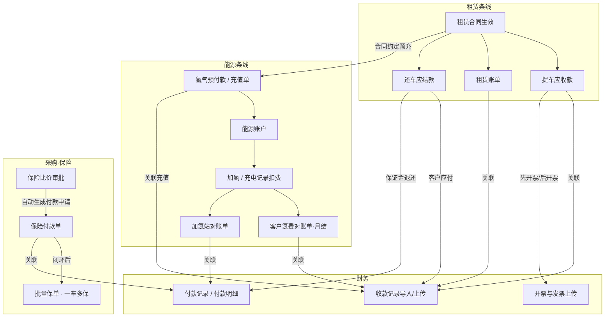

---

## 2. 财务侧共性机制

### 2.1 收款从哪里来

财务收款记录**主要由客户向公司打款产生的收款业务**形成，系统侧通过财务**手动上传 / 导入**进入，再由业务、业管或能源人员**主动关联**到对应业务单据。

与租赁相关的收款业务主要包括：

1. **提车应收款**
2. **租赁账单**
3. **还车应结款**（客户侧仍有应付时）

此外还有：**能源账户充值 / 氢气预付款**、**客户氢费对账单（月结）** 等，同样依赖收款记录关联闭环。

### 2.2 付款从哪里来

当还车结算后出现**应退客户**（含保证金大于尾期应付、预付款模式提前还车多收等），对**加氢站**付款，或向**保险公司供应商**支付保费时，费用由**公司账户支付**，对应**付款单 / 付款明细 / 付款记录**，需与业务单据（还车应结款、加氢站对账单、**保险付款单**）关联。

### 2.3 闭环通用公式

```text
业务单据（应收/应付金额、状态）
        ↕ 人工关联（业务/业管/能源/采购）
财务收/付款记录（实收/实付、时间、附件）
        → 回写业务状态（付清/部分/未收、已付款、账户余额、可否交车等）
```

**关键纪律**：财务负责「钱进系统」；业务条线负责「钱对上哪张单」；不允许只收款不关联，也不允许只开单不核销。

---

## 3. 租赁条线：提车应收款

### 3.1 应收如何自动生成（标准合同约定）

| 提车约定时点 | 租金 | 保证金 | 服务费 | 应收合计逻辑 |
|--------------|------|--------|--------|--------------|
| **每月 15 号前**约定提车 | 当月**剩余天数**租金 | 一次性保证金 | 按剩余天数自动计算的服务费 | 剩余天租金 + 保证金 + 剩余天服务费 |
| **每月 15 号后**约定提车 | **当月 + 下个自然月**整月租金 | 一次性保证金 | **整月**服务费 | 当月+下月整月租金 + 保证金 + 整月服务费 |

提车应收款**自动生成**后进入开票与收款关联流程。

### 3.2 开票两种模式

| 模式 | 是否审批 | 流程要点 | 闭环完成标志 |
|------|----------|----------|--------------|
| **先开票** | 要 | 业务/业管申请 → 流程审批通过 → 财务开票 → 上传发票附件、开票时间、开票金额 → 业务/业管可从提车应收款**下载发票**交给客户 | 发票已回传到单据 |
| **后开票** | 不要 | 先关联收款记录 → 通知财务开票金额与开票信息 → 财务开票并上传发票 | 收款已关联 + 发票已上传 |

### 3.3 交车门禁（业财咬合点）

- 客户打款后：**财务手动上传收款记录**。
- **业务或业管主动关联**收款记录到提车应收款。
- **实收 = 提车应收金额**：可正常交车放行。
- **实收 < 应收**：原则上不可交车；若要对客户**特例放行**，必须走**特批流程**。

> 无论先开票还是后开票：**只要收款记录已关联提车应收款且付清**，即可放行交车（特例除外）。

### 3.4 提车应收 · 流程图

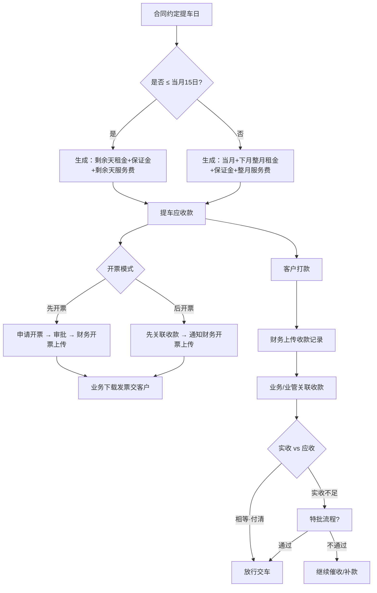

### 3.5 角色协作（提车）

| 步骤 | 业务/业管 | 财务 | 系统 |
|------|-----------|------|------|
| 生成应收 | 确认合同与提车日 | — | 按 15 日规则自动算应收 |
| 先开票 | 发起申请、跟审批、下载发票 | 审批后开票并上传 | 单据挂发票 |
| 后开票 | 关联收款后通知开票信息 | 按通知开票上传 | 单据挂发票 |
| 收款闭环 | **主动关联**收款到提车应收 | 上传收款记录 | 比对实收/应收 |
| 交车 | 付清放行；不足走特批 | — | 门禁校验 |

---

## 4. 租赁条线：租赁账单

### 4.1 计费起点与期次规则

租赁账单按车辆**实际交车成功时间**起算，不按合同约定提车日空想：

| 规则 | 说明 |
|------|------|
| 首日不足一天 | 交车时间在**中午 12:00 之后** → 首日只计**半天**，只收半天费用 |
| **首期账单** | 交车成功时间 → **当月月底**；自动计算当月剩余天数应收费用 |
| **第二期及以后** | 按**自然月**整月收取 |

### 4.2 与提车应收的抵扣关系

- 提车应收款中，**首月应付部分**在首月自动从提车应收中体现/扣除；
- 若提车应收已多收（例如 15 号后提车预收了下月整月），**多出部分在次月账单自动抵扣**；
- 次月客户只需支付**抵扣后的应收金额**。

### 4.3 里程减免

- 依据租赁合同约定的**里程要求**：当车辆达到里程要求时，**次月账单自动减免**合同约定的里程减免金额。
- 若该车**车机、GPS 均未取到里程数据**，不可自动减免，须**人工提报**，并上传：
  - 车辆里程表照片
  - 车牌照片  
  照片须带水印（含**时间、地址**）。

### 4.4 账单固定生成、通知与逾期宽限

- **第二期起**：每月 **25 日固定生成**当期租赁账单。
- 生成时提醒合同对应**业务人员、业管人员**（通道：短信、邮箱、站内信、微信服务号）。
- 账单生成后，按**集团管理制度宽限天数**判定逾期：超出宽限时限即记为**逾期**。
- 客户类型在**客户管理**模块由**业务管理部维护**，宽限按下表执行：

| 客户类型 | 定义（集团管理制度） | 宽限天数 |
|----------|----------------------|----------|
| **KA 客户** | 重要集团客户：政府、国企、央企、世界 500 强等；或公司预判的未来重要合作战略客户 | **15 日** |
| **LA 客户** | 大中型客户；当前市场口径：租赁/运营车辆 **≥ 10 台** | **10 日** |
| **SMB 客户** | 中小型客户；租赁/运营车辆 **＜ 10 台** | **6 日** |

> 逾期起算：账单生成日（通常为每月 25 日）起算宽限天数，超期即逾期（用于催款与财务评分）。

### 4.5 账单附加费用（滚入下期）

除租金/服务费外，下列由客户承担的费用进入**下期租赁账单**：

| 来源部门 | 费用类型 | 进入账单方式 |
|----------|----------|--------------|
| 安全部 | 事故记录导致的**保险上浮**、**违规罚款**、**违章待处理**等 | 安全侧上传/确认后滚入下期 |
| 运维部 | **维修费用**中客户承担部分 | 运维上报后滚入下期 |

### 4.6 无忧包费用（合同约定）

依据租赁合同是否购买 **易损保 / 轮胎保 / 养护保** 三种无忧包，按运维提供的最新易损保、养护保等规则**自动计算费用**并体现在账单侧。

> 运维为测试里程任务从客户处拿车产生的里程，从**其他业务登记**中扣除，不与客户里程减免/计费混淆。

### 4.7 业财闭环（租赁账单）

客户打款 → 财务上传/导入**收款记录** → **业务/业管关联到对应租赁账单** → 账单实收状态更新，形成闭环。

### 4.8 期末余额与催款埋点

- 在**提车应收款、租赁账单**嵌入数据埋点，自动汇总客户**期末余额**，供催款使用。
- **初期**系统尚无准确期末余额时：以财务提供的**期末余额 + 期末余额截止时间**为准。
- 自该截止时间之后产生的全部业务，系统**自动推算当前实时期末余额**。

### 4.9 租赁账单 · 流程图

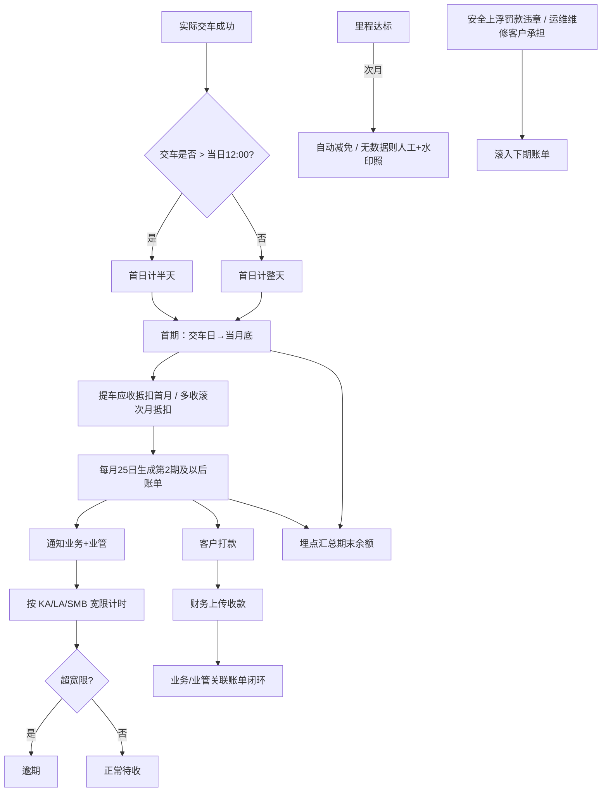

---

## 5. 租赁条线：还车应结款

### 5.1 退租日期与尾期应收/应退

- 用户**还车成功**且完成 **E 签宝用户方签字**时，该时点即为车辆**实际退租日期**。
- 以实际退租日期，对照**最后一期账单实收金额**等，计算客户**应收或应退**：
  - **预付款模式**客户通常提前一个月支付下月款项；**提前还车**会导致多收，需**退还客户**。
- 业财闭环：

| 结果 | 流程 | 财务单据 |
|------|------|----------|
| **应收** | 客户付款 → 财务上传收款记录 → 关联**尾期/还车应结款** | 收款记录 |
| **应退** | 生成**还车退款申请** → 财务支付 → 导入付款记录 → 关联应退的还车应结款 | 付款记录 |

（若保证金大于尾期应付，同样走付款退还路径，与前述一致。）

### 5.2 还车应结明细构成（新体系）

#### 5.2.1 业务管理组

| 项目 | 规则 | 待拍板 |
|------|------|--------|
| **ETC 费用** | 原则上新体系业管组主要登记 ETC 相关费用；也可按交车→还车时段**系统自动拉取 ETC 费用** | — |
| **ETC 卡缺损 / ETC 设备损坏** | 还车点检时认定损坏并计费 | **责任部门待界定：业管组 vs 运维组** |

#### 5.2.2 能源组 · 氢量差补缴

- 取运维**交车氢量**与**还车氢量**自动相减得氢量差；
- 若还车氢量 **＜** 交车氢量：氢量差 × 租赁合同约定的**退还车氢量差单价** → **氢量差补缴费用**，计入还车应结。

#### 5.2.3 运维部 · 自动/半自动费用

| 项目 | 计算规则 |
|------|----------|
| **未结算保养** | 按里程 / 保养时间**孰先到达**自动计算，未结算部分计入 |
| **未结算维修费** | 运维手动录入的维修工单中，**客户承担且尾期未付**部分 |
| **工具损坏丢失** | 交车时有、还车时无 → 按工具总价自动计 |
| **证照丢失** | 交车时有、还车时无 → 按公司文件约定分别收取 |
| **广告损坏丢失** | 目前**无固定价格**（会上待定能否固定价） |
| **送车 / 接车服务费** | 运维交车、还车时是否填写 → 自动取数 |
| **轮胎磨损** | （交车时全部轮胎+备胎胎纹深度）−（还车时全部轮胎+备胎胎纹深度）；若还车更浅，则 **每毫米单价 × 胎纹深度差** 自动计费 |

#### 5.2.4 安全组 · 未结费用并入尾期

违章处理违约金、保险上浮及其他违规费用：

- 若已在**租赁账单**中由客户打款并完成收款关联闭环 → **还车不再收**；
- 若**未支付** → 全部明细体现在还车应结款中，向客户收取。

### 5.3 还车应结 · 流程图

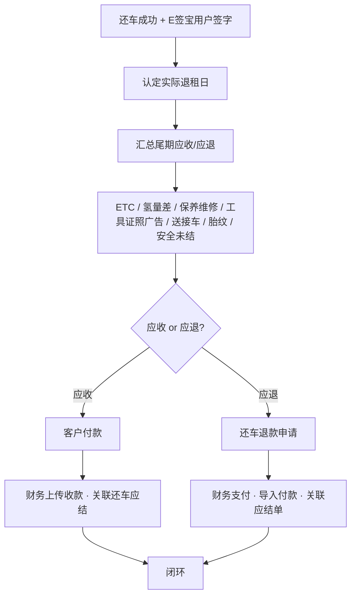

### 5.4 还车角色协作速览

| 费用块 | 主责录入/规则 | 系统动作 |
|--------|---------------|----------|
| ETC 通行费 | 业管登记或系统拉取 | 汇总入应结 |
| ETC 损坏 | **待定业管/运维** | 计损 |
| 氢量差 | 能源按运维氢量记录 | 自动算补缴 |
| 保养/维修/工具/证照/送接车/胎纹 | 运维点检与工单 | 自动或半自动入应结 |
| 广告损 | 运维点检 | **单价待定** |
| 安全未结 | 安全 | 未在账单闭环的并入尾期 |
| 收/付款闭环 | 业务跟单 + 财务 | 关联收/付款记录 |

---

## 6. 客户风险评估与租赁准入/预警

### 6.1 三类评估如何产生

业务管理组在**客户管理**维护客户信息后：

| 评估 | 责任方 | 产生方式 |
|------|--------|----------|
| **法律风险评估** | 法务 | 系统**每 3 个月自动生成** |
| **安全风险评估（安全评分）** | 安全部 | 根据违规情况**自动计算** |
| **账务风险评估（财务评分）** | 财务部 | 根据客户**逾期情况**自动计算 |

### 6.2 综合判定与业务影响

综合三项评估得分，并判断三项是否触达**公司红线**：

| 场景 | 系统动作 |
|------|----------|
| 新签租赁业务 | 视综合评分与红线情况，可能走**特殊审批流程**后方可创建 |
| 综合评分 **＜ 10**，或任一项触达公司红线 | 对**进行中合同**发出**风险预警** |
| 预警通知对象 | **短信 / 邮件 / 微信**通知法务、安全、财务等对应部门；同时通知**业务人员、业管人员** |
| 业务侧处置 | 业务/业管可按实际情况**主动终止合作并强制收车**（降风险；需结合**标准合同条款修订**，并保留公司**最终解释权**） |

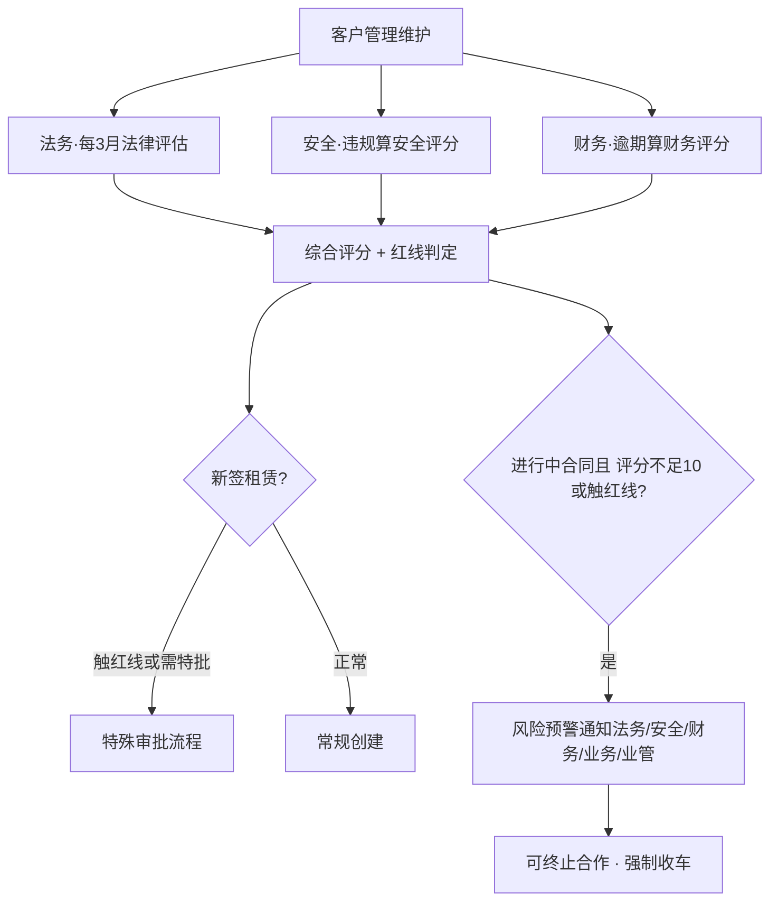

---

## 6b. 标准合同与租赁合同（签约 = 规则锁死）

### 6b.1 前置：标准合同管理

来源：法务形成的**标准制式化合同**。可维护：

| 能力 | 说明 |
|------|------|
| **风控红线** | 触及或改动即触发非标路径 |
| **条件可见条款/附件** | 按部分**品牌、车型**控制可见的条款与附件 |
| **锁定区域** | 不可由业务随意修改 |

### 6b.2 租赁合同创建与锁死

1. 调取对应标准合同模板；
2. **改动风控红线**或**新增合同内容** → **自动进入非标审批**；
3. **编号自动化且唯一**（规划消除现存编号重复）；
4. **合同即规则 · 一对一锁死**：条款与标准合同锁死；提车应收、租赁账单、还车应结、里程要求等关键要素均由本合同驱动。

### 6b.3 签章闭环

| 路径 | 流程 |
|------|------|
| 线上 | 在线打印；E 签宝自动签章；客户登录 E 签宝签客户章 |
| 线下 | 分享链接或不可篡改文件 → 客户盖章回传法务 → 法务补附件闭环 |

**未闭环**：工作台**催办任务常驻**，直至办结。

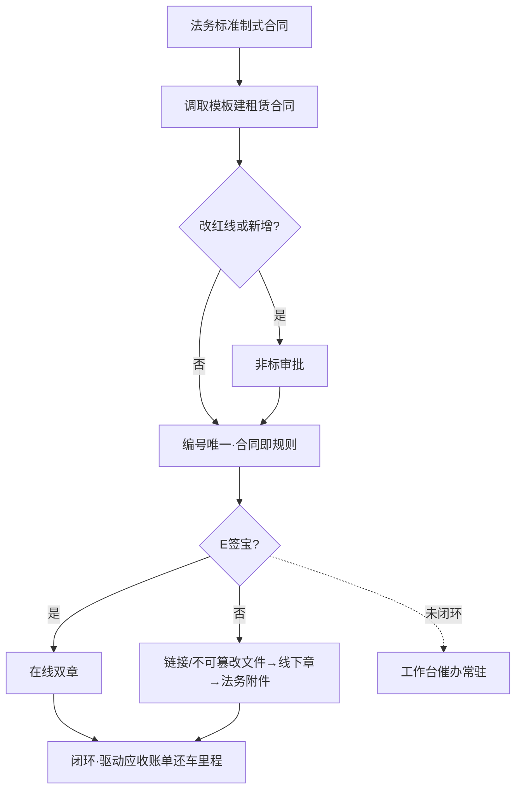

---

## 7. 能源账户与氢气预付款

### 7.1 能源账户用途

- 客户按**项目**维度持有能源账户，用于**氢气费、充电费**的预充值。
- 发生加氢 / 充电业务时，**自动从账户余额扣减**。
- 支持**单独发起充值单**；充值单与财务收款管理关联，形成「充值单 → 实收 → 入账」闭环。
- 租赁合同条款也可约定**氢气预充值**。

### 7.2 合同氢气预付款入账规则

租赁合同创建后，**氢气预付款**在「能源账户充值」中单独展示。

客户打款后：

1. **业务人员手动关联收款记录**；
2. 关联成功后，**关联部分金额自动充入**该客户对应项目的能源账户；
3. **是否已有能源账户**：
   - **有**：按关联金额充入；
   - **无**：自动创建该项目能源账户，再按关联金额充入。

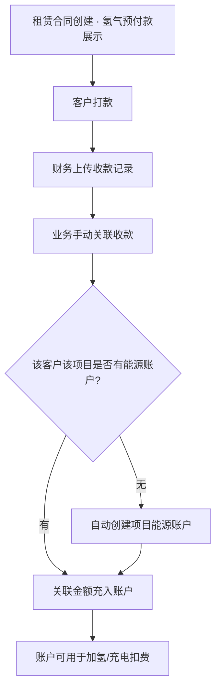

### 7.3 独立充值单

能源账户可单独发起充值 → 与财务收款关联 → 实收确认后余额增加。逻辑与预付款一致：**无单不充值，无关联不入账**。

---

## 8. 能源消耗：加氢 / 充电如何从账户扣费

### 8.1 扣费前提

账户有余额；业务记录**已核对完成**后，才自动扣减（避免未对账先扣）。

### 8.2 加氢记录来源（两路）

| 来源 | 路径 | 扣费时机 |
|------|------|----------|
| **一、加氢站主动上传** | 加氢站上传记录 → **能源部对账完成** | 对账完成后从能源账户扣除 |
| **二、能源部手动维护** | 「车辆氢费明细」录入并完成核对 | 核对完成后自动从账户扣除 |

充电记录同理：产生业务后按规则从能源账户扣除（与账户余额联动）。

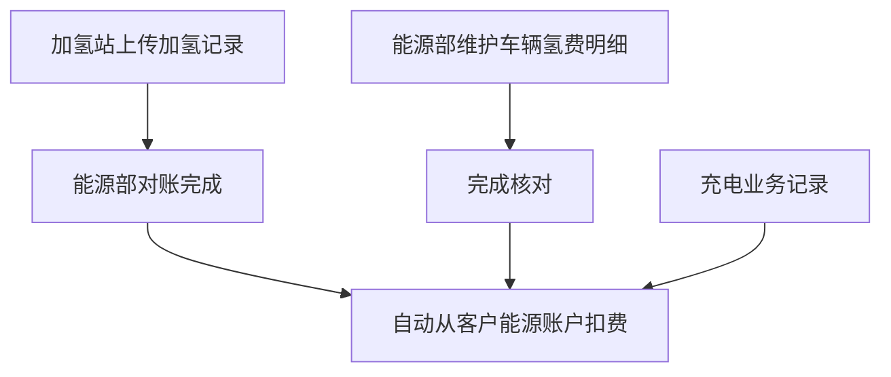

---

## 9. 客户侧氢费：月结算对账（应收闭环）

适用：租赁合同约定氢气费用结算方式为**月结算**。

### 9.1 流程步骤

1. **能源部**在「氢气账单管理」下，向**单个客户**发起对账单；
2. 筛选**开始～结束时间**，点击生成 → 汇总该时段内**已核对**的车辆氢气明细；
3. **导出对账单**，与客户确认；
4. 确认无误后，点击**生成对账单**（正式单据）；
5. 客户打款 → **财务上传收款记录**，并通知能源部；
6. **能源部手动**将收款记录与该氢气对账单关联；
7. 按实收情况回写状态。

### 9.2 对账单收款状态界定

| 状态 | 界定条件 |
|------|----------|
| **已付清** | 已关联收款，且实收 ≥ 应收（或按规则认定已打清） |
| **部分收款** | 已关联收款，但实收 < 应收 |
| **未收款** | 客户未打款，**或**系统收款记录中不存在已关联到该对账单的收款 |

### 9.3 流程图

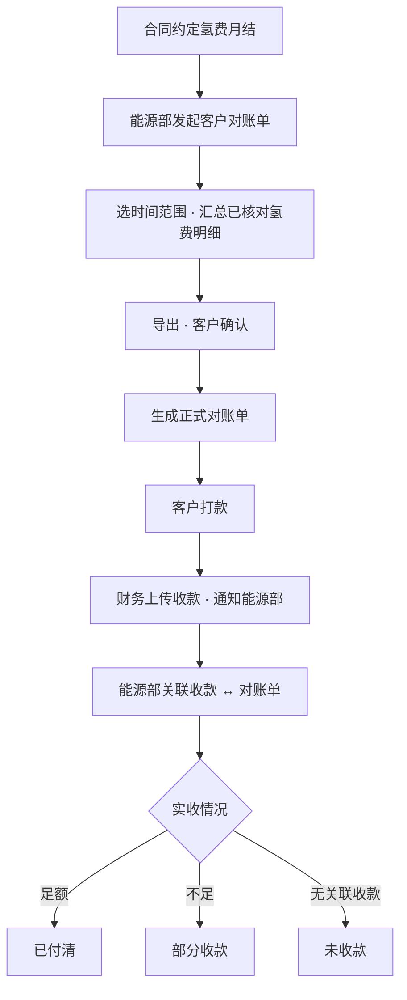

### 9.4 业财分工

| 步骤 | 能源部 | 财务 |
|------|--------|------|
| 出账与客户确认 | 发起、生成、导出、确认 | — |
| 收款进系统 | 被通知后**关联** | 上传收款记录 |
| 状态 | 依据关联结果看账单状态 | 保证收款数据准确完整 |

---

## 10. 加氢站侧：对账与付款（应付闭环）

加氢站相关对账方式原则：

- **客户承担的氢费**：由**客户**侧对账（见第 9 节）；
- **公司与加氢站之间的结算**：由**采购部**发起加氢站对账单，走付款审批与财务付款关联。

### 10.1 流程步骤

1. **采购部**在「加氢站站点管理」下，向**单个加氢站**发起对账单；
2. 筛选时间范围并生成 → 汇总时段内**已核对**的车辆氢费明细；
3. 导出对账单，经**加氢站确认**；
4. 采购部上传：
   - 加氢站**开票金额**
   - **发票附件**
   - **开票时间**
   - **盖章后的对账单附件**
5. 点击**发起付款申请** → 进入**审批工作流** → 终审节点到**财务**；
6. 财务完成付款后，在**付款明细**中关联该对账单；
7. 对账单标记为**已付款**，闭环完成。

### 10.2 流程图

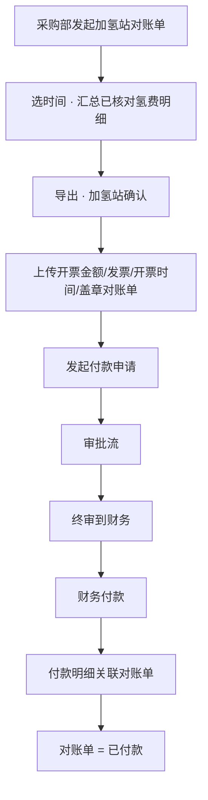

### 10.3 业财分工

| 步骤 | 采购部 | 财务 | 加氢站 |
|------|--------|------|--------|
| 出账确认 | 发起、生成、催确认 | — | 确认明细 |
| 票据 | 上传发票与盖章件 | 审核付款依据 | 开票 |
| 付款 | 发起申请跟审批 | 审批终态执行付款并关联付款明细 | — |

---

## 11. 采购条线：保险采购（比价 · 付款 · 保单）

### 11.0 前置：供应商账户信息（自动打款任务）

在**供应商管理**模块中，凡属后续需**自动生成付款任务**的主体（含**保险公司**，以及同类应付供应商），必须维护并上传**收款账户信息**（开户名、开户行、账号等，以财务打款要素为准）。

| 要求 | 说明 |
|------|------|
| 谁维护 | 采购在供应商管理中维护；财务可复核账户要素 |
| 维护什么 | 供应商收款账户信息（打款必备字段） |
| 干什么用 | 业务审批通过后**自动生成付款任务**时，带出账户信息，**告知财务打款对象与账号**，减少口头/邮件传账号 |
| 门禁建议 | 账户信息未完善的供应商，**不允许**自动生成付款任务（或生成后标红阻断提交财务） |

> 保险公司是首批典型主体；加氢站等其他需自动付款的供应商，同一套「先建档账户 → 再自动出付款任务」规则。

### 11.1 总体逻辑

保险采购遵循 **「比价流程」与「保单上传」同步推进、付款闭环后再批量落保单** 的处理原则：

0. **供应商建档**：保险公司等主体在供应商管理上传**账户信息**（见 §11.0）；
1. **比价**：采购发起比价 → 走审批；
2. **付款申请 / 付款任务**：比价流程**审批通过后，自动生成保险付款申请（付款任务）**推送财务，并**带出供应商账户打款信息**；
3. **付款闭环**：财务按账户信息向保险公司供应商完成付款 → **导入付款记录**并**关联保险付款单** → 保险付款单闭环完成；
4. **保单管理**：付款闭环后，采购部可对本批次车辆**批量上传保单** → 系统**自动识别** → 支撑 **一车多保** 管理。

> 「同步」含义：比价与保单准备可并行推进；但**批量上传保单并完成一车多保归档，以保险付款单业财闭环完成为前提门禁**（避免未付款先挂正式保单档案）。

### 11.2 业财闭环步骤

| 步骤 | 采购部 | 财务 | 系统 |
|------|--------|------|------|
| 供应商账户 | 在供应商管理上传/维护账户信息 | 可复核账户要素 | 账户作为自动付款任务数据源 |
| 比价 | 发起比价、跟审批 | — | 比价流程审批 |
| 付款申请 | （审批通过后自动生成，采购可跟踪） | 接收保险付款申请，**查看打款账户信息** | **自动生成**付款任务/保险付款申请并带出账户 |
| 付款执行 | — | 按账户信息向保险公司供应商付款 | — |
| 付款关联 | — | 导入付款记录并关联保险付款单 | 回写付款单已付 / 闭环 |
| 保单上传 | 付款闭环后**批量上传**该批次车辆保单 | — | **自动识别**；一车多保建档 |

### 11.3 流程图

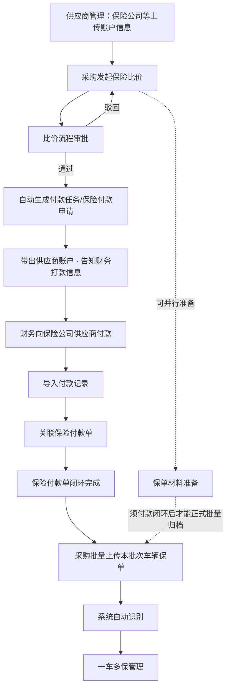

### 11.4 一车多保

- 同一车辆可挂接多份保单（如交强险、商业险、承运人责任险等，以实际险种为准）；
- 批量上传后由系统自动识别并归集到对应车辆，形成该车保单清单，便于续保、理赔与台账查询。

---

## 12. 两条线如何串成「业财一张网」

### 12.1 从合同到能源 / 采购的资金与单据链

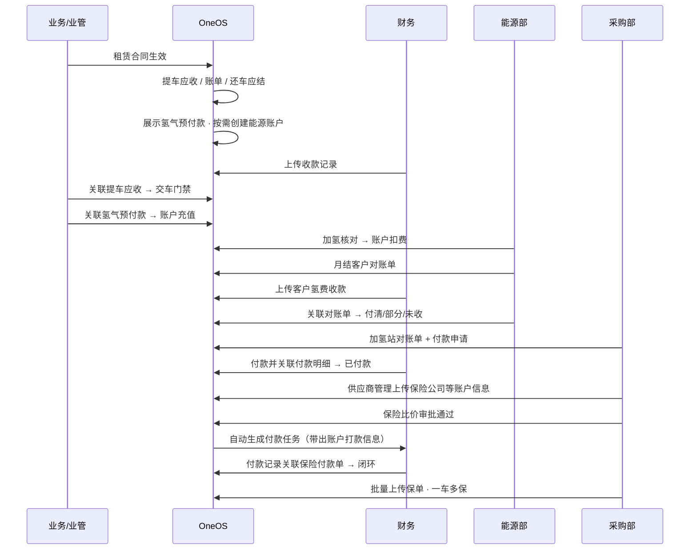

### 12.2 闭环检查清单（会上可逐项对）

| # | 检查项 | 通过标准 |
|---|--------|----------|
| 1 | 提车 | 收款已关联且实收=应收（或特批通过）才交车 |
| 2 | 开票 | 先开票有审批+发票回传；后开票有收款关联+发票回传 |
| 3 | 租赁账单计费 | 按实际交车起算；12 点后首日半天；首期至月底；二期起自然月；25 日生成 |
| 4 | 账单减免/抵扣 | 里程达标次月减免；无车机/GPS 须人工+水印照；提车多收次月抵扣 |
| 5 | 账单逾期 | 按 KA15 / LA10 / SMB6 宽限；客户类型由业管维护 |
| 6 | 账单附加费 | 安全上浮/罚款/违章、运维维修客户承担滚入下期；无忧包按规则计费 |
| 7 | 期末余额 | 埋点汇总；初期用财务截止余额向后推算实时余额 |
| 8 | 租赁账单收款 | 每笔实收都能追溯到账单关联 |
| 9 | 还车退租日 | 还车成功 + E 签宝用户签字 = 实际退租日；预付提前还车可应退 |
| 10 | 还车应结 | 应收→收款关联；应退→退款申请→付款关联；明细含 ETC/氢差/运维/安全未结等 |
| 11 | 客户风险 | 法务/安全/财务三维评估；红线或综合分＜10 预警；新签可特批；可强制收车 |
| 12 | 能源充值 | 关联收款后余额增加；无账户则自动建户 |
| 13 | 氢/电消耗 | 仅已核对记录扣账户 |
| 14 | 客户月结氢费 | 能源关联收款后状态=已付清/部分/未收 |
| 15 | 加氢站付款 | 审批→财务付款→付款明细关联→对账单已付款 |
| 16 | **保险采购** | 比价审批通过→自动保险付款申请（带供应商账户）→付款记录关联保险付款单→闭环后批量上传保单·一车多保 |
| 17 | **供应商账户** | 保险公司等自动付款主体已在供应商管理上传账户信息；付款任务自动带出打款信息告知财务 |

---

## 13. 会上建议对齐的结论（供拍板）

1. **业财分工钉死**：财务管收/付款进系统与开票付款执行；业务条线（含能源、采购、运维、安全）管单据、点检与关联。
2. **关联是闭环开关**：无关联则不得假性「已结清 / 已充值 / 已付款」。
3. **交车强门禁**：提车应收付清才放行；不足必须特批。
4. **账单节奏统一**：实际交车起算 + 每月 25 日生成 + KA/LA/SMB 宽限逾期。
5. **还车应结一张清单**：退租日以 E 签宝用户签定为准；应收/应退分走收、付闭环。
6. **待拍板三项**（会上必须钉死）：
   - **ETC 卡/设备损坏**：还车点检责任归**业管组**还是**运维组**；
   - **广告损坏丢失**：能否制定**固定价格表**；
   - **强制收车 / 终止合作**：标准合同条款如何改，并保留公司最终解释权。
7. **能源账户是氢/电资金池**：预付与充值统一「关联收款 → 入账」；消耗统一「核对后扣减」。
8. **氢费双边对账**：客户月结走能源应收；加氢站走采购应付 + 财务付款。
9. **客户风险三维联动**：法律 / 安全 / 财务评分 + 红线 → 新签特批、在途预警、可终止并强制收车。
10. **保险采购闭环**：比价审批通过自动生成付款申请；付款记录关联保险付款单后，才批量上传保单并完成一车多保。
11. **供应商账户先建档**：保险公司等需自动生成付款任务的主体，须在供应商管理上传账户信息；付款任务自动带出打款信息告知财务。

---

## 附录 A · 单据与状态速查

| 单据 | 主责部门 | 关联财务对象 | 关键状态 |
|------|----------|--------------|----------|
| 提车应收款 | 业务/业管 | 收款记录 | 未收 / 部分 / 付清；可否交车；开票进度 |
| 租赁账单 | 业务/业管 | 收款记录 | 待收 / 部分 / 付清；宽限内 / 逾期 |
| 还车应结款 | 业务/业管（汇总）+ 运维/能源/安全明细 | 收款或付款 | 应收结清 / 应退已付 |
| 还车退款申请 | 业务发起 / 财务支付 | 付款记录 | 审批中 / 已支付 |
| 能源充值 / 氢气预付款 | 业务 | 收款记录 | 是否已入账 |
| 客户氢费对账单 | 能源 | 收款记录 | 已付清 / 部分收款 / 未收款 |
| 加氢站对账单 | 采购 | 付款明细 | 待付款 / 已付款 |
| **保险付款单** | 采购发起 / 财务付款 | 付款记录 | 待付 / 已闭环；闭环后可批量上传保单 |

## 附录 B · 名词对照

| 名词 | 含义 |
|------|------|
| 业财闭环 | 业务应收应付与财务实收实付通过关联对齐并回写状态 |
| 先开票 / 后开票 | 先票后款（含审批） / 先款后票（关联收款后开票） |
| KA / LA / SMB | 客户分级；宽限分别为 15 / 10 / 6 日；业管在客户管理维护 |
| 实际退租日 | 还车成功且 E 签宝用户方签字完成的时点 |
| 期末余额 | 催款用客户余额；初期采财务截止值，之后业务自动推算 |
| 能源账户 | 客户项目维度的氢/电预充值账户 |
| 已核对氢费明细 | 可作为客户对账、加氢站对账与账户扣费依据的明细 |
| 无忧包 | 易损保 / 轮胎保 / 养护保，按合同购买与运维规则计费 |
| **一车多保** | 同一车辆挂接多份保单；付款闭环后批量上传并由系统自动识别归集 |
| **供应商账户信息** | 供应商管理中维护的收款账户要素；供自动生成付款任务时告知财务打款信息 |

## 附录 C · 会上待确认事项（摘录）

| # | 事项 | 建议会上结论方式 |
|---|------|------------------|
| 1 | ETC 卡缺损、ETC 设备损坏的还车检查与计费责任部门 | 二选一：业管 / 运维；或主检+会签 |
| 2 | 广告损坏丢失费用能否固定价 | 能 → 出价格表；不能 → 还车个案估价流程 |
| 3 | 风险触红线后强制收车的合同条款与最终解释权表述 | 法务牵头改标准合同 |
| 4 | 合同编号历史重复治理与唯一生成规则 | 系统强制唯一 + 历史数据治理 |

---

*文档依据产品口述整理，用于管理沟通与方案对齐；若与现行系统实现有差异，以会上拍板结论回写需求为准。*
