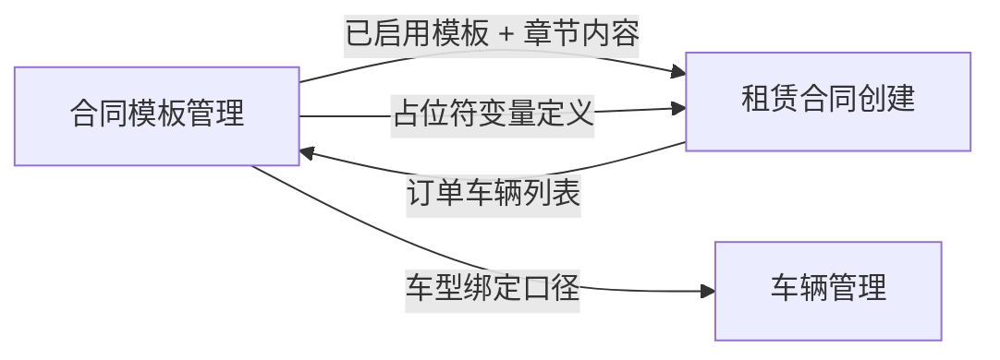

# 合同模板管理 · 产品需求文档（PRD）

| 项 | 内容 |
|---|---|
| 文档版本 | v1.4 |
| 模块名称 | 合同模板管理 |
| 所属系统 | ONE-OS 业务管理 |
| 目标读者 | 前端 / 后端 / 测试 / 法务产品对接人 |
| 交互原型 | `/prototypes/contract-template-management` |
| 关联原型 | [车辆管理](/prototypes/vehicle-management)（车型主数据口径参考） |
| 文档状态 | 已对齐原型（v1.4：章节 Tab 由 Word「标题」自动生成；列表筛选类型字段；未导入 Word 不展示章节导航） |

---

## 1. 背景与目标

### 1.1 背景

商用车租赁合同以 Word 文档形式维护，内容长、结构复杂，包含合同主体与 8 个附件章节。不同车型可能需要不同的附件条款组合。法务人员需要：

- 以 **Word 版式保真** 的方式维护整份合同；
- 按 **章节** 管理内容，并配置 **适用车型**；
- 发布 **版本**，通过 **启用/停用** 控制模板是否可供租赁合同选用；
- 在合同主体及租赁订单～安全责任协议各章节中配置 **条件条款**（按订单车辆命中显隐）。

### 1.2 产品目标

| 目标 | 说明 |
|---|---|
| 降低维护成本 | 一份 Word 文件 = 一条记录，导入后自动拆分章节 |
| 保证合规可控 | 支持锁定区、风控红线条款标记与统计 |
| 支撑业务差异化 | 附件章节按车型绑定；各章节均支持条件条款 |
| 版本可追溯 | 草稿 / 已发布分离；已发布修改产生新版本并写入版本日志 |
| 多套模板并存 | 正式/试用、不同车型等多套已发布模板可同时存在；租赁创建时由用户选择 |

### 1.3 非目标（本期不做）

- 采购合同、服务合同等其他分类的完整业务闭环（数据结构预留 `category`，当前仅启用 `lease`）
- 在线多人协同编辑、审批流配置界面
- Word 导出回写（本期以 HTML 结构化存储 + 预览为主）
- 列表页顶部章节 Tab（**仅编辑页**保留章节 Tab）

---

## 2. 用户与场景

### 2.1 目标用户

| 角色 | 诉求 |
|---|---|
| 法务人员（主用户） | 导入/编辑 Word 模板、发布版本、启用/停用模板 |
| 客服人员（间接用户） | 草拟新合同时从已启用模板中选择（下游「租赁合同管理」消费） |
| 运营 / 风控（间接用户） | 查看风控红线条款配置情况 |

### 2.2 核心用户故事

1. **作为法务**，我希望导入一份完整 Word 合同，系统自动拆成 9 个章节，以便分章节维护。
2. **作为法务**，我希望为「租赁订单」等附件章节绑定适用车型，以便创建合同时只纳入匹配车辆的条款。
3. **作为法务**，我希望在合同主体及租赁订单～安全责任协议各章节为某段落设置「条件条款」并绑定车型，以便不同车型看到不同正文。
4. **作为法务**，我希望保存草稿不产生版本号，发布后才生成版本号，以便区分未上线内容。
5. **作为法务**，我希望对已发布模板执行启用/停用，停用后方可编辑，并在发布变更时自动归档旧版快照到版本日志。
6. **作为客服**，我希望在创建租赁合同时第一步选择要使用的已启用合同模板。
7. **作为法务**，我希望在列表展开行查看各章节的风控条款数、条件条款数，以便快速评估模板完整度。

---

## 3. 名词解释

| 名词 | 定义 |
|---|---|
| Word 文档 / 模板记录 | 列表主表一行，对应一份完整合同文件 |
| 章节 | 合同内的逻辑切片，共 9 个（1 个主体 + 8 个附件） |
| 草稿 | `status = draft`，无版本号 |
| 已发布 | `status = published`，有版本号 `vX.XX` |
| 启用 | `enabled = true` 的已发布模板，可供租赁合同创建选用 |
| 停用 | `enabled = false` 的已发布模板，不可编辑/删除，不可被租赁创建选用 |
| 版本日志 | `versionLogs[]`，记录发布变更前自动归档的快照 |
| 锁定区 | 编辑区内不可随意修改的段落，HTML 标记 `data-inline-lock="1"` |
| 风控红线条款 | 需重点合规关注的条款，HTML 标记 `data-risk-redline="1"` |
| 条件条款 | 各章节可用，按订单车辆命中显隐，HTML 标记 `data-vehicle-clause="1"` |
| 适用车型绑定 | 附件章节级别配置，决定该章节是否纳入某份合同 |
| 合同名称 | `contractName`，用户自定义展示名，如「正式合同」「试用合同」 |
| 类型 | `contractType` 枚举：合同 / 授权委托书 / 转三方协议 / 其他 |
| 模板占位符 | 形如 `{{contractCode}}` 的变量，创建合同时由系统替换 |

---

## 4. 信息架构

```text
合同模板管理
├── 列表页
│   ├── 筛选区
│   ├── 工具栏（新增）
│   └── 嵌套表格
│       ├── 主表：Word 文件
│       └── 子表：9 个章节（展开行）
└── 编辑 / 新增页
    ├── 顶栏（返回、保存、保存并发布）
    ├── 章节 Tab（仅本页展示）
    ├── 条件条款说明（各章节均可使用工具栏「条件」）
    ├── 适用车型绑定（附件章节 Tab 时显示）
    └── 工作区
        ├── 左侧：Word 版式编辑区
        └── 右侧：A4 实时预览
```

---

## 5. 数据模型

### 5.1 模板记录（Word 文档级）

一条记录代表 **一份 Word 合同文件**，不按章节拆成多行。

```typescript
interface ContractTemplateDocument {
  id: string;                          // 唯一 ID
  category: 'lease';                   // 合同分类，当前固定商用车租赁
  contractName: string;                // 合同名称，用户自定义，如「正式合同」
  contractType: string;                // 类型枚举：合同 | 授权委托书 | 转三方协议 | 其他
  fileName: string;                    // Word 文件名，如「现代18吨车型-数智中心版.docx」
  versionName: string;                 // 展示用版本名称
  versionNo: string | null;            // 已发布：v1.00；草稿：null
  status: 'draft' | 'published';
  enabled: boolean;                    // 已发布模板是否启用（草稿恒为 false）
  versionLogs: VersionLogEntry[];    // 版本变更日志与快照
  sectionContents: Record<SectionKey, string>;           // 各章节 HTML
  sectionVehicleBindings: Record<SectionKey, VehicleBinding[]>; // 各章节车型绑定
  creator: string;
  createTime: string;                  // YYYY-MM-DD HH:mm
  updater: string;
  updateTime: string;
  remark?: string;                     // 内部备注（列表不展示）
}

interface VersionLogEntry {
  id: string;
  versionNo: string;                   // 归档时的版本号
  action: string;                      // 如「发布变更」
  operator: string;
  time: string;
  remark?: string;
  snapshot: {
    fileName: string;
    versionName: string;
    versionNo: string;
    sectionContents: Record<SectionKey, string>;
    sectionVehicleBindings: Record<SectionKey, VehicleBinding[]>;
    remark?: string;
    archivedAt: string;
  };
}

interface VehicleBinding {
  brand: string;   // 品牌，如「现代」
  model: string;   // 型号，如「18吨氢燃料电池车」
}
```

### 5.2 章节枚举（SectionKey）

| key | 章节名称 | 车型绑定 | 条件条款 |
|---|---|:---:|:---:|
| `main` | 合同主体 | 否 | 是 |
| `lease_order` | 租赁订单 | 是 | 是 |
| `vehicle_cost` | 车辆产生的费用 | 是 | 是 |
| `safety_notice` | 安全责任告知书 | 是 | 是 |
| `dynamic_supervision` | 重型普通货运车辆租赁动态监管责任告知与确认书 | 是 | 是 |
| `safety_commitment` | 安全责任承诺书 | 是 | 是 |
| `vehicle_spec` | 车辆使用规范和驾驶员要求 | 是 | 是 |
| `authorization` | 授权委托书 | 是 | 是 |
| `safety_agreement` | 安全责任协议 | 是 | 是 |

### 5.3 章节内容 HTML 标记规范

研发需保证存储、渲染、统计口径一致：

| 类型 | 选择器 / 属性 | 统计函数 |
|---|---|---|
| 锁定区 | `.ct-inline-lock[data-inline-lock="1"]` | `countLockRegions` |
| 风控红线 | `.ct-risk-redline[data-risk-redline="1"]` | `countRiskRedlineRegions` |
| 条件条款 | `.ct-vehicle-clause[data-vehicle-clause="1"]` | `countVehicleClauseRegions` |
| 条件条款车型 | `data-vehicle-bindings`（JSON 数组） | 预览命中逻辑 |

---

## 6. 业务规则（全局）

### 6.1 版本号规则

- 格式：`v{major}.{minor}`，如 `v1.00`、`v1.01`
- **仅发布时生成**；保存草稿时 `versionNo = null`
- 同分类下递增：取当前已发布版本最大 minor +1；minor ≥ 99 时 major +1、minor 归 0
- 首版默认 `v1.00`

### 6.2 保存与发布

| 操作 | 新增模式 | 编辑草稿 | 编辑已发布（须先停用） |
|---|---|---|---|
| **保存** | 新建草稿记录 | 更新原记录，保持草稿 | 更新原记录，**保持已发布与版本号**，仍为停用态 |
| **保存并发布** | 新建已发布记录 + 版本号，默认启用 | 原记录变已发布 + 版本号，默认启用 | **同记录升级版本号**；旧内容写入 `versionLogs` 快照；发布后默认停用，需手动启用 |

**校验**：保存/发布前须满足：

- 合同主体（`sectionContents.main`）不能为空；
- **合同名称**（`contractName`）已填写；
- **类型**（`contractType`）已选择。

**离开编辑**：有未保存修改时返回列表需二次确认。

### 6.3 启用 / 停用规则

1. 仅 **已发布** 模板具有启用态；草稿显示「—」。
2. **启用中**：不可编辑、不可删除；可供租赁合同创建选用。
3. **停用**：需二次确认（提示可能导致标准合同无法正常使用）；停用后可编辑、可删除；租赁创建不可选用。
4. **启用**：直接生效，无需二次确认。
5. 编辑已发布模板并发布后，模板自动变为 **停用**，需重新启用后下游才可选。

### 6.4 版本日志规则

1. 对已发布模板执行「保存并发布」前，系统将 **当前内容自动归档** 为快照写入 `versionLogs`。
2. 列表操作列提供「版本日志」，可查看历史版本号、操作人、时间与快照正文（只读）。
3. 列表主表 **一行对应一份 Word 文件**，历史版本通过日志追溯，不另增列表行。

### 6.5 删除规则

- **启用中** 的已发布模板不可删除。
- 其余记录可删除；删除前二次确认；删除后不可恢复。

### 6.6 列表排序

按 `updateTime` 降序。

### 6.7 筛选匹配规则

| 字段 | 匹配逻辑 |
|---|---|
| 合同名称 | 可搜索下拉；精确匹配 `contractName`（选项来自现有模板去重） |
| 类型 | 下拉；精确匹配 `contractType` 枚举 |
| 状态 | 精确匹配 `draft` / `published` |
| 创建人 | 精确匹配 `creator` |
| 启用状态 | `enabled`：仅已发布且启用；`disabled`：仅已发布且停用 |

> **已移除**：筛选项「适用品牌/适用车型」、主表列「备注」、「设为标准模板」能力。

---

## 7. 列表页需求

### 7.1 页面结构

筛选区 + 工具栏 + 嵌套表格。**列表页不展示章节 Tab。**

### 7.2 筛选区

| 字段 | 控件 | 说明 |
|---|---|---|
| 合同名称 | 可搜索下拉 | 选项来自现有模板 `contractName` 去重；支持输入模糊搜索 |
| 类型 | 下拉 | 合同 / 授权委托书 / 转三方协议 / 其他 |
| 状态 | 下拉 | 全部 / 已发布 / 草稿 |
| 创建人 | 下拉 | 选项来自现有模板 `creator` 去重 |
| 启用状态 | 下拉 | 全部 / 启用 / 停用（仅作用于已发布记录） |

**布局**：默认首行展示 4 项（合同名称、类型、状态、创建人）；第 5 项「启用状态」收入「更多筛选」折叠区（与全局 `vm-filter` 规则一致）。扩展筛选项已设置时，折叠区自动展开并显示角标。

**按钮**：

- **查询**：应用筛选条件
- **重置**：清空筛选恢复默认

### 7.3 工具栏

| 按钮 | 行为 |
|---|---|
| 新增 | 进入新增页，模式为 create；**未导入 Word 前不展示章节 Tab** |

### 7.4 主表字段

| 列名 | 字段 | 展示规则 |
|---|---|---|
| （展开列） | — | 宽 48px |
| 合同名称 | `contractName` | 展示用户自定义合同名称；同行展示启用状态 Tag |
| 类型 | `contractType` | 展示类型枚举文案 |
| 版本号 | `versionNo` | 草稿显示「—」 |
| 状态 | `status` | 已发布 / 草稿 Tag |
| 启用状态 | `enabled` | 已发布：启用/停用；草稿：「—」 |
| 创建时间 | `createTime` | — |
| 创建人 | `creator` | 展示短名（如 `法务-王静` → `王静`） |
| 最后更新时间 | `updateTime` | — |
| 更新人 | `updater` | 同创建人展示规则 |
| 操作 | — | 见 7.5 |

**分页**：每页 10 条，展示总条数。

### 7.5 主表操作

| 操作 | 显示条件 | 行为 |
|---|---|---|
| 启用 / 停用 | 已发布 | 停用需确认；启用直接生效 |
| 版本日志 | 已发布 | 查看历史快照 |
| 编辑 | 草稿，或已发布且停用 | 启用中按钮禁用 |
| 删除 | 草稿，或已发布且停用 | 启用中按钮禁用；删除前确认 |

### 7.6 子表（展开行）

主表每行可展开，展示该 Word 文档下 **9 个章节** 的摘要（原生 HTML 表，非嵌套 Ant Design Table）。

| 列名 | 说明 |
|---|---|
| 章节 | 章节名称 |
| 适用车型 | 附件章节展示绑定列表，格式「品牌 · 型号」；多个用「；」连接；未绑定显示「全部车型」；合同主体显示「—」 |
| 风控条款数 | 该章节 HTML 内风控红线标记数量 |
| 条件条款数 | 按各章节 HTML 统计条件条款标记数量 |

---

## 8. 编辑 / 新增页需求

### 8.1 页面结构

顶栏 → 章节 Tab（导入 Word 后展示）→ 合同主体配置 / 车型绑定（按章节显隐）→ 左右分栏工作区。

### 8.2 顶栏

| 按钮 | 行为 |
|---|---|
| ← 返回列表 | 回到列表页，不自动保存 |
| 保存 | 见 §6.2 |
| 保存并发布 | 见 §6.2 |

### 8.3 章节 Tab

- **新增模式**：未导入 Word 时 **不展示** 章节 Tab 导航（含「合同主体」）及合同主体配置卡片。
- **编辑模式**：优先按记录已保存的 `sectionTabs` 展示；无自定义 Tabs 时按 §9 规则生成。
- **Tab 生成逻辑（非固定列表）**：
  - 导入 Word 后，系统识别文档中被标记为 **「标题」** 样式的段落（Word 样式名如 `标题`、`标题1`～`标题3` 等，导入后映射为 `h1`～`h6`）；
  - 每个标题段落的纯文本生成一个章节 Tab，Tab 文案与标题一致；
  - 第一个标题之前的内容归入 **「合同主体」** Tab（`main`）；该 Tab 下编辑/预览 **整份 Word 合并全文**；
  - 其余 Tab 仅展示对应标题至下一标题之间的切片内容；
  - 若文档中 **未识别到任何标题**，回退为按 §9.2 预置章节标记切分的默认章节 Tab（与演示模板一致）。
- **展示**：横向滚动 Tab 条展示全部章节，右侧提供「章节列表」按钮打开可搜索的章节面板（便于长标题章节快速定位）。
- 切换 Tab 后，编辑区与预览区 **同步切换** 至对应章节内容。

### 8.4 合同主体配置（仅合同主体 Tab）

| 元素 | 说明 |
|---|---|
| 合同名称输入框 | **必填**；用户自行填写，如「正式合同」 |
| 类型下拉 | **必填**；选项：合同 / 授权委托书 / 转三方协议 / 其他 |
| 展示位置 | 章节 Tab 下方配置卡片，与附件章节的「适用车型」卡片交互一致 |
| 用途 | 同步至列表页「合同名称」「类型」列；租赁合同创建时按合同名称筛选模板 |

**规则**：

- 仅当存在 **合同主体** 章节 Tab 且当前选中该 Tab 时显示本卡片（未导入 Word 时不展示）。
- 未填写合同名称时无法保存或发布，并提示「请输入合同名称」。
- 未选择类型时无法保存或发布，并提示「请选择类型」。
- 切换至租赁订单等附件章节时，显示「适用车型」卡片，本卡片隐藏。
- 保存/发布时分别写入 `contractName`、`contractType` 字段。

### 8.5 条件条款说明（合同主体及租赁订单～安全责任协议）

展示说明卡片，文案要点：

> 在编辑区选中段落后，点击工具栏「条件」并指定适用车型。适用于合同主体及全部附件章节。创建合同时，订单车辆任意命中即纳入正文；右侧预览可选择模拟车型验证显隐。

### 8.6 适用车型绑定（仅附件章节 Tab）

| 元素 | 说明 |
|---|---|
| 品牌下拉 | 来自车型主数据 |
| 型号下拉 | 随品牌联动 |
| 添加车型 | 追加到当前章节绑定列表 |
| 已绑定 Tag | 可删除单项 |
| 空状态文案 | 「当前未绑定车型，表示全部车型适用」 |

**规则**：

- 绑定保存在 `sectionVehicleBindings[当前章节 key]`。
- 切换章节 Tab 时加载对应章节的绑定到编辑表单。
- 保存时将各章节绑定一并写入文档记录。

### 8.7 编辑区（左侧）

#### 8.7.1 面板头操作

| 按钮 | 说明 |
|---|---|
| { } 模板占位符 | 弹层展示变量分组，点击插入光标处 |
| 导入 Word 模板 | 接受 `.doc` / `.docx`；导入后按 §9 拆分章节 |

#### 8.7.2 编辑能力

- **Word 版式保真**：A4 分页编辑，保留 Word 导出样式类名。
- **富文本工具栏**（节选）：
  - 字号、加粗、对齐等基础格式
  - **锁定**：选中内容设为锁定区
  - **解锁**：解除锁定
  - **风控**：标记风控红线条款
  - **条件**：在各章节选中段落绑定车型条件

#### 8.7.3 条件条款交互

**适用范围**：合同主体、租赁订单、车辆产生的费用、安全责任告知书、重型普通货运车辆租赁动态监管责任告知与确认书、安全责任承诺书、车辆使用规范和驾驶员要求、授权委托书、安全责任协议。

1. 用户选中段落或文字；
2. 点击工具栏「条件」；
3. 为选中内容绑定一个或多个「品牌 · 型号」；
4. 生成 `.ct-vehicle-clause` 包裹结构，并写入 `data-vehicle-bindings`；
5. 创建合同时：订单车辆 **任意一辆** 命中绑定车型 → 段落纳入正文；否则隐藏。

### 8.8 实时预览（右侧）

#### 8.8.1 预览模式

| 模式 | 说明 |
|---|---|
| 连续预览 | 多页连续滚动 |
| 单页预览 | 按 A4 单页翻页 |

#### 8.8.2 预览顶栏统计

展示当前章节：

`锁定 N 处 · 风控红线 M 处 · 条件条款 K 处`

当前章节支持条件且已选模拟车型时追加：`（预览命中 X）`

#### 8.8.3 模拟车型

- 在合同主体及全部附件章节可用；多选下拉，选项来自车型主数据（品牌 · 型号）。
- 未选车型时：**隐藏**所有条件条款段落（与创建合同时无车辆命中行为一致）。
- 选中后按命中规则过滤并展开条件条款正文。

#### 8.8.4 占位符预览

预览时替换部分占位符为样例值，如：

- `{{customerName}}` → `【承租方公司名称】`
- `{{contractCode}}` → `20260001`
- 甲方相关变量按预览所选出租方公司填充

### 8.9 空状态

编辑区无内容时，预览区展示空状态引导；新增模式下突出「导入 Word 模板」按钮。

---

## 9. Word 导入与章节拆分

### 9.1 导入范围

- 一次导入 **整份合同**；
- 导入后写入各 `sectionContents[key]`，并展示章节 Tab；
- 导入后默认进入「合同主体」章节编辑。

### 9.2 拆分策略

**优先：按 Word「标题」样式生成章节 Tab**

1. 对导入 HTML 做 Word 导出清洗（`sanitizeWordExportHtml`）；
2. 扫描 `h1`～`h6` 标题节点（由 Word「标题」类样式映射而来），每个标题文本生成一个章节 Tab；
3. 第一个标题之前的内容写入 `main`（合同主体）；各标题至下一标题之间的片段写入对应 Tab；
4. 将结果写入 `sectionTabs` 与各 `sectionContents[key]`。

**回退：按预置章节标记切分（无标题时）**

1. 从附件章节起，按 **章节标记字符串** 定位切分点；
2. 切分点优先落在 `</p>`、`</table>`、`</div>` 之后，避免打断标签；
3. `main` = 第一个切分点之前的全文；
4. 各附件章节 = 相邻切分点之间的片段；
5. 使用默认 `DOCUMENT_SECTION_TABS` 作为 Tab 列表。

### 9.3 章节标记（节选）

研发需维护可扩展的 `markers` 列表，示例：

| 章节 | 标记示例 |
|---|---|
| 租赁订单 | `附件 1：租赁订单`、`附件1：租赁订单` |
| 车辆产生的费用 | `附件2：车辆产生的费用` |
| 安全责任告知书 | `附件3：安全责任告知书` |
| … | 完整列表见原型 `DOCUMENT_SECTION_TABS` |

### 9.4 误匹配过滤

以下情况 **不应** 作为切分点：

- 标记出现在「详见附件…」「以附件…」等引用语境；
- 标记过短且不在 `<b>` 标题语境内；
- 标记前为「（」「、」等不完整标题上下文。

---

## 10. 模板占位符

### 10.1 变量分组

**甲方签约主体**（创建合同时按所选签约公司自动替换）：

| key | 标签 |
|---|---|
| `lessorName` | 甲方全称 |
| `lessorAddress` | 甲方地址 |
| `lessorContact` | 甲方联系人 |
| `lessorPhone` | 甲方电话 |
| `lessorEmail` | 甲方邮箱 |
| `lessorAccountName` | 收款户名 |
| `lessorBankName` | 开户行 |
| `lessorBankAccount` | 银行账号 |

**合同通用**（创建合同时由系统或客服填写）：

| key | 标签 |
|---|---|
| `contractCode` | 合同编号 |
| `customerName` | 乙方公司全称 |
| `creditCode` | 乙方统一社会信用代码 |
| `customerAddress` | 乙方地址 |
| `customerContact` | 乙方联系人 |
| `customerPhone` | 乙方联系电话 |
| `signDateYear` | 签订年份 |
| `signDateMonth` | 签订月份 |
| `signDateDay` | 签订日期 |

### 10.2 插入规则

- 编辑区光标处插入 `{{key}}`；
- 存储为 HTML 文本，不做运行时强校验；
- 缺失变量创建合同时按空字符串或业务默认值处理（由下游定义）。

---

## 11. 车型主数据

品牌 · 型号下拉数据与车辆管理模块保持一致，当前原型内置示例：

| 品牌 | 型号示例 |
|---|---|
| 现代 | 18吨氢燃料电池车、帕力安牌4.5吨冷链车 |
| 苏龙 | 9.6米氢燃料电池车 |
| 柳汽乘龙 | 9.6米氢燃料电池车 |
| 飞驰 | 集卡头、半挂车 |
| 跃进 | 4.2米冷链车 |
| 宇通 | 氢燃料电池客车 |

> 正式环境应由车辆主数据服务提供；绑定存储仅保存品牌 + 型号字符串。

---

## 12. 与其他模块的关系



| 模块 | 关系 |
|---|---|
| 租赁合同创建 | 创建流程第一步选择 **已启用** 的已发布模板；按订单车辆过滤条件条款与附件章节 |
| 车辆管理 | 车型品牌/型号枚举口径一致 |
| 非标准合同审批 | 合同正文出现 `data-nonstd-trigger` 时触发（标记规范已预留） |

---

## 13. 权限与审计（建议）

| 能力 | 建议权限 |
|---|---|
| 查看列表 | 法务、客服（只读） |
| 新增 / 编辑 / 发布 | 法务 |
| 启用 / 停用 | 法务 |
| 删除 | 法务负责人 |

**审计字段**：`creator`、`createTime`、`updater`、`updateTime` 必须在每次保存时更新；发布变更写入 `versionLogs`。

---

## 14. 接口需求（建议）

### 14.1 列表查询

```
GET /api/contract-templates?category=lease&fileName=&status=&creator=&enabled=&page=1&pageSize=10
```

响应需包含主表字段；章节摘要可列表内嵌或展开时按需加载。

### 14.2 详情

```
GET /api/contract-templates/{id}
```

返回完整 `sectionContents`、`sectionVehicleBindings`、`versionLogs`。

### 14.3 创建 / 更新

```
POST /api/contract-templates
PUT  /api/contract-templates/{id}
```

请求体含章节 HTML 与绑定；`publish: boolean` 控制是否发布。

### 14.4 启用 / 停用

```
POST /api/contract-templates/{id}/enable
POST /api/contract-templates/{id}/disable
```

停用前需二次确认；启用中记录拒绝编辑/删除类写操作（由业务层校验）。

### 14.5 删除

```
DELETE /api/contract-templates/{id}
```

拒绝删除 `enabled=true` 的记录。

### 14.6 Word 导入

```
POST /api/contract-templates/import-word
Content-Type: multipart/form-data
```

返回拆分后的 `sectionContents` 供前端预览确认（或后端直接落库，由研发评估）。

---

## 15. 非功能需求

| 类别 | 要求 |
|---|---|
| 性能 | 单份合同 HTML ≤ 2MB 时，章节切换 < 500ms（前端缓存） |
| 兼容性 | Chrome / Edge 最新两个大版本；编辑区最低宽度 1280px 推荐 |
| 可访问性 | 表单控件有 `aria-label`；操作按钮具备可读文案 |
| 安全 | 导入 Word 需做 XSS 清洗；仅白名单标签/属性入库 |
| 可追溯 | 已发布版本不可原地覆盖内容，只能新发版 |

---

## 16. 验收标准

### 16.1 列表页

- [ ] 筛选项包含：合同名称（可搜索下拉）、类型、状态、创建人、启用状态；超过 4 项时默认折叠扩展筛选项
- [ ] 主表含合同名称、类型列；操作含启用/停用、版本日志、编辑、删除
- [ ] 启用中模板编辑/删除按钮禁用；停用需二次确认
- [ ] 主表每行对应一份 Word 文件，可展开 9 个章节子表
- [ ] 子表展示：章节名、适用车型、风控条款数、条件条款数

### 16.2 编辑页

- [ ] 章节 Tab 仅在编辑页展示；横向滚动 + 章节列表面板
- [ ] 新增页未导入 Word 时不展示章节 Tab 与合同主体配置卡片
- [ ] 导入 Word 后章节 Tab 按「标题」样式自动生成（无标题时回退默认标记拆分）
- [ ] 附件章节可绑定车型；各章节均可设条件条款
- [ ] 预览支持连续/单页切换；各章节可模拟车型验证条件条款
- [ ] 保存草稿无版本号；发布生成版本号
- [ ] 编辑已发布（停用后）并发布时版本号递增，旧版写入版本日志
- [ ] 编辑已发布（停用后）点「保存」不改变发布态与版本号
- [ ] 有未保存修改时返回列表需确认

### 16.3 跨模块与数据一致性

- [ ] 模板管理停用后，租赁合同创建页不可再选用该模板
- [ ] 租赁创建预览读取 store 中模板 `sectionContents`（与模板管理编辑一致）
- [ ] 列表子表「风控条款数」与编辑区统计一致
- [ ] 列表子表「条件条款数」与各章节实际标记数一致

### 16.4 标注与文档（原型）

- [ ] 原型已接入 `@axhub/annotation`，关键区域有 `data-annotation-id`
- [ ] 目录路由可切换列表页 / 新增页
- [ ] `PRD.md` 与 `annotation-source.json` 与当前实现一致

---

## 17. 原型实现映射（供研发对照）

| 能力 | 原型文件 / 符号 |
|---|---|
| 主逻辑 | `src/prototypes/contract-template-management/ContractTemplate.jsx` |
| 跨模块模板状态 | `src/prototypes/contract-template-management/contract-template-store.js` |
| 章节 HTML 合并 | `src/prototypes/contract-template-management/contract-template-section-html.js` |
| 冷启动种子 | `src/prototypes/contract-template-management/contract-template-seed.js` |
| 租赁侧消费目录 | `src/prototypes/contract-template-management/contract-template-catalog.js` |
| 入口与标注 | `src/prototypes/contract-template-management/index.tsx` |
| 标注数据 | `src/prototypes/contract-template-management/annotation-source.json` |
| 下游选用 | `src/prototypes/lease-contract-management/LeaseContractCreate.jsx` |
| 占位符与出租方 | `src/prototypes/contract-template-management/contract-template-vars.js` |
| 样式 | `src/prototypes/contract-template-management/styles/` |

> **原型限制**：模板数据经 `localStorage`（兼写 `sessionStorage`）持久化；冷启动由 `contract-template-seed.js` 注入种子，无需先打开模板管理页即可在租赁创建选用已启用模板。

---

## 18. 附录：停用确认弹窗（原文案）

**标题**：确认停用

**正文**：

> 停用后，该模板将不可在租赁合同创建时选用，是否确定？

**按钮**：取消 / 确定停用

---

## 19. 修订记录

| 版本 | 日期 | 作者 | 说明 |
|---|---|---|---|
| v1.4 | 2026-07-07 | 产品 | 章节 Tab 改为由 Word「标题」样式自动生成；明确未导入 Word 不展示章节导航；列表筛选与列名统一为「类型」 |
| v1.3 | 2026-07-07 | 产品 | 合同名称与类型字段拆分；列表筛选增加类型与折叠；新增页未导入 Word 不展示章节 Tab；PRD 与原型对齐 |
| v1.2 | 2026-06-29 | 产品 | 租赁预览贯通 store；冷启动种子；列表按合同类型筛选；移除 isDefault；localStorage 持久化；PRD 与实现对齐 |
| v1.1 | 2026-06-29 | 产品 | 移除标准模板模型，改为启用/停用 + 版本日志；列表筛选与操作同步；各章节支持条件条款 |
| v1.0 | 2026-06-25 | 产品 | 首版：Word 文档级模型、嵌套列表、章节拆分与条件条款 |
