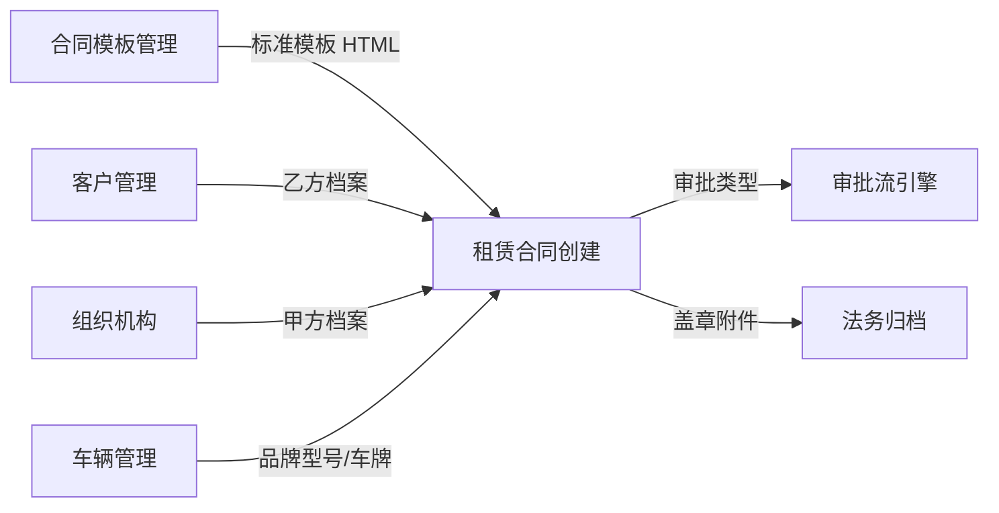

# 租赁合同管理 · 产品需求文档（PRD）

| 项 | 内容 |
|---|---|
| 文档版本 | v1.2 |
| 模块名称 | 租赁合同管理 |
| 所属系统 | ONE-OS 业务管理 |
| 目标读者 | 前端 / 后端 / 测试 / 业务产品对接人 |
| 交互原型 | `/prototypes/lease-contract-management` |
| 关联原型 | [合同模板管理](/prototypes/contract-template-management)、[车辆管理](/prototypes/vehicle-management) |
| 文档状态 | 已对齐原型，待研发排期 |

---

## 1. 背景与目标

### 1.1 背景

商用车租赁业务以合同为履约核心。业务人员需要基于法务维护的标准 Word 合同模板，快速草拟租赁合同、录入订单车辆与费用条款，并走标准/非标准审批。合同全生命周期包含草稿、审批、进行中变更、到期续签、终止等状态。

### 1.2 产品目标

| 目标 | 说明 |
|---|---|
| 台账可视 | 多维度筛选 + KPI 卡片快速定位进行中/临期/过期合同 |
| 草拟高效 | 左侧结构化表单 + 右侧 Word 版式实时预览 |
| 合规可控 | 修改模板风控红线条款自动走非标准合同审批 |
| 档案复用 | 甲乙双方信息从主数据只读带出，减少重复录入 |
| 流程闭环 | 列表操作覆盖续签、增车、附加费用、终止、法务盖章等场景 |

### 1.3 非目标（本期不做）

- 完整审批流配置界面（审批节点由流程引擎提供）
- 合同 PDF 在线签署
- 与财务系统的自动对账接口
- 三方合同变更页的完整表单（列表入口预留，原型 Toast）

---

## 2. 用户与场景

### 2.1 目标用户

| 角色 | 诉求 |
|---|---|
| 业务人员 | 新增/编辑合同、提交审批、进行中变更 |
| 法务人员 | 审批通过后上传盖章合同扫描件 |
| 客服/运营 | 查看合同台账与车辆交车情况 |
| 风控（间接） | 非标准合同审批识别风控条款变更 |

### 2.2 核心用户故事

1. **作为业务**，我希望按项目/客户/状态筛选合同，以便跟进我的在管合同。
2. **作为业务**，我希望新增合同时选客户即带出开票与证照信息，以便快速核对乙方资料。
3. **作为业务**，我希望右侧预览与左侧表单联动，以便确认合同正文与填写一致。
4. **作为业务**，我若只改非红线内容，应走标准审批；改了风控红线则自动走非标准审批。
5. **作为法务**，我希望审批通过后在列表上传盖章合同，以便归档。
6. **作为业务**，我希望进行中的合同能续签、增车、录附加费用，以便业务持续运营。

---

## 3. 名词解释

| 名词 | 定义 |
|---|---|
| 标准合同审批 | 未改动模板风控红线条款正文时的审批路径 |
| 非标准合同审批 | 预览中风控红线条款（`data-risk-redline="1"`）相对模板基线被修改 |
| 风控红线条款 | 合同模板中标记的合规关键条款 |
| 合同状态 | 草稿、已提交审批、变更、合同进行中、到期合同、已结束等 |
| 审批状态 | 未提交、待审批、审批中、审批通过、审批驳回 |
| 标准模板 | 合同模板管理中 `isDefault=true` 的已发布租赁模板 |

---

## 4. 信息架构

```text
租赁合同管理
├── 列表页
│   ├── 筛选区（13 项，默认展示 4 项）
│   ├── KPI 卡片（5 张）
│   ├── 工具栏（费用模板 / 导出 / 新增）
│   └── 合同台账表
└── 新增 / 编辑页
    ├── 主体合同信息
    │   ├── 签约信息
    │   ├── 里程标准
    │   └── 费用信息
    ├── 附件1：租赁订单
    ├── 授权委托书
    ├── 实时预览（可编辑 + 审批类型）
    └── 底栏（保存草稿 / 提交审核）
```

---

## 5. 数据模型（建议）

```typescript
interface LeaseContract {
  id: string;
  contractCode: string;           // HT-ZL-YYYY-NNN
  projectId: string;
  projectName: string;
  lessorId: string;               // 甲方签约主体
  customerId: string;             // 乙方客户
  contractType: 'formal' | 'trial';
  contractApprovalType: 'standard' | 'nonstandard';
  approvalStatus: 'draft' | 'pending' | 'in_review' | 'approved' | 'rejected';
  contractStatus: string;
  contractEndDate: string;        // YYYY-MM-DD
  businessDept: string;
  businessOwner: string;
  mileage: MileageStandard;
  feeInfo: FeeInfo;
  leaseOrder: LeaseOrder;
  powerOfAttorney: PowerOfAttorney;
  previewHtmlBaseline: string;    // 用于风控比对
  previewHtmlCurrent?: string;
  legalStampedContractUploaded?: boolean;
  vehicles: LeaseVehicleRow[];
  creator: string;
  createTime: string;
  updater?: string;
  updateTime?: string;
  remark?: string;
}
```

字段细节见新增页各表单区块说明（`.spec/requirements-prd-create.md`）。

---

## 6. 业务规则（全局）

### 6.1 乙方客户可选规则

仅 **A/B 级** 风控客户可选；C/D 级在客户选择器中标记「不可选」。

### 6.2 合同编号

展示前缀 `HT-ZL-`，用户输入后缀；存储时拼接完整编码。

### 6.3 审批类型自动判定

- 基线：由 `buildLeaseContractPreviewHtml` 生成的初始 HTML。
- 当前：用户可编辑预览合并后的 HTML。
- 若 `isRiskRedlineContentModified(baseline, current)` 为真 → **非标准合同审批**。

### 6.4 列表 KPI 与筛选

KPI 卡片筛选与筛选区条件 **叠加**（先 KPI 维度，再应用筛选表单）。

### 6.5 法务盖章上传

- 条件：`approvalStatus = 审批通过` 且 `legalStampedContractUploaded != true`。
- 权限：当前用户部门为法务部。
- 上传成功后隐藏「上传盖章合同」入口。

### 6.6 交还与履约规则

| 规则 | 说明 |
|---|---|
| 审批 gate | **仅审批通过**的合同才产生交车/还车履约数据；待审批、审批中、驳回、撤回等状态下，车辆不计入「已交车辆数」 |
| 交车 | 审批通过后，经提车应收款办理实际交车；子表「交车」列展示里程、交车人、时间 |
| 租赁账单 | 仅已交车车辆展示「正常 / 欠费」 |
| 子表还车 | **审批通过 + 已交车 + 未还车** 时，子表操作列显示「还车」；已还车为「—」 |
| 还车应结款 | 还车后按待提交 → 审批中 → 已完成流转；审批中审批人展示与主表「审批状态」列一致 |
| 已终止 | 全部车辆已还车，或续签/转三方后旧合同自动终止 |

> 操作流程图见 `.spec/requirements-flow-operations.md`；标注上下文见 `.spec/requirements-annotation-context.md`。

---

## 7. 列表页需求

> 详细字段与操作见 `src/prototypes/lease-contract-management/.spec/requirements-prd-list.md`

### 7.1 筛选区

13 个筛选项；默认 4 项；支持展开/收起、查询、重置。

其中 **合同模板** 与 **标准合同名称** 为联动单选：

- 合同模板：取自合同模板管理已发布模板的「合同名称」类别（正式合同、试用合同等）
- 标准合同名称：选定合同模板后，列出该类别下具体 Word 文档名（如 2026年标准商用车租赁合同）
- 切换合同模板时清空标准合同名称；未选模板时标准合同名称禁用

### 7.2 KPI 卡片

全部合同 / 草稿 / 进行中 / 审批中 / 已终止（按合同状态分桶，与筛选区叠加）。

### 7.3 工具栏

租赁费用模板、导出、新增。

### 7.4 列表

项目信息合并列、租赁订单车辆数/已交车子表、合同签署方式、审批流悬停、费用与交车安排、整体里程、操作列。

子表「还车应结款」审批中状态与主表审批人展示一致；仅审批通过合同产生交车履约数据。

### 7.5 操作

查看、编辑、删除、撤回、增车、续签、被授权人、附加费用、三方变更、转正式、终止、上传盖章合同等（按状态显隐）。

---

## 8. 新增 / 编辑页需求

> 详细见 `src/prototypes/lease-contract-management/.spec/requirements-prd-create.md`

### 8.1 主体合同信息

签约信息（含甲乙档案只读）、里程标准、费用信息；区块完成度徽章。

### 8.2 附件1：租赁订单

订单车辆表、交车信息、三者责任险等。

### 8.3 授权委托书

被委托人列表。

### 8.4 实时预览

Word 版式、可编辑正文、缩放与翻页、审批类型徽章。

### 8.5 底栏

取消、保存草稿、提交审核。

---

## 9. 与其他模块的关系



| 模块 | 关系 |
|---|---|
| 合同模板管理 | 提供标准模板、风控红线/条件条款标记 |
| 客户管理 | 乙方选择、风控等级、证照 |
| 车辆管理 | 租赁订单品牌型号、可交车辆车牌 |
| 审批流 | 消费标准/非标准审批类型 |

---

## 10. 接口需求（建议）

### 10.1 列表查询

```
GET /api/lease-contracts?...filters&page=1&pageSize=10
```

### 10.2 详情

```
GET /api/lease-contracts/{id}
```

### 10.3 创建 / 更新

```
POST /api/lease-contracts
PUT  /api/lease-contracts/{id}
```

请求体含表单各区块与 `contractApprovalType`。

### 10.4 提交审批

```
POST /api/lease-contracts/{id}/submit
```

### 10.5 上传盖章合同

```
POST /api/lease-contracts/{id}/stamped-files
Content-Type: multipart/form-data
```

---

## 11. 非功能需求

| 类别 | 要求 |
|---|---|
| 性能 | 预览 HTML 变更后 300ms 内更新审批类型判定 |
| 兼容性 | Chrome / Edge 最新两版；推荐宽度 ≥ 1280px |
| 可访问性 | 表单 `aria-label`；完成度 `role="status"` |
| 安全 | 预览 HTML 入库前 XSS 清洗 |

---

## 12. 验收标准

### 12.1 列表页

- [ ] 13 项筛选（含合同模板联动标准合同名称）与 KPI 五卡片联动正确
- [ ] 项目信息列、车辆/交车 Popover、审批流悬停
- [ ] 操作按合同状态/类型正确显隐
- [ ] 法务盖章上传后入口关闭

### 12.2 新增页

- [ ] 三块主体合同表单 + 完成度徽章
- [ ] 甲乙档案只读同步、客户 A/B 级限制
- [ ] 预览随表单实时更新
- [ ] 可编辑预览改动风控红线 → 非标准审批徽章
- [ ] 保存/提交展示审批类型

### 12.3 标注与文档（原型）

- [ ] 已接入 `@axhub/annotation`，关键区域有 `data-annotation-id`
- [ ] 目录可切换列表页 / 新增页，PRD 全文可阅

---

## 13. 原型实现映射

| 能力 | 文件 |
|---|---|
| 列表主逻辑 | `LeaseContractManagement.jsx` |
| 新增页 | `LeaseContractCreate.jsx` |
| 主体表单 | `LeaseContractEditorForm.jsx` |
| 预览 | `LeaseContractPreviewPanel.jsx` |
| 预览拼装 | `lease-contract-preview-build.js` |
| 风控检测 | `lease-contract-risk-detect.js` |
| 表单校验 | `lease-contract-form-validation.js` |
| 标注入口 | `index.tsx` |
| 标注数据 | `annotation-source.json` |
| PRD | `src/resources/lease-contract-management/PRD.md` |
| 操作流程图 | `.spec/requirements-flow-operations.md` |
| 标注上下文 | `.spec/requirements-annotation-context.md` |

---

## 14. 修订记录

| 版本 | 日期 | 说明 |
|---|---|---|
| v1.0 | 2026-06-25 | 首版：对齐列表/新增原型、风控审批判定、标注与 PRD 接入 |
| v1.1 | 2026-07-12 | 补充交还车履约规则、子表还车条件、全流程操作图与标注上下文文档 |
| v1.2 | 2026-07-12 | 筛选「合同类型」改为「合同模板 + 标准合同名称」联动；KPI/列表列与原型对齐 |
