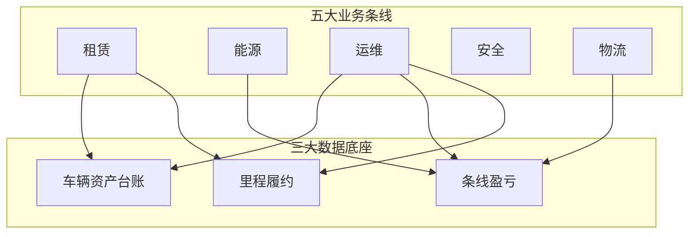

# OneOS 产品总览

**一句话**  
ONE-OS 是集**租赁、能源、运维、安全、物流**五大业务条线闭环于一体，以**车辆资产、条线盈亏、里程履约**三大数据底座为支撑，并逐步打通 YS 财务与外部生态（电子签、PLC、银企直联）的氢能车统一运营管理平台。

## 中期不可偏离的方向

1. **业务闭环优先**：责任部门、起点、标准化流转、明确终点；禁止无法结算或无法归档的断头流程。
2. **先梳理再原型**：产品需求确认 → 设计方案确认 → 原型实现。
3. **业财一体化演进**：由「业务驱动、财务手工」过渡到「收付款记录双向联动、自动对账核销」。  
   **现行规划与原型设计基准**：[foundations/biz-finance-integration.md](foundations/biz-finance-integration.md)（汇报主稿 [`../业财一体化全链条方案-汇报稿.md`](../业财一体化全链条方案-汇报稿.md)）。
4. **数据同源与一车一档**：以车辆资产台账为中心，贯通采购入库、租赁履约、加氢、故障维保、违章事故与报废处置。

## 五大条线 + 三大底座

| 条线 | 闭环一句话 | 总述文档 |
|------|------------|----------|
| 租赁 | 客户准入 → 签约 → 提车应收 → 交车履约台账 → 还车会签结算归档 | [lines/lease.md](lines/lease.md) |
| 能源 | 供应商/站点 → 加氢订单或补录 → 对账 → 账户核销已付款 | [lines/energy.md](lines/energy.md) |
| 运维 | 采购验车入库 → 上牌证照备车 → 交还车/故障维保异动 → 处置出库 | [lines/ops.md](lines/ops.md) |
| 安全 | 司机培训资料 → 违章事故定责 → 费用进还车应结 | [lines/safety.md](lines/safety.md) |
| 物流 | 物流合同 → 调度派车 → 台账落账与盈亏 | [lines/logistics.md](lines/logistics.md) |

## 平台能力

工作台督办、统一审批壳、消息触达、任务工单（含里程门禁）。见 [platform/](platform/)。

## 素材基准

- **业财一体化全链条（王冕规划/原型/数字分身基准）**：[foundations/biz-finance-integration.md](foundations/biz-finance-integration.md) · [`../业财一体化全链条方案-汇报稿.md`](../业财一体化全链条方案-汇报稿.md)
- 中期架构：`src/resources/prd/oneos-midterm-architecture-and-requirements-autoprd.md`
- 故事地图：`src/resources/oneos-story-map/user-story-map.md`
- 各模块 AutoPRD：`src/resources/prd/*-autoprd.md`
- **V1.2 / Desktop ONE-OS 并入说明**：[00-source-corpus.md](00-source-corpus.md) · [00-v12-oneos-mapping.md](00-v12-oneos-mapping.md)
