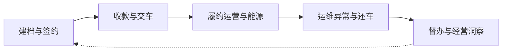

# OneOS 用户故事地图

> 基于仓库原型目录、`nav-menu.json`、各域 `.spec`/PRD 盘点生成。  
> 方法：Jeff Patton User Story Mapping（`user-story-mapping` skill）  
> 日期：2026-07-19  
> 说明：这是**用户旅程战略图**，不是功能清单或甘特图；任务按「用户做什么」描述。

---

## Who

### Segment

- **能源物流车队经营平台的内部业务运营组织**（租赁 + 自营物流 + 加氢能源 + 车辆运维协同）
- 使用 OneOS Web（及加氢站 H5 / 小羚羚外链）完成签约、履约、结算、督办与经营查看

### Persona（主旅程）

- **陈思远 · 业务管理部业务员（可切换主管视角）**
  - 日常：跟进客户合同、提车收款、台账核对、异常催办、还车结算协同
  - 痛点：事项散落多系统、异常不醒目、审批卡在哪一步不清楚、常用入口不好找
  - 目标：在一个工作台里先把异常和今日事办完，并能跳进对应业务模块闭环

### 协同画像（同一地图上的相邻泳道，不另开骨干）

| 角色 | 在本旅程中的位置 |
|------|------------------|
| 业务部销售 | 客户与签约发起偏前段 |
| 能源组 | 加氢记录核对、氢费对账、站点结算 |
| 运维 | 交还车、维保、工单执行 |
| 财务 | 收款认领、应收/应结核对 |
| 法务 / 采购 / 安全 | 合同模板与审批、保险采购、还车会签费用 |
| 总经理 | 工作台跨部门风险与经营总览 |
| 加氢站操作员（H5） | 站端上报流水（Activity 3 补充入口） |

### Narrative（Jobs-to-be-Done）

- **当**客户需要用车履约或能源结算时，**我想**从签约到交车、运营记账、异常处理直至还车结算都在 OneOS 里可执行可追溯，**以便**少漏单、少对账扯皮、异常能当天清掉。

---

## Backbone（从左到右）

```text
① 建档签约 → ② 收款交车 → ③ 履约运营与能源结算 → ④ 运维异常与还车闭环 → ⑤ 工作台督办与经营洞察
```



---

## Activities → Steps → Tasks

图例：

- **R1** = MVP / 当前主路径（原型已较完整、应优先打通）
- **R2** = 增强（闭环补齐、角色深化）
- **R3** = 未来（合包页拆分、安全条线独立、深度分析）

---

### Activity 1：建档与签约

**用户做什么：** 把客户、供应商、合同模板准备好，并签下租赁或自营合同。

#### Steps

1. 维护客户 / 供应商主数据  
2. 准备或选用合同模板  
3. 发起并推进租赁合同  
4. 发起并生效自营（物流）合同  

#### Tasks

**Step 1 · 主数据**

| 优先级 | Task | 对应原型 |
|--------|------|----------|
| R1 | 按条件筛选客户，查看风险标签与 KPI | `customer-management` |
| R1 | 新建客户（集团/子公司编号规则） | `customer-management` |
| R1 | 维护供应商主数据与结算要素 | `supplier-management` |
| R2 | 查看客户操作日志与待审批风险标签 | `customer-management` |
| R3 | 在业务合包旧页中补录遗留字段 | `oneos-web-business` |

**Step 2 · 模板**

| 优先级 | Task | 对应原型 |
|--------|------|----------|
| R1 | 导入 Word、拆章节、发布启用模板 | `contract-template-management` |
| R1 | 配置变量与条件条款（车型/付款方式） | `contract-template-management` |
| R2 | 查看版本日志；停用不可编辑的启用中模板 | `contract-template-management` |
| R3 | 风控红线规则产品化配置 | `contract-template-management` |

**Step 3 · 租赁合同**

| 优先级 | Task | 对应原型 |
|--------|------|----------|
| R1 | 筛选合同列表，查看审批/合同状态 KPI | `lease-contract-management` |
| R1 | 用标准模板新增租赁合同并预览 | `lease-contract-management` |
| R1 | 提交审批；在审批中心处理合同类待办 | `oneos-web-approval-*` |
| R2 | 变更 / 续签 / 转正式 / 终止等流程操作 | `lease-contract-management` |
| R2 | 非标合同转法务 | `lease-contract-management` |
| R3 | 在遗留合包中对照旧版合同页 | `oneos-web-lease-contract` |

**Step 4 · 自营合同**

| 优先级 | Task | 对应原型 |
|--------|------|----------|
| R1 | 创建自营合同草稿并业务确认生效 | `self-operated-contract` |
| R1 | 维护客户、车型数量、交车点、计价单价、附件 | `self-operated-contract` |
| R2 | 无未办结调度任务时结束合同 | `self-operated-contract` |
| R3 | （明确不做）租期账单/押金/提车应收套用租赁模型 | — |

---

### Activity 2：收款与交车

**用户做什么：** 合同提交后收齐提车款，认领到账，并完成交车交付。

#### Steps

1. 生成并核对提车应收  
2. 登记到账并认领关联账单  
3. 运维完成交车 / 备车相关动作  
4. 采购侧确认保险等交车前置  

#### Tasks

**Step 1 · 提车应收**

| 优先级 | Task | 对应原型 |
|--------|------|----------|
| R1 | 查看合同生成的提车应收单与车辆明细 | `vehicle-pickup-receivable` |
| R1 | 按提车日规则核对应收（保证金+租金服务费） | `vehicle-pickup-receivable` |
| R2 | 手动办理勾选车辆；子表收款单审批 | `vehicle-pickup-receivable` |
| R2 | 实收反写后查看收款情况 | `vehicle-pickup-receivable` + `payment-records` |

**Step 2 · 收款认领**

| 优先级 | Task | 对应原型 |
|--------|------|----------|
| R1 | 录入/导入到账，查看未关联预警 | `payment-records` |
| R1 | 将收款关联到租赁/自营/氢费账单 | `payment-records` |
| R2 | 触发入账通知（短信等演示通道） | `payment-records` |
| R2 | 工作台「收款未关联」KPI 点进处理 | `oneos-web-workbench-new` |

**Step 3 · 交车**

| 优先级 | Task | 对应原型 |
|--------|------|----------|
| R1 | 在车辆资产中确认车辆状态与项目/合同 | `vehicle-management` |
| R1 | 在运维合包中执行交车任务 | `oneos-web-ops` |
| R2 | 自营调度模拟交车（运营态=自营） | `self-operated-dispatch-task` |
| R3 | 小羚羚端交车/替换车协同 | `xll-miniapp`（外链） |

**Step 4 · 保险前置**

| 优先级 | Task | 对应原型 |
|--------|------|----------|
| R1 | 维护车队保险台账；交强+商业有效才允许交车 | `insurance-procurement` |
| R2 | 发起比价审批；OCR 落保单 | `insurance-procurement` |
| R3 | 停保/复驶/退保留痕深化 | `insurance-procurement` |

---

### Activity 3：履约运营与能源结算

**用户做什么：** 租期内管应收台账；自营出车派单办结；加氢流水采集并对账结算。

#### Steps

1. 维护租赁业务台账 / 明细  
2. 调度自营出车并办结落账  
3. 站端/PC 上报加氢记录  
4. 核对氢费并完成站点对账结算  

#### Tasks

**Step 1 · 租赁履约记账**

| 优先级 | Task | 对应原型 |
|--------|------|----------|
| R1 | 按月筛选租赁业务台账，关联收款、看 KPI | `lease-business-ledger` |
| R1 | 在租赁业务明细中核对宽表、公式列与系统校验 | `lease-business-detail` |
| R2 | 导入导出明细；主管预览数据范围 | `lease-business-detail` |
| R3 | 单元格一键修复建议值产品化 | `lease-business-detail` |

**Step 2 · 自营调度**

| 优先级 | Task | 对应原型 |
|--------|------|----------|
| R1 | 选生效合同创建调度任务并派车 | `self-operated-dispatch-task` |
| R1 | 办结出车，自动生成物流业务明细一行 | `self-operated-dispatch-task` → `self-operated-business-ledger` |
| R2 | 改派、多趟线路、未办结占用车牌校验 | `self-operated-dispatch-task` |
| R2 | 导入补录物流明细；核算盈亏 | `self-operated-business-ledger` |

**Step 3 · 加氢采集**

| 优先级 | Task | 对应原型 |
|--------|------|----------|
| R1 | H5 本站新增加氢流水（含手工台账/照片） | `oneos-h5-h2-order` |
| R1 | Web 多站查看/导入导出加氢记录 | `oneos-web-h2-station` |
| R2 | 羚牛车牌标签、前日缺失禁新增、锁定已核对 | H5 + Web |
| R3 | OCR/水印拍摄体验强化 | `oneos-h5-h2-order` |

**Step 4 · 氢费对账结算**

| 优先级 | Task | 对应原型 |
|--------|------|----------|
| R1 | 在车辆氢费明细中核对异常（量/单价） | `vehicle-h2-fee-ledger` |
| R1 | 站点生成对账单 → 收票 → 提交结算 | `oneos-web-h2-station-site` |
| R2 | 回写氢费「已对账」；维护站点价格/预付余额 | site + ledger |
| R2 | 查看加氢站数量周统计 | `oneos-web-h2-station-stats` |
| R3 | 分析合包中的遗留氢费/采购汇总报表 | `oneos-web-data-analysis` / ledger-data |

---

### Activity 4：运维异常与还车闭环

**用户做什么：** 处理维保/年审/故障等运维事项，完成还车多部门结算并归档。

#### Steps

1. 处理运维任务与维保费用  
2. 督办采购合同拆解的任务工单  
3. 发起还车并完成多部门应结  
4. （扩展）安全违章/事故费用写入还车  

#### Tasks

**Step 1 · 运维执行**

| 优先级 | Task | 对应原型 |
|--------|------|----------|
| R1 | 在车辆资产总览证照/保险/交还车状态 | `vehicle-management` |
| R1 | 录入维保台账并确认提交；导出 | `vehicle-maintenance-ledger` |
| R2 | 在运维合包完成年审/故障/替换车/调拨等 | `oneos-web-ops` |
| R3 | 备件库存、仓库、后装设备等深化 | `oneos-web-ops` |

**Step 2 · 任务工单**

| 优先级 | Task | 对应原型 |
|--------|------|----------|
| R1 | 从合同拆解或独立创建工单并指派 | `task-work-order` |
| R2 | 催办；按里程/维保/付款节点类型管理 | `task-work-order` |
| R3 | 执行人端独立工作台（金额脱敏） | `task-work-order` |

**Step 3 · 还车应结**

| 优先级 | Task | 对应原型 |
|--------|------|----------|
| R1 | 还车后生成应结任务；分部门填费用 | `vehicle-return-settlement` |
| R1 | 关联收款/付款；总审批归档 | `vehicle-return-settlement` + 审批 |
| R2 | 车辆明细与费用明细办理页 | `vehicle-return-settlement` |
| R3 | 三方退租采购流程 | `oneos-web-procurement` |

**Step 4 · 安全扩展**

| 优先级 | Task | 对应原型 |
|--------|------|----------|
| R3 | 司机/培训/违规/违章/事故独立模块 | 条线说明 `lease-business-line-overview`（多数尚未独立原型） |
| R3 | 违章事故费用写入还车应结 | 叙事在 SAFETY_MODULES |

---

### Activity 5：工作台督办与经营洞察

**用户做什么：** 每天打开工作台知道要做什么、异常在哪、审批到哪步、并快速进模块；管理层看盈亏与回款。

#### Steps

1. 在工作台处理待办三态与通知  
2. 跟进审批进度并催办  
3. 使用快捷入口发起常用操作  
4. 查看角色业务数据与经营分析  

#### Tasks

**Step 1 · 每日执行台**

| 优先级 | Task | 对应原型 |
|--------|------|----------|
| R1 | 打开工作台-新，按角色看预警 KPI | `oneos-web-workbench-new` |
| R1 | 按「异常 / 今日必办 / 即将执行」处理待办 | `oneos-web-workbench-new`（方案 C） |
| R1 | 阅知未读消息（催办优先）并跳转办理 | `oneos-web-workbench-new` |
| R2 | 切换轻量个人台 / 高密度台比稿方案 | layout A/B |
| R3 | 旧工作台退役与数据迁移 | `oneos-web-workbench` |

**Step 2 · 审批与催办**

| 优先级 | Task | 对应原型 |
|--------|------|----------|
| R1 | 在审批中心处理我的待办/已办/发起/抄送 | `oneos-web-approval-*` |
| R1 | 在工作台看审批「当前步骤 + 处理人」 | `oneos-web-workbench-new` |
| R2 | 邮件/短信/微信催办（演示） | `oneos-web-workbench-new` |
| R2 | 按约 20 类审批类型筛选与专用详情 | 共享 approval |

**Step 3 · 快捷发起**

| 优先级 | Task | 对应原型 |
|--------|------|----------|
| R1 | 自定义钉选常用入口并进入模块 | `oneos-web-workbench-new` CustomQuick |
| R1 | 快速发起：新合同/退车/保险/充值等 | 各业务原型 |
| R2 | FAB 与页内常用入口策略统一 | workbench |

**Step 4 · 经营洞察**

| 优先级 | Task | 对应原型 |
|--------|------|----------|
| R1 | 查看角色业务洞察看板 | `oneos-web-workbench-new` |
| R1 | 查看项目盈亏、客户回款分析 | `business-dept-ledger` / `customer-payment-collection` |
| R2 | 阅读业务条线说明，理解五条线闭环 | `lease-business-line-overview` |
| R3 | 数据分析合包报表收敛为正式菜单 | `oneos-web-data-analysis` |

---

## Release 切片（纵向）

```text
━━━━━━━━━━━━━━━━━━━━━━━━━━━━━━━━━━━━━━━━━━━━━━━━━━━━
R1 MVP 主航道（先打通「能签、能收、能交、能记、能结、能督办」）
  · 客户/模板/租赁合同 · 提车应收 · 收款认领
  · 租赁台账+明细 · 加氢 H5/Web + 氢费核对 + 站点对账
  · 自营合同+调度办结+物流明细（轻量）
  · 还车应结基础会签 · 维保台账 · 保险交车校验
  · 工作台-新执行台（待办三态+通知+审批进度+常用入口）
  · 审批四 Tab
━━━━━━━━━━━━━━━━━━━━━━━━━━━━━━━━━━━━━━━━━━━━━━━━━━━━
R2 增强闭环
  · 合同变更续签族 · 催办三通道 · 工单督办
  · 运维合包高频页（年审/故障/替换车）产品化入口
  · 氢费/站点余额告警 · 周统计 · 角色洞察完善
  · 自营占用车牌/改派等规则加固
━━━━━━━━━━━━━━━━━━━━━━━━━━━━━━━━━━━━━━━━━━━━━━━━━━━━
R3 扩展与收敛
  · 安全条线独立原型 · 小羚羚深度打通
  · legacy 合包（business/ops/finance/data）拆清或下线
  · 帮助中心与说明书体系化
━━━━━━━━━━━━━━━━━━━━━━━━━━━━━━━━━━━━━━━━━━━━━━━━━━━━
```

---

## 功能目录 ↔ 故事地图覆盖（速查）

| 导航分组 | 主要落入 Activity |
|----------|-------------------|
| 工作台 / 工作台-新 | 5 |
| 审批中心 | 1, 2, 4, 5 |
| 车辆资产 | 2, 4 |
| 业务管理（客户/供应商/合同/保险） | 1, 2 |
| 合同配置 | 1 |
| 加氢站管理 | 3 |
| 台账管理 | 3, 4 |
| 财务管理 | 2, 4 |
| 任务工单 / 调度任务 | 3, 4 |
| 数据分析 | 5 |
| 业务条线说明 | 全图对齐 |

---

## Gaps / Opportunities（地图审视）

1. **安全条线**：叙事完整，独立可运行原型少 → R3 缺口。  
2. **运维合包**：能力多但入口「合包化」，用户难发现 → 应用户步骤拆主导航。  
3. **双工作台**：旧/新并存 → 明确主路径为工作台-新。  
4. **跨模块状态**：交车/对账/认领依赖桥接脚本，故事地图上要标「系统自动」任务以免漏测。  
5. **站端 vs 能源组**：H5 与 Web/氢费双角色，培训与权限需在 Persona 培训材料中分开讲。

---

## 使用建议

- 评审时**横着讲一遍**陈思远从签约到还车，再**竖着切** R1。  
- 写用户故事时：从本表 Task 拆「作为…我想…以便…」，不要从原型文件夹名倒推。  
- **R1 可排期清单**（已拆）：[r1-user-stories.md](./r1-user-stories.md)（US-01~US-40，分 W1–W5 五波）。  
- 若只做单域（如仅氢能），可复制本文件裁剪为子地图，保持同一 Narrative 口径。

---

## 来源

- `src/prototypes/oneos-prototype-nav/nav-menu.json`
- 各原型 `.spec/requirements-prd.md` / PRD（抽样）
- `lease-business-line-overview/lines.ts` 五条线
- `src/resources/self-operated-logistics/assumptions.md`
- 工作台角色：`oneos-web-workbench-new/data/roles.ts`
