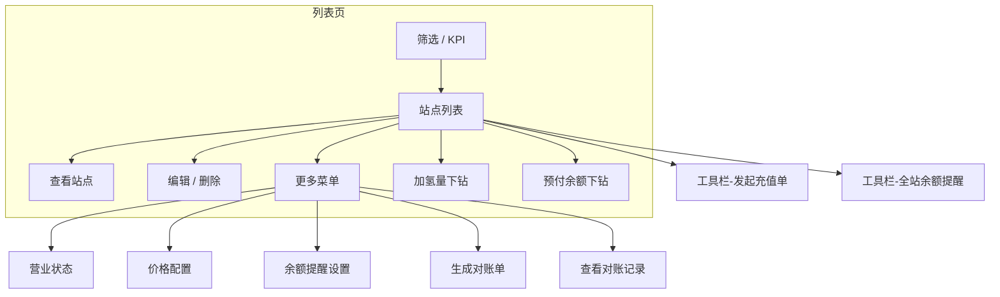
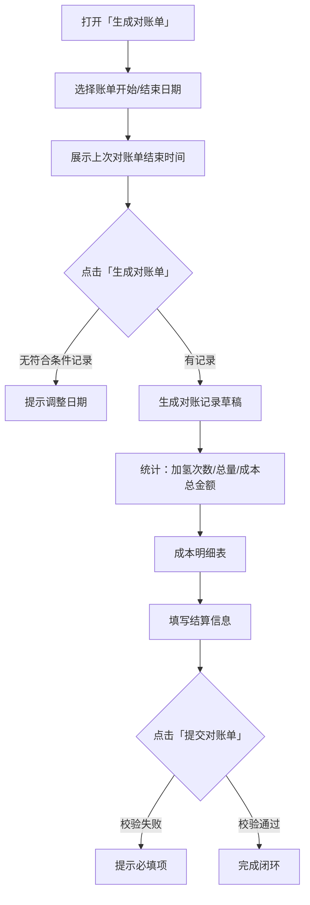
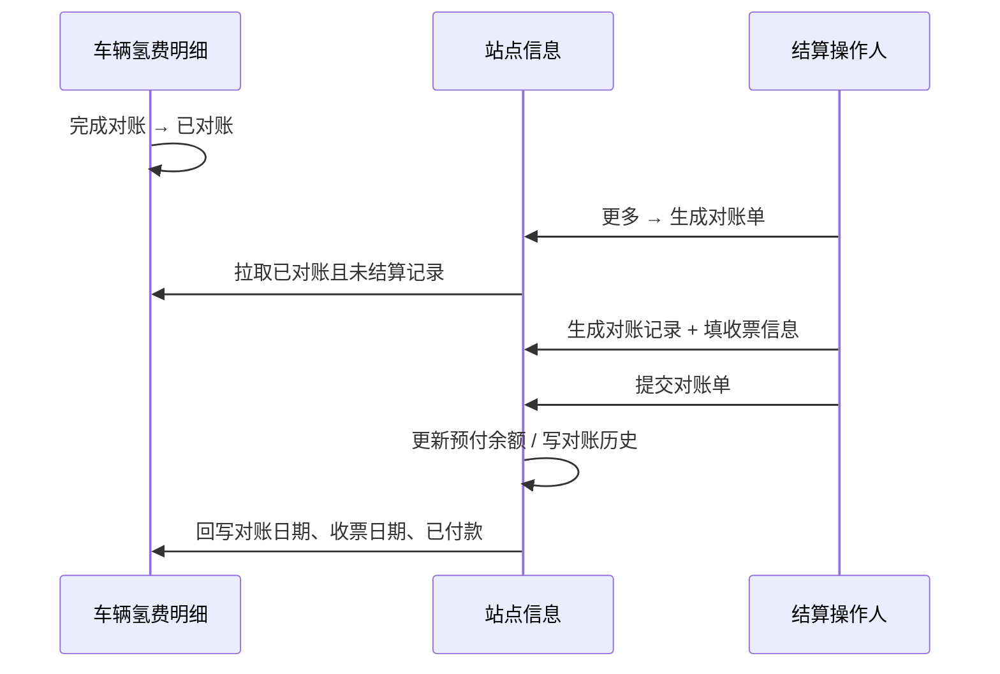

# 加氢站管理 · 站点信息 — 产品需求说明（PRD）

| 项目 | 内容 |
|------|------|
| 文档版本 | v2.0 |
| 产品模块 | 加氢站管理 → 站点信息 |
| 文档类型 | 产品需求说明 |
| 适用读者 | 研发、测试、产品、项目 |
| 关联模块 | 台账数据 → 车辆氢费明细 |
| 原型文件 | `web端/加氢站管理/站点信息.jsx` |

---

## 一、为什么做这件事

### 1.1 业务背景

加氢站是氢费成本结算的关键节点。运营侧需要维护站点主数据（签约、地址坐标、营业、成本价、预付余额），并在财务周期内按站点与加氢站完成对账、收票与付款闭环。

### 1.2 本期目标

建设 Web 端「站点信息」页面，支撑：

- 站点台账的查询、新建、编辑、查看、删除与批量导入
- 地图定位、营业状态、多规则成本价格、余额提醒等运营配置
- 加氢量 / 预付余额下钻分析与充值单发起
- **按站点生成氢费对账单 → 填写收票信息 → 提交结算**，并与「车辆氢费明细」联动回写

### 1.3 用户角色

| 角色 | 典型诉求 |
|------|----------|
| **加氢站运营** | 维护站点资料、营业与价格；查看加氢量与余额；设置余额提醒 |
| **财务/结算** | 按周期生成对账单、登记收票、发起充值、完成站点付款闭环 |
| **管理员** | 批量导入站点、全站余额提醒、删除无效站点、绑定系统账号 |

---

## 二、页面整体结构

用户进入「加氢站管理 → 站点信息」后，页面自上而下为：

1. **筛选区** — 名称、是否签约、地区、营业状态
2. **KPI 分类** — 全部 / 预付余额预警 / 已欠费 / 无加氢；签约站点快捷筛选
3. **工具栏** — 全站余额提醒设置、批量导入、发起充值单、新建站点
4. **站点列表** — 主数据 + 运营指标 + 操作列
5. **子页面 / 弹窗** — 新建/编辑整页、查看、营业状态、价格配置、余额提醒、对账单、对账记录、下钻分析等



页面右上角提供 **「查看需求说明」**、**「查看使用说明书」** 入口。

---

## 三、列表与 KPI 规则

### 3.1 列表字段

| 字段 | 说明 |
|------|------|
| 加氢站名称 | 含签约标签（签约站点 / 签约站点-未上传合同）；下一行展示完整地址 |
| 合作时间 | 未签约显示为空 |
| 营业状态 / 营业时间 | 列表只读；在「更多 → 营业状态」维护 |
| 当前成本价格 | 元/kg；由价格配置规则与生效时间驱动；多客户规则时展示主规则价格 |
| 加氢次数 / 加氢量 | 加氢量可点击下钻；列表头支持排序 |
| 预付余额 | 可点击下钻流水；负值标红并显示「已欠费」 |
| 联系方式 | 联系人 + 电话 |
| 操作 | 查看 + 更多（⋮） |

### 3.2 KPI 分类逻辑

| 分类 | 规则 |
|------|------|
| 全部加氢站 | 台账内全部站点 |
| 预付余额预警站点 | 已设置提醒阈值，且预付余额 ≥ 0 且低于阈值（不含已欠费） |
| 已欠费站点 | 预付余额 < 0 |
| 无加氢站点 | 加氢次数 = 0 |

**签约快捷筛选**（与 KPI 并列展示）：

| 分类 | 规则 |
|------|------|
| 签约站点 | `isSigned = true` |
| 普通站点 | `isSigned = false` |

点击「预付余额预警站点」「已欠费站点」KPI 卡，打开对应站点列表弹窗，支持 **一键发起充值单**（预填站点与当前余额）。

筛选或 KPI 切换后列表回到第 1 页；默认分页 10 条，可选 5 / 10 / 20 / 50。

---

## 四、站点主数据（新建 / 编辑 / 查看）

### 4.1 新建站点

**入口**：列表工具栏 → **新建站点**

整页表单分三块卡片：

#### （1）加氢站基本信息

| 字段 | 必填 | 说明 |
|------|------|------|
| 加氢站名称 | 是 | 不可与已有站点重名 |
| 省市、通讯地址 | 是 | 只读，由地址解析回填 |
| 地址解析 | 否 | 粘贴完整地址，失焦后自动解析省/市与详细地址 |
| 地图定位 | 否 | 见 [4.4 地图定位模块](#44-地图定位模块) |
| 联系人 | 是 | — |
| 手机号 / 固定电话 | 至少一项 | 格式校验 |
| 站点类型 | 否 | 签约站点 / 普通站点；签约须填合作时间与合同附件 |

#### （2）系统账号绑定

- 选择 **绑定系统账号** 或 **暂不绑定**
- 绑定支持 **多选**；已被其他站点占用的账号不可选
- 绑定后所选账号可登录并管理该站点

#### （3）供应商相关信息

Tab：**关联已有** / **新建供应商** / **不关联供应商**

- 关联已有：搜索供应商档案绑定，可 OCR 营业执照
- 新建供应商：主体、开票、银行、证照上传
- 不关联：跳过供应商区块

**底部**：返回（未保存二次确认）、提交创建（进度达 100% 后可点）

### 4.2 编辑 / 查看

| 模式 | 交互 |
|------|------|
| **编辑** | 整页（与新建同结构）；**不含**供应商；营业状态不在此页；系统账号仅 admin 可改 |
| **查看** | 弹窗分块：加氢站信息、系统账号、供应商信息、付款信息 |

编辑页同样包含 **地图定位模块**，回显已保存经纬度。

### 4.3 批量导入

**入口**：列表工具栏 → **批量导入**（位于「全站余额提醒设置」右侧）

- 下载 CSV 模板 → 上传 `.csv` / `.xlsx` / `.xls`
- 预览可导入 / 不可导入条数及错误原因
- 站点名称不可与现有台账重复

模板字段与新建表单一致（名称、省、市、详细地址、是否签约、签约起止、营业状态、营业时间、联系人、联系电话等）。

### 4.4 地图定位模块

**位置**：新建 / 编辑页 → 加氢站基本信息卡片 → 地址解析下方

**数据字段**：

| 字段 | 说明 |
|------|------|
| `mapAddress` | 地图模块地址（可与通讯地址一致） |
| `latitude` | 纬度，保留 6 位小数 |
| `longitude` | 经度，保留 6 位小数 |

**交互规则**：

1. **地址解析联动**：上方「地址解析」识别成功后，自动将完整地址填入地图地址框并触发定位
2. **输入定位**：地图地址框支持手动输入；失焦、回车或点击「定位」后，地图自动移动到对应位置
3. **拖动微调**：地图上标记可拖动，拖动结束后更新经纬度并展示在地图下方
4. **定位失败**：提示用户拖动标记手动选点

**实现说明（原型）**：使用 OpenStreetMap + Leaflet；优先按省市区 Mock 坐标定位，必要时调用 Nominatim 地理编码。

### 4.5 删除站点

**入口**：更多 → 删除 → 二次确认，不可撤销。

---

## 五、运营配置

### 5.1 营业状态

**入口**：更多 → **营业状态**

- 顶部站点信息卡（名称、地址、当前状态）
- **营业状态**：营业中 / 暂停营业 / 停止营业（按钮组）
- **营业时间**：全天营业 / 自定义时段；非全天须填开始、结束时间（HH:mm）
- 下方展示 **营业状态变更记录**
- 保存后列表同步更新

### 5.2 价格配置

**入口**：更多 → **价格配置**

#### 5.2.1 弹窗结构

```
┌─────────────────────────────────────────────┐
│ 顶部：加氢站名称 + 签约站点标签（无则省略）    │
├─────────────────────────────────────────────┤
│ 当前已生效价格配置（表格）    [+ 新增规则]    │
├─────────────────────────────────────────────┤
│ （点击修改/新增后展开）编辑表单               │
│ 定价方式 | 适用客户                          │
│ 固定价：成本价格 + 生效时间                   │
│ 阶梯价：阶梯条件 + 重置日/生效时间            │
├─────────────────────────────────────────────┤
│ （编辑态）当前规则调整记录                    │
└─────────────────────────────────────────────┘
```

- 打开弹窗默认为 **查看态**，仅展示已生效配置表格
- 点击行内 **「修改」** 或 **「+ 新增规则」** 才展开编辑卡片
- **保存** 后回到查看态，**不关闭**弹窗

#### 5.2.2 已生效配置表格

| 列 | 说明 |
|----|------|
| 适用客户 | 全部客户 / 指定客户名称 |
| 定价方式 | 固定价格 / 阶梯价格（Tag） |
| 当前价格 | 元/kg；阶梯价展示当前匹配单价，可附「距下个阶梯还差 X kg」 |
| 生效时间 | 最近一条已生效日志的生效时间 |
| 阶梯重置 | 阶梯规则展示「每月 N 日」；固定价显示 — |
| 操作 | 修改 |

#### 5.2.3 定价方式

**固定价格**

- 成本价格（元/kg）+ 生效时间
- 适用客户：与阶梯价相同的多选下拉
  - 未选客户 → 保存为「全部客户」规则
  - 已选客户 → 为每个客户各生成一条固定价规则
  - 已有单独规则的客户在下拉中禁用
  - 固定价提示：默认对全部客户生效；已为某客户单独配置的，将自动从本规则中排除

**阶梯价格**

- 阶梯价格条件：加氢总量阈值（kg）+ 成本单价，可多条
- 阶梯量重置日期（每月 1～28 日）+ 生效时间
- 适用客户：多选，至少选一个；可为多个客户批量配置相同阶梯规则

#### 5.2.4 生效与列表联动

- 保存时写入规则及调整日志
- 到达生效时间后，列表「当前成本价格」按适用客户范围更新（原型模拟）
- 同一客户仅允许一套生效规则；保存时校验冲突

### 5.3 余额提醒设置

#### 5.3.1 单站设置

**入口**：更多 → **余额提醒设置**

- 展示站点名称、当前预付余额
- 必填 **提醒金额（元）**，须 > 0
- 保存后写入 `balanceAlertThreshold`
- 当预付余额低于阈值时，站点计入 KPI「预付余额预警站点」（已欠费站点不计入预警）

#### 5.3.2 全站批量设置

**入口**：列表工具栏 → **全站余额提醒设置**（位于批量导入左侧）

- 交互与单站余额提醒相同
- 保存后将同一阈值批量写入 **全部加氢站**

### 5.4 发起充值单

**入口**：

- 列表工具栏 → **发起充值单**（空白行，自选站点）
- KPI 预警 / 欠费弹窗 → **一键发起充值单**（预填站点）

**规则**：

- 支持多行，每行选择站点、填写付款金额
- 自动带出收款公司、银行账号、转账用途等（来自供应商付款信息）
- 提交后走付款流程（原型提示成功）

### 5.5 加氢量 / 预付余额下钻

**加氢量下钻**（点击列表加氢量）：

- 统计卡：加氢次数、加氢总量、成本总价、加氢总价
- 明细表字段对齐「车辆氢费明细」
- 支持导出 CSV

**预付余额下钻**（点击列表预付余额）：

- 当前余额（负值标「已欠费」）
- 充值 / 车辆加氢流水
- 余额趋势图 + 导出 CSV

---

## 六、核心流程：生成对账单

本模块与「车辆氢费明细」配合完成 **站点侧氢费结算闭环**。

### 6.1 数据来源

对账单明细取自 **车辆氢费明细** 中同时满足以下条件的记录：

1. 对账状态 = **已对账**
2. **尚未**被本站点历史对账单结算过（未绑定 `statementRecordId`）
3. 加氢时间落在 `[账单开始日期, 账单结束日期]` 内
4. 加氢站名称与当前操作站点一致

> 对账单明细 **仅展示成本字段**，不展示加氢单价、加氢总价。

### 6.2 两阶段交互



**阶段一 · 选期生成**

- 展示 **上次对账单结束时间**（无则「暂无」）
- 默认开始日期 = 上次结束日 + 1 天
- 生成后进入阶段二，日期锁定

**阶段二 · 结算提交**

| 统计项 | 说明 |
|--------|------|
| 加氢次数 | 本账单笔数 |
| 加氢总量 | kg 合计 |
| 成本总金额 | 成本总价合计 |

**必填结算项**：

| 字段 | 规则 |
|------|------|
| 结算后加氢站预付款余额 | 只读，= 当前预付余额 − 成本总金额 |
| 收票日期 | 必填 |
| 收票金额 | 必填，默认成本总金额 |
| 发票附件 | 必填 |

### 6.3 提交后的系统行为

提交成功后需原子性完成：

1. 写入对账历史
2. 扣减站点预付余额
3. 标记台账记录已结算（`statementRecordId`）
4. 回写车辆氢费明细：对账日期、收票日期、加氢站付款状态 = 已付款



---

## 七、查看对账记录

**入口**：更多 → **查看对账记录**

### 7.1 历史列表

| 列 | 说明 |
|----|------|
| 对账日期 | 提交操作时间 |
| 对账人 | 操作人 |
| 账单开始/结束日期 | 覆盖区间 |
| 加氢次数 / 加氢金额 | 本单汇总 |
| 对账后预付款余额 | 负值标「已欠费」 |
| 操作 | 查看明细 |

### 7.2 查看明细

- 账单区间、统计三卡
- 收票时间、收票金额、发票附件下载
- 成本明细表

---

## 八、操作列「更多」菜单

| 菜单项 | 作用 |
|--------|------|
| 编辑 | 整页编辑站点主数据（含地图） |
| 营业状态 | 维护营业状态与营业时间 |
| 价格配置 | 固定价 / 阶梯价多规则配置 |
| 余额提醒设置 | 单站提醒阈值 |
| 生成对账单 | 两阶段对账结算 |
| 查看对账记录 | 历史对账单与明细 |
| 删除 | 删除站点（不可恢复） |

---

## 九、校验与异常

| 场景 | 处理 |
|------|------|
| 新建/编辑：名称重复 | 阻止提交 |
| 新建/编辑：省市区或详细地址为空 | 阻止提交 |
| 新建/编辑：联系人或电话缺失 | 阻止提交 |
| 签约站点：合作时间或合同缺失 | 阻止提交 |
| 价格配置：未填价格/生效时间/阶梯条件 | 阻止保存 |
| 阶梯价：未选适用客户 | 阻止保存 |
| 价格配置：客户已有规则 | 提示编辑原规则 |
| 余额提醒：金额无效 | 阻止保存 |
| 对账单：日期无效 / 无已对账记录 | 阻止生成 |
| 对账单：收票信息不完整 | 阻止提交 |
| 预付余额结算后为负 | 允许提交，标「已欠费」 |
| 地图：地址无法定位 | 提示手动拖动选点 |

---

## 十、研发实现要点

1. **价格配置模型**：`priceConfigs[]` 支持 `customerScope: all | customer`、固定价 / 阶梯价、生效日志 `logs[]`；列表价取当前时间已生效日志。
2. **客户规则互斥**：`h2GetAssignedCustomerIds` 维护已占用客户；保存时 `h2ApplyCustomerExclusion` 处理规则覆盖。
3. **余额预警**：`balanceAlertThreshold` + `prepaidBalance` 计算 KPI；欠费优先于预警。
4. **地图字段**：`mapAddress`、`latitude`、`longitude` 随站点主数据持久化。
5. **对账单幂等**：同一笔已对账记录只能绑定一次 `statementRecordId`。
6. **跨模块同步**：生产对接统一台账服务；原型通过 `H2_STATION_STATEMENT_LEDGER_UPDATES` / `H2_VEHICLE_LEDGER_API` 模拟回写。
7. **权限**（后续）：对账提交、全站余额设置建议限制财务 / 管理员角色。

### 10.1 主要数据字段（站点）

| 字段 | 类型 | 说明 |
|------|------|------|
| `name` | string | 加氢站名称 |
| `region` | string[] | 省、市 |
| `addressDetail` | string | 详细地址 |
| `fullAddress` | string | 完整地址展示 |
| `mapAddress` | string | 地图定位地址 |
| `latitude` / `longitude` | number | 经纬度 |
| `isSigned` | boolean | 是否签约 |
| `contractStart` / `contractEnd` | string | 合作时间 |
| `businessStatus` / `businessHours` | string | 营业信息 |
| `costUnitPrice` | number | 列表展示用当前成本价 |
| `priceConfigs` | array | 价格规则集合 |
| `balanceAlertThreshold` | number | 余额提醒阈值 |
| `prepaidBalance` | number | 预付余额 |
| `bindAccountIds` | string[] | 绑定系统账号 |

---

## 十一、本期不做

- 对账单审批流、ERP 自动过账
- 发票 OCR 识别与验真
- 多币种 / 多税率
- 高德 / 百度地图商用 Key 接入（原型使用 OSM）
- 按组织架构的复杂数据权限

---

**文档结束**
