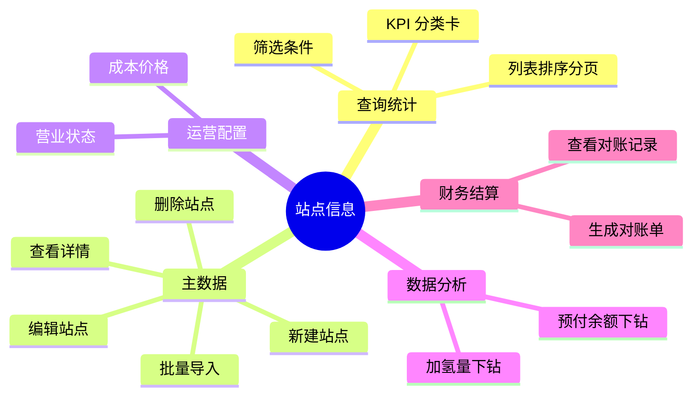
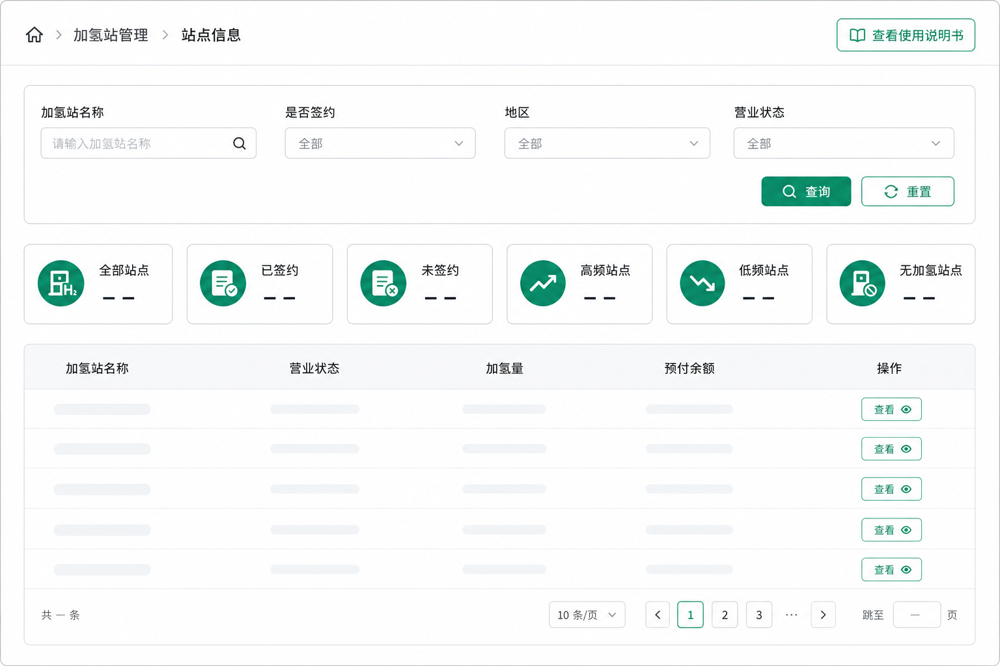
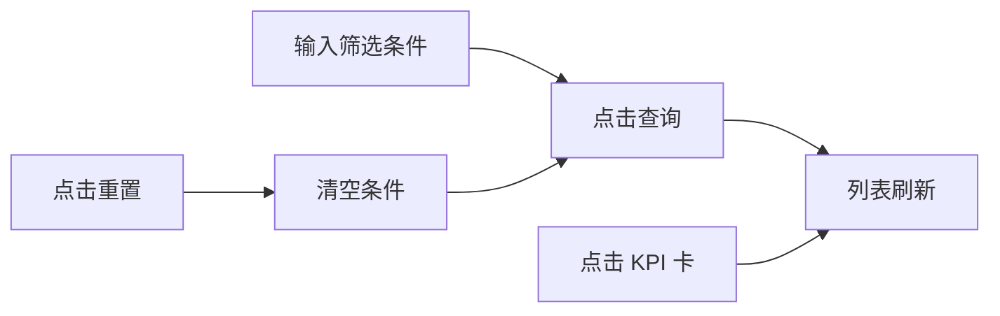
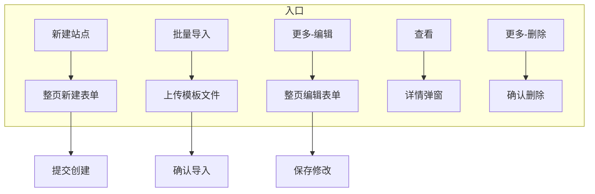
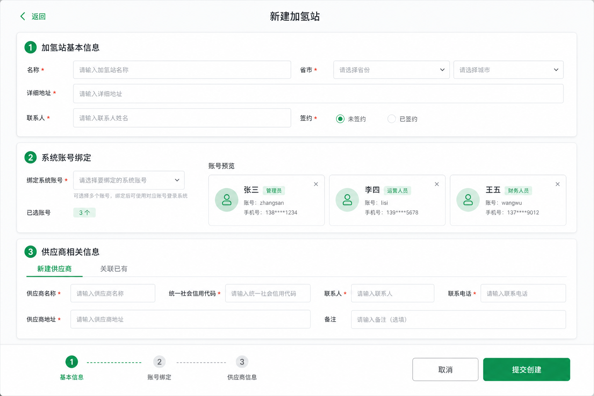
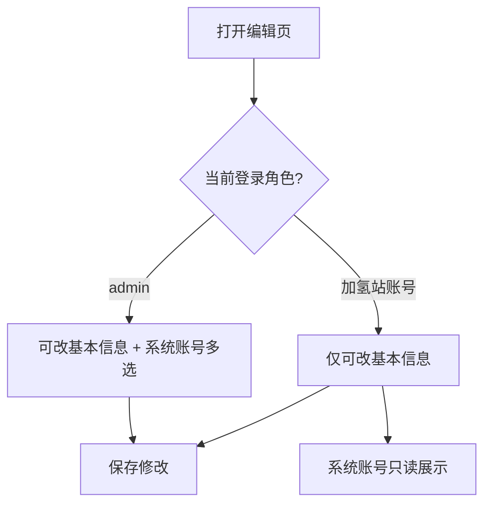
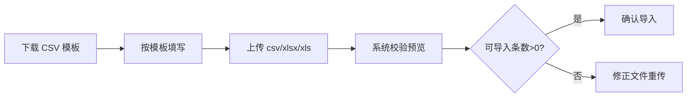
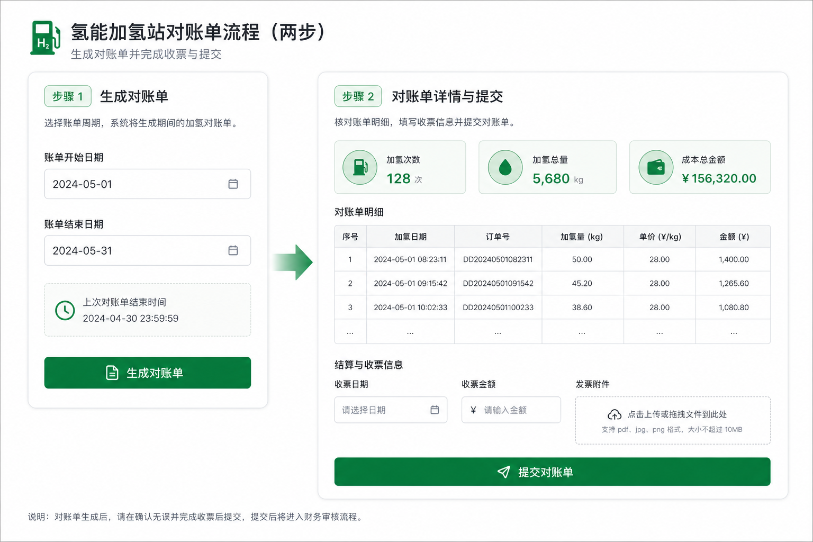
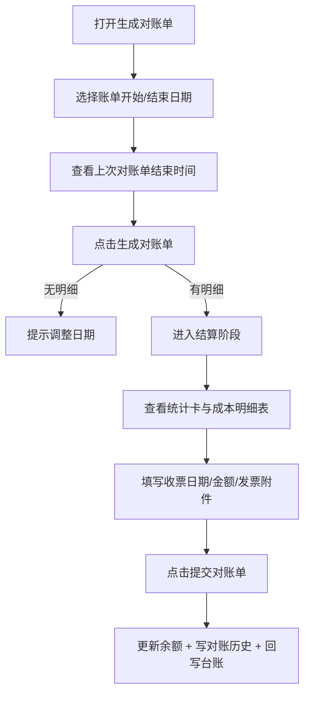
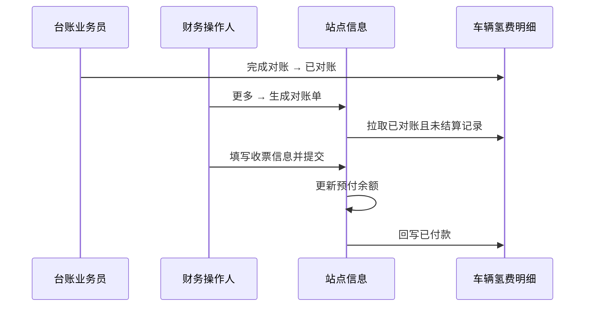

# 加氢站管理 · 站点信息 — 用户使用说明书

| 项目 | 内容 |
|------|------|
| 文档版本 | v1.0 |
| 产品模块 | 加氢站管理 → 站点信息 |
| 文档类型 | **用户使用说明书** |
| 适用读者 | 加氢站运营、财务结算、平台管理员、培训与汇报人员 |
| 关联模块 | 台账数据 → 车辆氢费明细 |
| 配图目录 | 与本文件同级的 docs/ 文件夹 |

---

## 使用本说明书

本说明书用于**教会一线用户操作**站点管理模块，也可作为**项目汇报、培训宣讲**的配套材料。建议按以下顺序阅读：

1. **第二章** — 认识页面布局（5 分钟）
2. **第四章** — 新建 / 编辑 / 导入站点（15 分钟）
3. **第七章** — 生成对账单与结算（重点，20 分钟）
4. **第九章** — 汇报话术与常见问题

页面右上角可点击 **「查看使用说明书」** 随时打开本文档。

---

## 一、模块能做什么

### 1.1 一句话说明

站点信息模块是加氢站的**主数据与运营台账中心**：维护站点档案、营业与成本价，查看加氢量与预付余额，并按周期与加氢站完成**氢费对账、收票登记与付款闭环**。

### 1.2 功能地图



### 1.3 谁来做什么事

| 角色 | 常用功能 | 注意事项 |
|------|----------|----------|
| **平台管理员（admin）** | 新建、编辑、批量导入、删除、绑定系统账号 | 系统账号支持多选绑定 |
| **加氢站运营账号** | 编辑本站资料、营业状态、价格配置 | 编辑时**不能改**供应商与系统账号 |
| **财务 / 结算人员** | 生成对账单、登记收票、查看对账记录 | 需先在台账完成「已对账」 |

---

## 二、进入模块与页面总览

### 2.1 菜单路径

左侧导航：**加氢站管理 → 站点信息**

### 2.2 页面结构（自上而下）

```
┌─────────────────────────────────────────────────────────────┐
│ 面包屑：加氢站管理 > 站点信息          [查看需求说明][使用说明书] │
├─────────────────────────────────────────────────────────────┤
│ 【筛选条件】名称 | 是否签约 | 地区 | 营业状态    [重置][查询] │
├─────────────────────────────────────────────────────────────┤
│ KPI：全部 | 已签约 | 未签约 | 高频 | 低频 | 无加氢          │
├─────────────────────────────────────────────────────────────┤
│ 工具栏：[批量导入]  [新建站点]                               │
│ ┌─────────────────────────────────────────────────────────┐ │
│ │ 站点列表（名称/签约/营业/价格/加氢量/余额/操作）          │ │
│ └─────────────────────────────────────────────────────────┘ │
└─────────────────────────────────────────────────────────────┘
```



### 2.3 列表字段速查

| 列名 | 怎么用 |
|------|--------|
| 加氢站名称 | 含「已签约」标签；下方显示完整地址 |
| 签约起止时间 | 未签约显示为空 |
| 营业状态 / 营业时间 | 只读；在「更多 → 营业状态」修改 |
| 当前成本价格 | 元/kg；由价格配置生效时间驱动 |
| 加氢次数 / 加氢量 | **点击加氢量**可下钻明细 |
| 预付余额 | **点击余额**可下钻流水；负数标红「已欠费」 |
| 操作 | **查看** + **更多**（⋮） |

---

## 三、日常查询与 KPI 筛选

### 3.1 操作流程



### 3.2 操作步骤

1. 在「筛选条件」卡片填写一个或多个条件。
2. 点击 **查询**；列表按条件过滤，并回到第 1 页。
3. 点击 **重置** 可清空所有筛选。
4. 也可直接点击 KPI 卡片快速筛选：
   - **全部站点** — 显示所有
   - **已签约 / 未签约** — 按签约状态
   - **高频站点** — 加氢次数 ≥ 3
   - **低频站点** — 加氢次数 1～2
   - **无加氢站点** — 加氢次数 = 0

### 3.3 列表排序与分页

- 点击 **加氢次数**、**加氢量** 列表头可升序 / 降序排序。
- 底部分页默认每页 10 条，可切换 5 / 10 / 20 / 50。

---

## 四、站点主数据维护

### 4.1 整体流程





### 4.2 新建站点

**入口**：列表工具栏 → **新建站点**

整页表单分三块卡片：

#### （1）加氢站基本信息

| 字段 | 必填 | 说明 |
|------|------|------|
| 加氢站名称 | 是 | 不可与已有站点重名 |
| 省 / 市、详细地址 | 是 | 可用「快速粘贴地址」自动解析 |
| 联系人、联系电话 | 是 | 手机或固话 |
| 是否签约 | 否 | 选「签约站点」后须填签约时间与合同附件 |

#### （2）系统账号绑定

1. 选择 **绑定系统账号** 或 **暂不绑定**。
2. 若绑定：在「选择系统账号」中**多选**账号（已绑定其他站点的不可选）。
3. 下方可预览已选账号的登录名、姓名、角色、手机号。

> 绑定后，所选账号可登录系统并管理该站点。

#### （3）供应商相关信息

- **关联已有供应商** — 搜索档案绑定
- **新增供应商** — 填写主体、开票、银行账户、营业执照与充装许可证

**底部操作**：

- **返回 / 取消** — 有未保存内容时会二次确认
- **提交创建** — 底部进度条达 100% 后可提交（新建页**无「重置」按钮**）

### 4.3 编辑站点

**入口**：列表操作 → **更多（⋮）→ 编辑**

编辑页与新建页**同布局整页**，但有以下差异：

| 项目 | 编辑页规则 |
|------|------------|
| 供应商信息 | **不展示**，不可修改 |
| 系统账号 | **仅 admin 可改**；加氢站账号登录时为只读展示 |
| 营业状态 | 不在此页维护，请用「更多 → 营业状态」 |
| 底部按钮 | **保存修改**（无重置） |



### 4.4 查看站点

**入口**：列表操作 → **查看**

弹窗分四块只读信息：

1. 加氢站信息（含签约、营业时间等）
2. 系统账号（支持展示多个绑定账号）
3. 供应商信息
4. 付款信息

### 4.5 删除站点

**入口**：列表操作 → **更多 → 删除**

弹出确认框，确认后从列表移除，**不可撤销**。

### 4.6 批量导入

**入口**：列表工具栏 → **批量导入**



**注意**：

- 站点名称不能与现有台账重复
- 模板字段与新建表单一致
- 上传后查看「可导入 / 不可导入」条数与错误原因

---

## 五、运营配置

### 5.1 营业状态

**入口**：更多 → **营业状态**

```
┌──────────────────────────────────────┐
│ 站点信息卡（名称、地址、当前状态）      │
├──────────────────────────────────────┤
│ 营业状态：[营业中][暂停营业][停止营业]  │
│ 营业时间：[全天营业][自定义时段]        │
├──────────────────────────────────────┤
│ 营业状态变更记录（历史列表）            │
│                          [取消] [保存] │
└──────────────────────────────────────┘
```

**操作要点**：

1. 营业状态、营业时间均用**按钮组**点选（非下拉）。
2. 非「全天营业」时，必须填写开始与结束时间（HH:mm）。
3. 保存后列表「营业状态 / 营业时间」同步更新；若状态变更会写入记录表。

### 5.2 价格配置

**入口**：更多 → **价格配置**

1. 填写 **成本价格（元/kg）** 与 **生效时间**。
2. 保存后：
   - 若已到生效时间 → 列表「当前成本价格」**立即更新**
   - 若未到生效时间 → 到点后自动更新
3. 下方展示价格调整记录（操作人、调整前后价格、生效时间）。

---

## 六、数据下钻分析

### 6.1 加氢量下钻

**入口**：列表点击 **加氢量** 数字

弹窗内容：

- 统计卡：加氢次数、加氢总量（kg）、成本总价、加氢总价
- 明细表：字段对齐「车辆氢费明细」
- **导出 CSV** 按钮

### 6.2 预付余额下钻

**入口**：列表点击 **预付余额** 数字

弹窗内容：

- 当前余额（负数显示「已欠费」）
- 充值 / 车辆加氢流水明细
- **导出 CSV** 按钮

---

## 七、对账与结算（核心流程）

本流程与 **车辆氢费明细** 联动，完成站点侧付款闭环。

### 7.1 前置条件（必知）

生成对账单前，台账中须已有满足以下**全部**条件的记录：

1. 对账状态 = **已对账**（业务员已在台账点击「完成对账」）
2. **尚未**被本站点历史对账单结算过
3. 加氢时间在所选账单日期区间内
4. 加氢站名称与当前站点一致

> 对账单只展示**成本侧**字段（加氢量、成本单价、成本总价），不展示客户加氢价。

### 7.2 生成对账单 — 两阶段操作

**入口**：更多 → **生成对账单**





#### 阶段一：选期生成

| 步骤 | 操作 |
|------|------|
| 1 | 选择 **账单开始日期**、**账单结束日期** |
| 2 | 参考「上次对账单结束时间」（无历史显示「暂无」） |
| 3 | 点击 **生成对账单** |
| 4 | 成功后进入阶段二，**日期锁定不可改** |

#### 阶段二：结算提交

**统计卡**（明细表上方）：

| 指标 | 含义 |
|------|------|
| 加氢次数 | 本账单包含的记录笔数 |
| 加氢总量 | kg 合计 |
| 成本总金额 | 成本总价合计 |

**结算表单**（必填）：

| 字段 | 规则 |
|------|------|
| 结算后加氢站预付款余额 | **只读**，= 当前余额 − 成本总金额 |
| 收票日期 | 必填，与收票金额同一行 |
| 收票金额 | 必填，带 ￥ 前缀；默认等于成本总金额 |
| 发票附件 | 必填，支持上传 |

点击 **提交对账单** 后系统将：

1. 写入对账历史（供后续查询）
2. 扣减站点预付余额
3. 标记台账记录已结算（防重复入账）
4. 回写车辆氢费明细：对账日期、收票日期、加氢站付款状态 → **已付款**



### 7.3 查看对账记录

**入口**：更多 → **查看对账记录**

历史列表字段：对账日期、对账人、账单区间、加氢次数、加氢金额、对账后余额、操作。

点击 **查看明细** 可看到：

- 账单区间与统计三卡
- 收票时间、收票金额
- 发票附件下载
- 成本明细表

---

## 八、操作列「更多」菜单速查

| 菜单项 | 作用 |
|--------|------|
| 编辑 | 整页编辑站点主数据 |
| 营业状态 | 维护营业状态与营业时间 |
| 价格配置 | 设置成本价与生效时间 |
| 生成对账单 | 两阶段对账结算 |
| 查看对账记录 | 历史对账单与明细 |
| 删除 | 删除站点（不可恢复） |

---

## 九、汇报与培训话术要点

向领导或客户汇报时，可围绕 **「一个中心、三条主线」** 组织：

**一个中心**：站点全生命周期台账（档案 → 运营 → 结算）

**三条主线**：

1. **主数据线** — 新建 / 导入 / 编辑，保证站点档案完整准确
2. **运营线** — 营业状态、成本价格、加氢量与余额下钻，支撑日常经营分析
3. **结算线** — 台账已对账 → 站点生成对账单 → 收票登记 → 余额扣减 → 台账已付款，形成闭环

**可量化成果表述示例**：

- 支持按 KPI（高频/低频/无加氢）快速识别运营薄弱站点
- 对账单两阶段设计，避免选错账期；提交后自动更新余额并防重复结算
- 多账号绑定 + 角色权限，满足平台管理与站点自治并存

---

## 十、常见问题

| 问题 | 解答 |
|------|------|
| 生成对账单提示无记录？ | 检查台账是否「已对账」、日期区间是否正确、是否已被历史对账单结算 |
| 编辑时看不到供应商？ | 编辑页 intentionally 不展示供应商，需在供应商模块或新建时维护 |
| 加氢站账号改不了系统账号？ | 仅 admin 可修改绑定；加氢站账号只能查看 |
| 预付余额为负还能提交吗？ | 可以；系统标「已欠费」，提醒后续充值 |
| 批量导入失败？ | 检查名称重复、营业状态枚举、日期格式；建议用 CSV UTF-8 |

---

## 十一、快速检查清单

培训验收时可按此清单实操一遍：

- [ ] 用筛选 + KPI 找到目标站点
- [ ] 新建一个站点（含供应商 + 多账号绑定）
- [ ] 用加氢站角色编辑，确认账号只读
- [ ] 用 admin 编辑，调整系统账号绑定
- [ ] 配置营业状态与成本价格
- [ ] 下钻加氢量与预付余额并导出 CSV
- [ ] 完成一次「生成对账单 → 提交」全流程
- [ ] 在「查看对账记录」中核对明细与发票信息

---

**文档结束**
