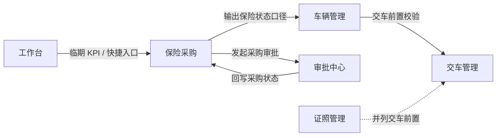
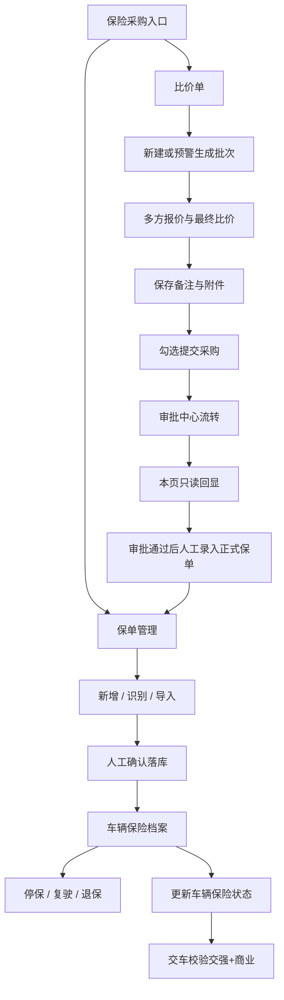

# 保险采购 · 产品需求说明（全模块）

| 项 | 内容 |
|---|---|
| 模块名称 | 保险采购 |
| 所属系统 | ONE-OS（PC） |
| 交互原型 | `/prototypes/insurance-procurement` |
| 业务条线 | 运维管理条线（证照 / 保险相关） |
| 文档状态 | AutoPRD · 已对齐可运行原型 |

---

## 1. 一句话与目标

**一句话**  
在同一模块内管理车队**保单台账**与**采购前比价审批**两条业务线，保证续保不遗漏、变更可追溯，并为交车提供交强险 + 商业险合规校验。

**要解决的问题**  
- 保险信息散落在表格、邮件与线下批单中，台账不全、临期易漏  
- 停保 / 复驶 / 退保缺少统一留痕  
- 采购前多方比价难追溯，审批结果难跟踪  
- 交车时无法与车辆管理共用同一套「保险是否有效」口径  

**本期目标**  
1. 一车一档维护五类险种台账；支持手工新增、批量识别、批量导入  
2. 支持停保 / 复驶 / 退保办理与操作历史  
3. 输出与车辆管理一致的车辆级保险状态，支撑交车拦截  
4. 比价单批次管理：多方报价、最晚付费预警、勾选提交采购审批（本页只读跟踪）  

**非目标（本期不做）**  
- 比价单与保单台账**自动双向同步**；审批通过后**不自动写入**正式保单  
- 在本模块内办理审批（通过 / 驳回 / 撤回均在审批中心）  
- 维护行驶证、道路运输证等证照档案（见证照管理）  
- 事故赔付、保险上浮等事故链路台账（见事故管理）  

---

## 2. 模块边界（最重要）

| 业务线 / 子域 | 做什么 | 不做什么 |
|---------------|--------|----------|
| 保单管理 | 一车一档、多通道录入、停保/复驶/退保、状态与交车口径 | 不替代证照管理；不办事故赔付 |
| 比价单 | 批次比价、付费预警、提交采购、只读跟踪审批 | 不自动生成正式保单；不在本页审批 |
| 与车辆 / 交车 | 提供交强 + 商业是否有效的统一口径 | 不在本页完成交车动作 |

**外部依赖（产品口径）**

| 依赖方 | 交互方式 | 产品要求 |
|--------|----------|----------|
| 车辆管理 | 读取保险状态 / 到期日 | 口径与本模块一致：异常则禁止交车 |
| 交车管理 | 交付前校验交强 + 商业有效 | 不合规须可理解拦截原因 |
| 审批中心 | 接收采购申请并回写状态 / 当前审批人 | 本页只读展示，不办理审批 |
| 工作台 | KPI、快捷「发起保险采购」 | 跳转至本模块对应能力 |
| 证照管理 | 并列交车前置 | 证照与保险各自独立维护 |

**关键约束**  
- **保单台账 ↔ 比价单互不自动同步**；审批通过后须运营在保单管理侧另行录入正式保单  
- **交车只看交强险 + 商业险**；超赔 / 货物 / 驾意仅参与临期预警，不参与交车判定  
- **最晚付费临期 / 超期**仅服务比价采购节奏，不写入保单台账  

---

## 3. 用户与角色

| 角色 | 主要目标 |
|------|----------|
| 运维部 | 维护保单台账、办理停保/复驶/退保；交车前确认保险有效 |
| 安全部 | 从合规视角关注保险与证照并列的交车前置 |
| 采购部 | 创建比价单、录入报价、提交采购申请；关注临期与付费节奏 |
| 业务管理组（业管） | 在审批中心确认报价等节点（本页只读看到结果） |

> 部门名对齐业务条线说明；`module-role-mapping` 将本模块主责记为运维部、安全部，采购部为比价线主操作用户。

---

## 4. 用户故事与故事点（业务条线说明口径）

> 故事点供排期参考，可按团队基准调整。合计约 **28 SP**。

### Epic A · 保单台账与交车合规（约 15 SP）

#### A1 · 一车一档台账与检索（约 3 SP）
- **角色**：运维部、采购部  
- **起点**：需要按车牌 / VIN / 运营状态 / 保险状态等快速定位车辆保险档案。  
- **怎么运作**：  
  1. 在列表筛选或点击 KPI 卡片缩小范围。  
  2. 查看五类险种到期日与车辆级保险状态。  
  3. 进入「管理」打开车辆保险档案。  
- **关键结果**：`可按条件定位车辆` / `空态提示无可匹配台账`  
- **闭环**：台账可检索、可下钻，与 KPI 口径一致。  
- **排期（可选）**：US-IPC-01 · 规模 M · 作为运维/采购，我想快速筛出台账车辆，以便处理续保与异常。

#### A2 · 多通道录入正式保单（约 5 SP）
- **角色**：运维部、采购部  
- **起点**：拿到新保或续保材料（纸质 / 电子保单、批量表格）。  
- **怎么运作**：  
  1. 选择新增、保单批量识别或批量导入。  
  2. 识别类须人工确认后再落库；导入仅处理新保/续保。  
  3. 按车牌/VIN（或批单场景按保单号）匹配车辆并写入对应险种台账。  
- **关键结果**：`确认后落库` / `识别失败可理解提示` / `车牌不一致则拦截`  
- **闭环**：正式保单进入一车一档，列表与车辆管理可见最新到期与状态。  
- **排期（可选）**：US-IPC-02 · 规模 L · 作为运维/采购，我想用识别或导入补齐台账，以便续保不遗漏。

#### A3 · 停保 / 复驶 / 退保留痕（约 4 SP）
- **角色**：运维部  
- **起点**：车辆需临时停保、恢复行驶或办理退保。  
- **怎么运作**：  
  1. 在车辆保险档案对**当前有效**记录发起对应办理。  
  2. 填写时间、金额等业务字段并上传批单附件。  
  3. 写入操作历史；更新险种与车辆状态展示。  
- **关键结果**：`变更可追溯` / `归档记录只读`  
- **闭环**：停保/复驶/退保全程留痕，交车口径随之更新。  
- **排期（可选）**：US-IPC-03 · 规模 M。

#### A4 · 交强 + 商业决定是否可交车（约 3 SP）
- **角色**：运维部、采购部  
- **起点**：采购/运维维护交强险与商业险台账，作为交车前置合规数据。  
- **怎么运作**：  
  1. 台账维护一车一档核心险种。  
  2. 交车时按「交强 + 商业均为正常或临期」判定是否放行。  
  3. 异常（未购买 / 已到期 / 已退保视同无效）则拦截并提示原因。  
- **关键结果**：`允许交车` / `禁止交车 · 保险异常`  
- **闭环**：交车合规与台账一致、可追溯；异常车辆不能进入履约运营。  
- **排期（可选）**：US-17 · 规模 M · 作为采购/运维，我想维护交强+商业险并在交车时校验，以便不合规车辆无法交车。

### Epic B · 比价采购与审批跟踪（约 13 SP）

#### B1 · 比价单批次与付费预警（约 4 SP）
- **角色**：采购部  
- **起点**：需要按批次组织待购车辆与险种，并盯住最晚付费日。  
- **怎么运作**：  
  1. 在比价单管理新建或编辑批次；可从临期预警一键带入。  
  2. 用全部 / 临期（≤3 天）/ 超期看板筛选批次。  
  3. 保存时校验购买记录、备注与附件。  
- **关键结果**：`可按付费节奏跟进` / `未满足保存条件则拦截`  
- **闭环**：采购节奏可视、可预警；不与保单台账自动混写。  
- **排期（可选）**：US-IPC-04 · 规模 M。

#### B2 · 多方报价与提交采购（约 5 SP）
- **角色**：采购部  
- **起点**：同一购买需求需比较多家保司报价后发起采购。  
- **怎么运作**：  
  1. 为每行录入多家报价并指定唯一最终比价。  
  2. 填写最晚付费日，勾选可提交行。  
  3. 提交采购申请进入审批中心。  
- **关键结果**：`审批中/已通过行不可再提` / `撤回或驳回后可再提`  
- **闭环**：比价过程可追溯；正式保单仍须审批通过后在台账侧补录。  
- **排期（可选）**：US-IPC-05 · 规模 L。

#### B3 · 审批只读回显（约 4 SP）
- **角色**：采购部、业务管理组  
- **起点**：采购申请已在审批中心流转。  
- **怎么运作**：  
  1. 本页展示采购状态与当前审批人（可为空）。  
  2. 业管等角色在审批中心办理节点。  
  3. 结果回写本页；通过后运营去保单管理录入正式保单。  
- **关键结果**：`本页不可办理审批` / `状态与审批中心一致`  
- **闭环**：采购决策可跟踪；台账仍以人工录入为准。  
- **排期（可选）**：US-IPC-06 · 规模 M。

---

## 5. 功能模块说明（正向 / 逆向）

### 5.1 保险台账列表与 KPI

**正向**  
1. 按车牌、VIN、品牌型号、运营状态、保险状态、险种 + 到期区间筛选。  
2. 点击 KPI（台账车辆、状态正常、核心逾期、核心待购等）联动列表或打开预警。  
3. 行内「管理」打开车辆保险档案。  

**逆向 / 边界**

| 情况 | 系统表现 |
|------|----------|
| 无匹配数据 | 空态提示无可匹配台账车辆 |
| 退出运营车辆 | 列表可查看但样式弱化 |
| 险种到期筛选未选险种 | 须先选险种再筛到期区间 |
| 车牌与多车牌条件互斥 | 按产品约定互斥，避免条件冲突 |

### 5.2 保单录入（新增 / 识别 / 导入）

**正向**  
1. 新增：完整字段手工录入后保存。  
2. 批量识别：选业务类型 → 上传 → 识别 → **人工确认** → 落库。  
3. 批量导入：下载模板填写 → 上传 → 仅新保/续保入库。  
4. 识别任务记录：查看进度，对待确认结果继续确认。  

**逆向 / 边界**

| 情况 | 系统表现 |
|------|----------|
| 识别失败 | 提示清晰度 / 格式 / 损坏等原因 |
| 无成功结果可确认 | 提示暂无识别成功结果 |
| 识别车牌与所选车不一致 | 拦截并提示两边车牌 |
| 导入中的停保/复驶/退保行 | 自动跳过 |
| OCR 确认页 | 不展示承保险种明细、分项保费（手工路径仍可填） |

### 5.3 车辆保险档案 · 停保 / 复驶 / 退保

**正向**  
1. 分险种查看历史；对当前有效记录办理停保、复驶或退保。  
2. 填写业务时间 / 金额等并上传批单附件。  
3. 全周期时间轴与操作历史可追溯。  

**逆向 / 边界**

| 情况 | 系统表现 |
|------|----------|
| 历史归档记录 | 只读，不可再办停保/退保 |
| 已退保 | 仅允许复驶 |
| 已停保 | 可复驶或退保 |
| 新保覆盖已退保险种 | 旧记录归档后再写入新保单 |

### 5.4 比价单管理与编辑

**正向**  
1. 新建 / 编辑比价单，添加购买记录与多方报价。  
2. 设最终比价、最晚付费日；保存备注与附件。  
3. 勾选行提交采购；跟踪审批状态。  
4. 可从险种临期预警一键生成比价单（附件须补传）。  

**逆向 / 边界**

| 情况 | 系统表现 |
|------|----------|
| 保存校验不通过 | 拦截并提示缺记录 / 备注 / 附件等 |
| 审批中或已通过行 | 勾选禁用，不可重复提交 |
| 撤回 / 驳回 | 恢复可提交 |
| 修改行内险种 | 清空该行报价与最终比价 |
| 删除比价单 | 二次确认，删除后不可恢复 |
| 一键生成时已有审批中/通过的同车同险 | 跳过该条 |

---

## 6. 关键业务逻辑（必须对齐）

### 6.1 险种范围

| 险种 | 台账 | 临期预警 | 交车判定 |
|------|------|----------|----------|
| 交强险 | 是 | 是 | **是（核心）** |
| 商业险 | 是 | 是 | **是（核心）** |
| 超赔险 | 是 | 是 | 否 |
| 驾意险 | 是 | 是 | 否 |
| 货物险 | 是 | 是 | 否 |

### 6.2 单险种状态（按优先级命中即止）

1. 已退保  
2. 无保单号 → 未购买  
3. 停保标记 → 已停保  
4. 有号但无到期日 → 未购买  
5. 到期日 ≤ 今天 → 已到期  
6. 到期日 ≤ 今天 + 30 天 → 临期  
7. 否则 → 正常  

列表到期日取同车同险种**最新一条**记录。

### 6.3 车辆级保险状态（交车联动）

| 条件 | 车辆保险状态 | 交车 |
|------|--------------|------|
| 交强与商业均为正常或临期（仍在有效期内） | 正常 / 临期 | **允许**（临期可提示尽快续保） |
| 交强或商业任一未购买或已到期 | 异常 | **禁止** |
| 已退保 | 视同无有效保障 | **禁止** |

### 6.4 新保 / 续保录入必填（业务口径）

- 车牌与车辆识别代码至少填一项  
- 必填：险种、保险公司、保单号、生效日、到期日、保险费合计  
- 承保险种明细、分项保费：非必填  

### 6.5 批单匹配方式

| 业务 | 匹配方式 |
|------|----------|
| 保单录入 | 按车牌 / 车辆识别代码匹配车辆 |
| 停保 / 复驶 / 退保 | 按**保单号**在全库匹配已有记录 |

### 6.6 比价保存与提交

**保存须同时满足**：至少 1 条购买记录；每行已选车辆；整单备注非空；整单至少 1 个附件。  

**提交采购另须**：至少勾选 1 行；行内已有报价并设最终比价；已填最晚付费日；采购状态为未提交 / 撤回 / 驳回；未保存须先保存。  

**报价**：保司 + 金额大于 0；同一保司不可对同行重复报价。  

**最晚付费预警（仅比价）**：≤ 3 个自然日为临期；已过为超期。

### 6.7 采购状态（购买记录行级）

| 状态 | 可否再提交 | 说明 |
|------|------------|------|
| 未提交 | 可以 | 默认 |
| 审批中 | 不可以 | 本页提交后写入；勾选禁用 |
| 审批通过 | 不可以 | 审批中心回写；勾选禁用 |
| 撤回 / 审批驳回 | 可以 | 审批中心回写后可再提 |

> 审批办理不在本页；当前审批人由工作流回写，可为空。

---

## 7. 总览流程图

---

## 8. 验收清单（产品 / 测试）

**保单台账**  
- [ ] 筛选与 KPI 口径一致；空态文案正确  
- [ ] 五类险种独立台账；列表到期日取最新一条  
- [ ] 新增 / OCR 确认 / 导入（仅新保续保）均可落库  
- [ ] OCR 失败、车牌不一致有明确拦截  
- [ ] 停保 / 复驶 / 退保须附件并写入操作历史；归档只读  

**交车合规**  
- [ ] 仅交强 + 商业决定车辆级状态  
- [ ] 异常禁止交车；正常/临期允许（临期可提示续保）  
- [ ] 超赔 / 货物 / 驾意不参与交车判定  

**比价采购**  
- [ ] 保存 / 提交校验完整  
- [ ] 最晚付费临期 ≤3 天、超期看板正确  
- [ ] 审批中 / 通过行不可再提；撤回 / 驳回可再提  
- [ ] 审批通过**不**自动写入保单台账  
- [ ] 本页不可办理审批，状态只读回显  

**边界**  
- [ ] 保单与比价互不自动同步  
- [ ] 一键生成跳过已审批中/通过的同车同险  

---

## 9. 交付口径

> 「保险采购」在 OneOS PC 承载**保单台账**与**比价采购**两条独立业务线：运维部、采购部可一车一档维护交强 / 商业等五类险种并办理停保复驶退保，车辆管理与交车据此校验核心险种有效性；采购部可在比价单中完成多方报价、付费预警与采购审批跟踪，审批通过后须人工补录正式保单——台账与比价互不同步，审批不在本页办理。
