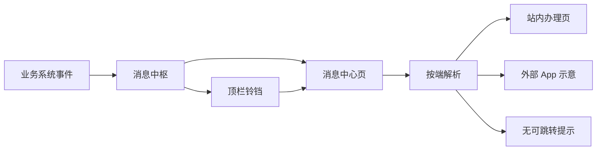
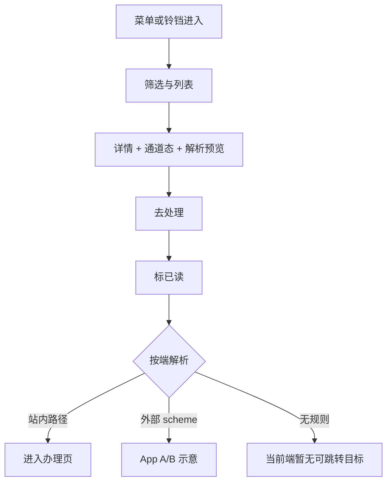

# 消息中心 · 产品需求说明（全模块）

| 项 | 内容 |
|---|---|
| 模块名称 | 消息中心 |
| 所属系统 | ONE-OS（PC） |
| 交互原型 | `/prototypes/message-center` |
| 业务条线 | 平台能力 · 统一触达与办理入口 |
| 文档状态 | AutoPRD · 首版 |
| 关联规格 | [route-resolve.md](./route-resolve.md) · 设计已确认（消息中枢） |

---

## 1. 一句话与目标

**一句话**  
统一汇聚多系统待办/提醒，在独立消息中心与顶栏铃铛中阅知，并按当前端解析「去处理」跳转到来源办理页（或明确不可跳）。

**要解决的问题**  
- 工作台铃铛仅能阅知，缺少独立消息中心与完整筛选/详情  
- 无统一的多系统消息源与五端触达/跳转口径  
- 「去处理」缺少可验收的本地路由解析规则（含外部双 App 示意）  

**本期目标**  
1. 独立「消息中心」菜单页 + 顶栏铃铛未读快捷（「查看全部」进中心）  
2. 宽首期：五端模拟器 + 多系统消息源样例（OneOS / 车辆数据中台 / 其他系统 / 外部）  
3. 列表筛选、详情（正文、通道触达态、解析预览）、「去处理」  
4. 外部应用 A / B 仅示意打开，不真唤端  
5. 跳转解析与规格全文一致（见关联规格）  

**非目标（本期不做）**  
- 真实推送 SDK、厂商通道、微信服务号模板下发  
- 跨端已读强一致、服务端已读同步  
- 外部 App 真唤端 / Universal Link 联调  
- 车辆中台真实事件流；独立移动/鸿蒙原生工程  

---

## 2. 模块边界（最重要）

| 业务线 / 子域 | 做什么 | 不做什么 |
|---------------|--------|----------|
| 消息池 | 一条业务事件一条消息；多通道触达态挂在同一条上 | 按通道拆成多条业务消息 |
| 消息中心 | 筛选、列表、详情、端模拟、去处理 | 真实推送回执中心 |
| 铃铛快捷 | 未读数、最近摘要、进详情/查看全部 | 列表行上直接跳走不看上下文 |
| 跳转解析 | 业务键 + 本地路由表；失败固定文案 | 服务端下发各端 URL；无规则静默进首页 |

**外部依赖（产品口径）**

| 依赖方 | 交互方式 | 产品要求 |
|--------|----------|----------|
| 各业务办理页 | 「去处理」站内跳转 | 命中 Web 路径才进入；演示可到对应原型 |
| 工作台 / 外壳铃铛 | 读同一消息池 | 未读数一致；查看全部进消息中心 |
| 外部应用 A / B | scheme 示意 | 占位名可后续替换真名；本期不真唤端 |

**关键约束**  
- 消息只带业务键，不带各端最终 URL  
- 无规则必须提示「当前端暂无可跳转目标」，禁止猜路径  

---

## 3. 用户与角色

| 角色 | 主要目标 |
|------|----------|
| 运营 / 业务人员（Web 为主） | 统一看待办与提醒，点「去处理」进办理 |
| 多角色（工作台用户） | 铃铛扫未读，需要时进消息中心深看 |
| 评审 / 产品（端模拟） | 切换五端预览同消息在不同端的可跳性 |

---

## 4. 用户故事与故事点（业务条线说明口径）

合计约 **13 SP**。

### Epic A · 统一入口与阅知（约 5 SP）

#### A1 · 独立消息中心
- **角色**：运营 / 业务  
- **起点**：从菜单进入消息中心，或从铃铛「查看全部」进入  
- **怎么运作**：
  1. 左侧筛选：全部 / 未读 / 已读、系统源、业务类型；端模拟器切换当前解析端  
  2. 右侧列表选中一条 → 详情展示标题、摘要、正文、通道触达态、解析预览  
  3. 本地标已读后列表角标与铃铛未读同步  
- **闭环**：在同一台账里完成阅知，并可发起去处理  
- **排期**：US-01 · M  

#### A2 · 顶栏铃铛快捷
- **角色**：工作台用户  
- **起点**：顶栏铃铛有未读  
- **怎么运作**：
  1. 见未读数与最近若干条  
  2. 点单条：标已读并看详情上下文（含去处理能力）；不在行上直接跳走  
  3. 「查看全部」进入消息中心  
- **闭环**：轻量扫读与完整中心同一数据源  
- **排期**：US-02 · S  

### Epic B · 多源与五端（约 4 SP）

#### B1 · 多系统消息源
- **角色**：运营 / 评审  
- **起点**：打开列表并按系统源筛选  
- **怎么运作**：
  1. 可见 OneOS、车辆数据中台、其他系统、外部系统样例  
  2. OneOS 侧覆盖审批、催办、合同/证照到期、账单、系统通知等（含工作台历史通知映射）  
  3. 每条展示通道触达演示态（待发送 / 已送达 / 失败 / 已跳过）  
- **闭环**：确认「一条事件、多通道」模型可演示  
- **排期**：US-03 · M  

#### B2 · 五端模拟器
- **角色**：产品 / 评审  
- **起点**：选中一条消息后切换端  
- **怎么运作**：
  1. 在 Web / iOS / Android / 鸿蒙 / 微信服务号间切换  
  2. 解析预览随路由表变化（含鸿蒙回退安卓模板等）  
  3. 不接真推送与真服务号 API  
- **闭环**：宽首期触达矩阵可验收  
- **排期**：US-04 · S  

### Epic C · 去处理与外部示意（约 4 SP）

#### C1 · 去处理跳转
- **角色**：运营 / 业务  
- **起点**：详情中点击「去处理」  
- **怎么运作**：
  1. 先标已读  
  2. 按当前模拟端解析目标（规则全文见 [route-resolve.md](./route-resolve.md)）  
  3. 站内路径 → 进入办理页；失败 → 固定提示「当前端暂无可跳转目标」  
- **关键结果**：`禁止` 无规则静默跳首页；`禁止` 按标题猜路径  
- **闭环**：有规则则到达来源办理上下文，无规则则明确不可办  
- **排期**：US-05 · M  

#### C2 · 外部应用 A / B 示意
- **角色**：运营（外部协同场景演示）  
- **起点**：选中外部系统订单/结算类消息并去处理（或非 Web 端 scheme）  
- **怎么运作**：
  1. 解析命中外部 scheme 与 App A / B 标识  
  2. 弹出「将打开 xxx」示意面板，展示 URI  
  3. 不真唤端、不联调 Universal Link  
- **闭环**：外部双 App 占位可演示，真名后续只改表不改模型  
- **排期**：US-06 · S  

---

## 5. 功能模块说明（正向 / 逆向）

### 5.1 消息中心列表与筛选

**正向**  
1. 按已读态、系统源、业务类型过滤，列表与选中详情一致  
2. 空筛选结果时列表为空态，详情跟随无可选  

**逆向 / 边界**

| 情况 | 系统表现 |
|------|----------|
| 仅其他系统通用通知等无可跳样例 | 列表仍可阅知；去处理提示无可跳 |
| 切换筛选导致选中项消失 | 自动落到当前结果第一条或清空选中 |

### 5.2 详情与通道态

**正向**  
1. 展示正文、优先级/业务标签、五端通道触达态  
2. 展示当前端解析预览（成功 URI/说明或失败文案）  

**逆向 / 边界**

| 情况 | 系统表现 |
|------|----------|
| 通道为已跳过 | 表示该端未触达尝试（演示），与是否可跳转无关 |
| 仅详情类系统通知 | 可阅知；Web 常无可跳 |

### 5.3 去处理

**正向**  
1. 标已读 → 解析 → 站内跳转或外部示意  
2. 端模拟切换后再次去处理，按新端结果执行  

**逆向 / 边界**

| 情况 | 系统表现 |
|------|----------|
| 无规则 / 空模板无回退 | 「当前端暂无可跳转目标」 |
| 外部 / 原生 scheme | 示意模态，不离开浏览器真唤端 |
| 鸿蒙配置回退安卓 | 预览与去处理使用安卓侧模板（若存在） |

---

## 6. 关键业务逻辑（必须对齐）

### 6.1 跳转解析优先级

| 顺序 | 条件 | 结果 |
|------|------|------|
| 1 | 来源系统 + 业务类型 + 当前端精确匹配且模板非空 | 填充业务主键后跳转 / 示意 |
| 2 | 精确匹配但模板空，且配置回退端 | 使用回退端同键模板 |
| 3 | 其余 | 失败文案「当前端暂无可跳转目标」 |

规格全文（前置条件、数据源、代码入口）：[route-resolve.md](./route-resolve.md)。

### 6.2 消息与触达

- 一条业务事件 = 一条消息；站内 / 推送 / 服务号等通道态挂在同一条上  
- 通道态只表示触达尝试演示，不代替路由表  

### 6.3 铃铛与中心同源

- 未读数与消息池一致  
- 铃铛点开单条先看上下文；「查看全部」进消息中心  

---

## 7. 总览流程图

---

## 8. 验收清单（产品 / 测试）

- [ ] 消息中心可按系统源 / 已读态 / 业务类型筛选，列表与详情一致  
- [ ] 端模拟器切换后，同一条消息的解析预览随路由表变化  
- [ ] 「去处理」仅在命中规则时跳转或示意；未命中固定提示「当前端暂无可跳转目标」  
- [ ] 外部应用 A / B 仅示意面板，不真唤端  
- [ ] 铃铛未读数与中枢一致；「查看全部」进入消息中心  
- [ ] 旧工作台通知类种子可在中枢中看到对应映射条目  
- [ ] 多系统源至少各有样例：OneOS、车辆数据中台、其他系统、外部  
- [ ] 规格中路由优先级与页面行为一致（见 [route-resolve.md](./route-resolve.md)）  

数据：本地种子 + 本地已读；**未接真实推送 / 真唤端 / 正式消息 API**。

---

## 9. 交付口径

> 本期交付 OneOS Web 统一消息中心：独立列表详情 + 铃铛快捷同源；宽首期演示五端模拟与多系统源；「去处理」按业务键与本地路由表解析，失败文案固定可验收；外部 App A/B 仅示意。复杂判定以跳转解析规格为准。

---

## 10. 功能变更记录

> 产品经理原型发版记录。仅记功能与业务逻辑变更；不含样式/UI/表结构。  
> 由「需求定稿」关键字触发追加；日常改原型不强制每改必写。

（首版，尚未定稿。）
