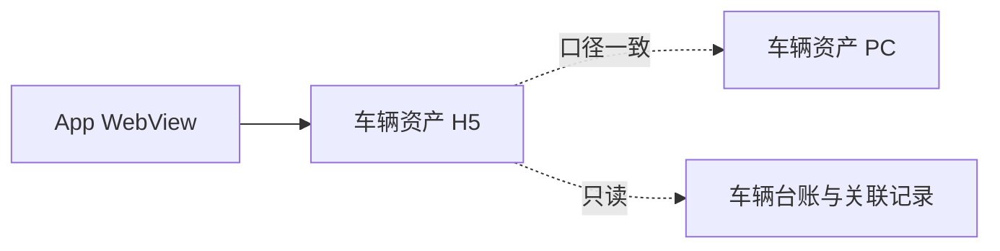
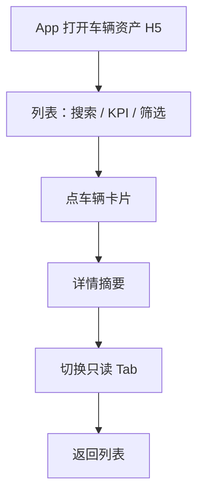

# 车辆资产（H5）· 产品需求说明（全模块）

## 1. 一句话与目标

**一句话**  
在 App / 手机浏览器提供与 PC「车辆资产」口径一致的只读查车与异常浏览能力。

**要解决的问题**  
- 外勤与业务人员无法在手机上快速按车牌查车、看营运分类与证照/保险异常  
- PC 宽表页不适合塞进 WebView，需要独立手机信息架构  

**本期目标**  
1. 列表：车牌搜索、KPI 分类横滑、证照/保险异常筛选、车辆卡片（含里程任务进度）  
2. 详情：多 Tab 对齐 PC，全程只读浏览  
3. 全角色同一套界面；手机端不做编辑  

**非目标（本期不做）**  
- 任意字段编辑（含 Admin）  
- 导入 / 导出、催办、跳转证照管理或保险采购等业务处理页  
- 里程任务工单下发 / 编辑、从卡片跳转工单详情、按截止日逾期标红  
- 在租车型占比等 PC 尾部分析入口  
- 将 PC 页做响应式自适应  

## 2. 模块边界

| 业务线 / 子域 | 做什么 | 不做什么 |
|---------------|--------|----------|
| 查车列表 | 搜索、KPI、异常筛选、卡片进详情、卡片里程任务进度 | 批量操作、写操作、下发/编辑工单 |
| 车辆详情 | 11 个 Tab 只读浏览 | 行内编辑、跳转处理 |

**外部依赖（产品口径）**  

| 依赖方 | 交互方式 | 产品要求 |
|--------|----------|----------|
| 车辆资产 PC | 同一套台账与统计口径 | KPI / 证照异常 / 保险异常定义一致；台账数据同源（业务导表） |
| 采购合同 / 任务工单 | 合同关联批次里程要求与起止；工单下发后回写进度 | 列表卡片只读展示完成百分比、剩余公里与预计天数；无工单时仍展示「暂无里程任务」 |
| App 壳 | 内嵌打开本 H5 | 固定打开手机页，不打开 PC 宽表地址 |

**关键约束**  
- 手机端明确提示：修改请在 PC 完成  
- 筛选与 KPI 叠加：先按 KPI，再按证照/保险条件  
- 列表车辆数据与 PC「车辆资产」共用业务导表台账（含真实车牌、客户、运营状态分布）  

## 3. 用户与角色

| 角色 | 主要目标 |
|------|----------|
| 运维 / 业务 / 管理等全角色 | 同一套界面查车、看异常与档案摘要 |
| Admin | 与普通用户相同；手机端仍无编辑（改数回 PC） |

## 4. 用户故事与故事点（业务条线说明口径）

合计约 **15 SP**。

### Epic A · 列表查车（约 10 SP）

#### A1 · 车牌搜索与卡片列表
- **角色**：全体手机用户  
- **起点**：从 App 进入车辆资产 H5  
- **怎么运作**：
  1. 顶栏左对齐「车辆资产」；搜索栏提示「搜索车牌 / VIN / 停车场 / 客户名称」，支持按这些关键词过滤；右侧扫码为占位提示  
  2. KPI 横滑摘要卡（每屏 3 张、共 2 页；图标 + 计数 + 占比）；下方固定筛选项行：品牌车型 / 运营城市（省→市，可只选省）/ 车辆状态 +「更多筛选」（证照 / 保险 / 出库 / 来源 / 在线）；前三项为 App 原生底部选择器，选项来自业务导表；更多筛选面板限制在手机操作区内并可滚动  
  3. 列表横卡含车牌、车型、来源标签、按运营状态变化的次要标签（租赁/自营→客户名省略；库存→未备车警告/已备车正常；非运营→非运营车辆；退出→三方退租/销售/报废）、营运状态圆点、里程与异常角标（不含车辆照片）；标签下方展示「里程任务」分隔区（有任务：百分比 + 进度条 + 剩余公里/预计天数 + 完成预判标签；无任务：「暂无里程任务」）；列表不展示总车辆数，不提供翻页按钮，滚动触底异步加载更多  
  4. 底部 App Tab 为单条悬浮胶囊壳层预览：车辆 / 业务 / 工作台（中间圆形仅图标）/ 消息 / 我的；非车辆入口仅提示；点卡片进详情  
- **闭环**：找到目标车并进入详情  
- **排期**：US-01 · M  

#### A2 · KPI 分类与异常筛选
- **角色**：运维 / 业务  
- **起点**：需要按营运分类或证照/保险异常缩小范围  
- **怎么运作**：
  1. 横滑点选 KPI 摘要卡（全部营运/租赁/物流/库存/非运营/退出；每屏完整显示 3 张，翻页看其余 3 张；显示计数与相对占比）  
  2. 筛选项行：品牌车型（品牌→车型）、运营城市（省→市，可只选省）、车辆状态（与 PC 字典一致，含调拨中 / 替换中等；无数据时计数为 0 仍可选）；点「更多筛选」可再调证照状态、保险状态、出库状态、车辆来源、在线状态  
  3. 列表随条件刷新并从顶部重新加载；不展示列表总辆数  
- **闭环**：得到与 PC 同口径的筛选结果  
- **排期**：US-02 · M  

#### A3 · 卡片里程任务进度
- **角色**：运维 / 业务 / 管理  
- **起点**：采购合同已为批次车辆关联里程要求与起止时间，并通过任务工单下发  
- **怎么运作**：
  1. 列表每张卡片固定展示「里程任务」区  
  2. 有工单：展示完成百分比、进度条、剩余公里；预计完成天数按近 7 个活跃日（日里程 > 0）平均日里程推算；文案后方展示完成预判标签（对照任务截止剩余日历天：预计无法完成 / 可完成 / 有完成风险）  
  3. 无工单：仍保留区块，文案「暂无里程任务」  
- **闭环**：不进详情也能判断该车里程任务是否在轨、还差多少  
- **排期**：US-04 · S  

### Epic B · 详情只读（约 5 SP）

#### B1 · 多 Tab 档案浏览
- **角色**：全体手机用户  
- **起点**：从列表进入某车详情  
- **怎么运作**：
  1. 详情与列表共用一体浅蓝渐变底；顶栏透明，仅返回 + 车牌；不挂底部悬浮 Tab  
  2. 摘要为浮起白卡：车牌、品牌型号、营运状态（与列表同文案/色点）、来源·城市·项目等标签、里程、证照/保险异常角标（无车辆实景大图）  
  3. 横滑切换与 PC 一致的 11 个 Tab；选中态为浅底主色字（对齐列表 Chip）  
  4. 各 Tab 仅展示信息（白卡 Section / 记录列表），无编辑按钮；检验有效期后方展示「剩余 x 天」标签；沪牌车在档案信息额外展示等级评定时间与剩余天数；证照信息 Tab 对齐证照管理八类证照；保险记录 Tab 对齐保险采购五险种与采购历史；租赁记录为纵向时间轴（近→远，未还车标注），并支持按客户名称 / 项目名称搜索；事故等业务 Tab 无种子时展示演示用例；无数据时为空态插画  
- **闭环**：不回 PC 也能看完档案与业务记录摘要  
- **排期**：US-03 · M  

## 5. 功能模块说明（正向 / 逆向）

### 5.1 列表

**正向**  
1. 默认展示「全部营运」KPI 下的卡片列表（首屏一批，触底异步加载更多；不含退出运营、不含非运营车辆）  
2. 搜索、切 KPI、改筛选后列表刷新并从顶部重新加载；不展示总车辆数、无翻页按钮  
3. 证照/保险异常在卡片上可见  
4. 每张卡片标签下方展示「里程任务」：有工单则百分比 + 进度条 + 剩余/预计 + 完成预判标签；无工单则「暂无里程任务」  

**逆向 / 边界**  

| 情况 | 系统表现 |
|------|----------|
| 无匹配 | 展示「暂无匹配车辆」+ 引导文案；可清空搜索或重置筛选 |
| 仅筛选异常 | 只保留对应异常车辆 |
| 更多筛选多项叠加 | 与 KPI / 搜索 / 筛选项行条件同时生效（AND） |
| 已加载全部 | 底部提示「没有更多了」 |
| 里程任务已完成 | 进度 100%，文案「已完成」，无预判标签 |
| 有任务但近窗无活跃日 | 仍显示剩余公里，预计侧「暂无法预计」，预判标签为「剩余 x 天，预计有完成风险」 |
| 按活跃日推算赶不上截止 | 预判标签「剩余 x 天，预计无法完成」 |

### 5.2 详情

**正向**  
1. 进入详情后背景与列表一体连续；摘要卡可见状态、标签、里程与异常  
2. 11 个 Tab 均可切换；内容区白卡展示字段或记录  
3. 检验有效期后方展示剩余/已过期天数标签；沪牌车额外展示等级评定时间与剩余天数  
4. 证照信息含八类证照（行驶证、道路运输证、登记证、特种设备使用登记证、特种设备使用标识、加氢卡、安全阀、压力表），字段与证照管理对齐；顶部索引单行横滑点选锚点  
5. 保险记录对齐保险采购：五险种卡片 + 当前保单摘要 + 采购/批单历史（纵向时间轴，只读）  
6. 租赁 / 事故 / 故障 / 违章 / 异动 / 调拨 / 年审均为纵向时间轴（近→远）；事故及右侧 Tab 支持时间快捷/自定义筛选（自定义为手机端原生滚轮选日）；调拨卡片展示出发城市、到达城市、停车场、接收人、接收日（不展示路线与调出人）；租赁可搜客户/项目，未还车显示「未还车」  
7. 业务 Tab 无种子时展示演示用例；租赁不足 3 条时补足  
8. 无记录时展示美化空态；无底部 App Tab，避免挡内容  

**逆向 / 边界**  

| 情况 | 系统表现 |
|------|----------|
| 任意角色 | 均无编辑、删除、导入入口 |
| 返回 | 顶栏返回或系统返回回到列表；列表底栏样式不受详情影响 |
| 检验有效期为空 | 显示「未上传」，无剩余天数标签 |
| 非沪牌 | 不展示等级评定时间 / 剩余天数 |
| 未绑定加氢卡 | 显示「尚未绑定加氢卡」 |
| 某险种无采购记录 | 显示「暂无记录」，引导回 PC 保险采购 |
| 租赁未还车 | 还车字段显示「未还车」 |
| 租赁搜索无匹配 | 展示「暂无匹配记录」，可清空搜索 |
| 业务 Tab 无种子 | 展示稳定演示用例（非真实业务单据） |

## 6. 关键业务逻辑

### 6.1 KPI 口径（与 PC 一致）

| KPI | 口径 |
|-----|------|
| 全部营运（原「所有营运车辆」） | 非「非运营车辆」，且运营状态不为「退出运营」 |
| 租赁 / 物流 | 运营状态等于对应值 |
| 库存 | 可运营或待运营 |
| 非运营 | 台账类型为非运营车辆 |
| 退出运营 | 运营状态为退出运营 |

### 6.2 异常口径

| 异常 | 口径 |
|------|------|
| 证照异常 | 检验有效期早于今天 |
| 保险异常 | 保险状态为「异常」 |

### 6.3 更多筛选口径

| 筛选项 | 口径 |
|--------|------|
| 证照 / 保险 | 同 §6.2 |
| 出库状态 | 由车辆状态推导：未出库 = 待验车/未备车/已备车/待交车；已出库 = 其余有状态车辆（原型无独立出库字段） |
| 车辆来源 | 自有 / 外租 / 挂靠，与台账一致 |
| 在线状态 | 在线 / 离线，与台账一致 |

规格全文见 [more-filters.md](./more-filters.md)。

### 6.4 里程任务进度（列表卡片）

| 项 | 口径 |
|----|------|
| 来源 | 采购合同批次里程要求 + 时间起止 + 任务工单下发（原型为本地演示种子，未接真实 API） |
| 完成百分比 | 任务内已完成里程 / 目标里程，封顶 100%，展示保留 1 位小数 |
| 剩余公里 | 目标 − 已完成，下限 0 |
| 活跃日 | 当日行驶里程 > 0 km |
| 预计天数 D | 剩余 ÷ 近最多 7 个活跃日平均日里程，向上取整；无活跃日则「暂无法预计」 |
| 截止剩余日历天 x | 任务时间窗相对今天的剩余自然日 |
| 预判标签 | 用 D 对照 x：无法完成 / 有完成风险 / 可完成（见规格全文）；无法完成时进度条与百分比为危险红，有完成风险为警告橙 |
| 无工单 | 仍展示区块，文案「暂无里程任务」 |

规格全文见 [mileage-task.md](./mileage-task.md)。

### 6.5 检验有效期剩余天数 · 沪牌等级评定

| 项 | 口径 |
|----|------|
| 检验有效期 | 日期后方标签：剩余 x 天 / 已过期 x 天；空为「未上传」 |
| 沪牌判定 | 车牌以「沪」开头 |
| 等级评定时间 | 仅沪牌展示；空为「未上传」 |
| 剩余天数 | 仅沪牌展示；相对等级评定日计算 |

规格全文见 [expire-remain-shanghai.md](./expire-remain-shanghai.md)。

### 6.6 证照信息（八类）

与证照管理一致：行驶证、道路运输证、登记证、特种设备使用登记证、特种设备使用标识、加氢卡、安全阀、压力表。规格全文见 [license-certs.md](./license-certs.md)。

### 6.7 保险记录（对齐保险采购）

五险种（交强 / 商业 / 超赔 / 驾意 / 货物）+ 当前保单摘要 + 采购历史（纵向时间轴）。规格全文见 [insurance-records.md](./insurance-records.md)。

### 6.8 业务记录纵向时间轴

租赁 / 保险历史 / 事故 / 故障 / 违章 / 异动 / 调拨 / 年审统一近→远时间轴。

| 能力 | 口径 |
|------|------|
| 时间筛选 | 事故及右侧 Tab：全部 / 近30天 / 近90天 / 近1年 / 自定义；按各 Tab 关键时间过滤；无匹配可重置 |
| 自定义选日 | 手机端底部滚轮（年 / 月 / 日，精确到日）；起日不得晚于止日；本模块选日入口统一该交互 |
| 调拨卡片 | 出发城市、到达城市、停车场、接收人、接收日；不展示「路线」合并行与「调出」人 |

规格全文见 [biz-timeline.md](./biz-timeline.md)、[lease-records.md](./lease-records.md)。

### 6.9 业务记录演示用例与空态

无种子时 H5 本地生成演示用例；真正无数据时展示美化空态。规格全文见 [demo-biz-records.md](./demo-biz-records.md)。

## 7. 总览流程图

## 8. 验收清单（产品 / 测试）

- [ ] 独立原型可打开，桌面 PhoneShell / 窄屏可用  
- [ ] KPI 六类计数与同数据 PC 一致  
- [ ] 证照异常、保险异常筛选结果与 PC 规则一致  
- [ ] 「更多筛选」含证照 / 保险 / 出库 / 来源 / 在线；面板不超出手机操作区，内容可滚动；启用后角标点亮  
- [ ] 出库：未出库对应待验车/未备车/已备车/待交车；来源与在线与台账字段一致  
- [ ] 车辆状态选项与 PC 字典一致，含「调拨中」「替换中」  
- [ ] 搜索支持车牌 / VIN / 停车场 / 客户名称过滤列表；可一键清空搜索  
- [ ] 无匹配时有引导操作（清空搜索 / 重置筛选）  
- [ ] 列表无总辆数、无翻页按钮；滚动触底可异步加载更多，到底提示「没有更多了」  
- [ ] 列表进详情：一体渐变底连续，无白顶栏色带；摘要为浮起白卡（状态/标签/里程/异常与列表同语义）；详情无底栏  
- [ ] 详情检验有效期后方有「剩余 x 天」或「已过期 x 天」标签；空为「未上传」  
- [ ] 沪牌详情可见「等级评定时间」「剩余天数」；非沪牌不出现  
- [ ] 证照信息 Tab 可见八类证照，与证照管理种类一致  
- [ ] 保险记录可见五险种卡片、当前保单摘要与历史时间轴；整体状态口径与保险采购一致  
- [ ] 保单附件可预览与下载（原型演示）  
- [ ] 租赁 / 事故 / 故障 / 违章 / 异动 / 调拨 / 年审为近→远时间轴；租赁未还车显示「未还车」  
- [ ] 调拨卡片可见出发城市、到达城市、停车场、接收人、接收日；无「路线」「调出」  
- [ ] 事故及右侧业务 Tab 可按时间快捷或自定义区间筛选；自定义起止为底部滚轮选日（精确到日），无匹配可重置  
- [ ] 租赁记录可按客户名称 / 项目名称搜索；无匹配可清空搜索  
- [ ] 任意车辆打开上述业务 Tab 可见列表（种子或演示用例）；空态有插画与说明 
- [ ] 详情 11 个 Tab 可进入且只读，无编辑按钮  
- [ ] 列表卡片标签下有「里程任务」区：有任务可见百分比、进度条、剩余公里与预计天数；无任务显示「暂无里程任务」  
- [ ] 预计天数按近 7 活跃日均里程推算；无活跃日时显示「暂无法预计」  
- [ ] 进行中任务文案后方有完成预判标签（剩余 x 天 + 预计无法完成 / 可完成 / 有完成风险）  
- [ ] 页脚说明「修改请在 PC」可见  

**交付口径**  
本期交付可嵌入 App 的车辆资产只读 H5：能查、能筛异常、能看详情全 Tab，并在列表卡片扫读里程任务进度；写操作与异常处理仍回 PC。
