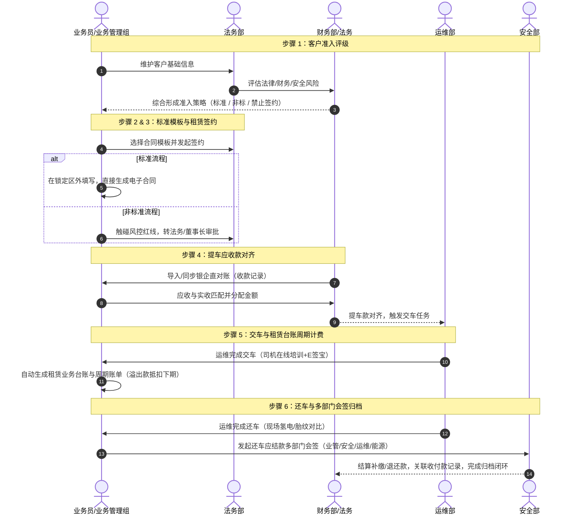
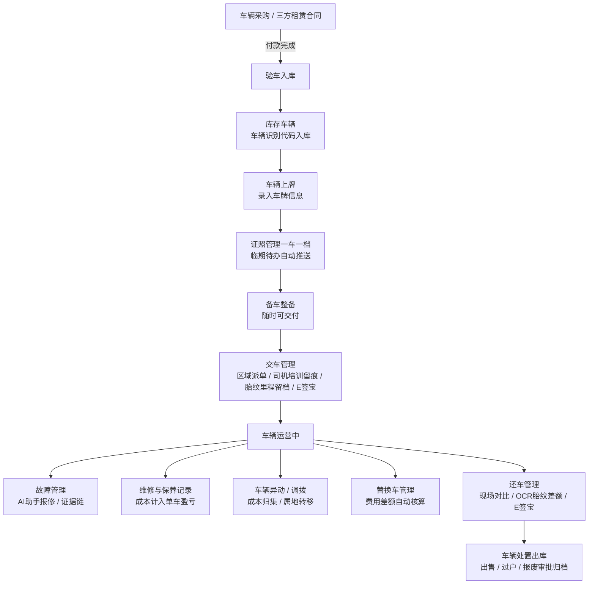
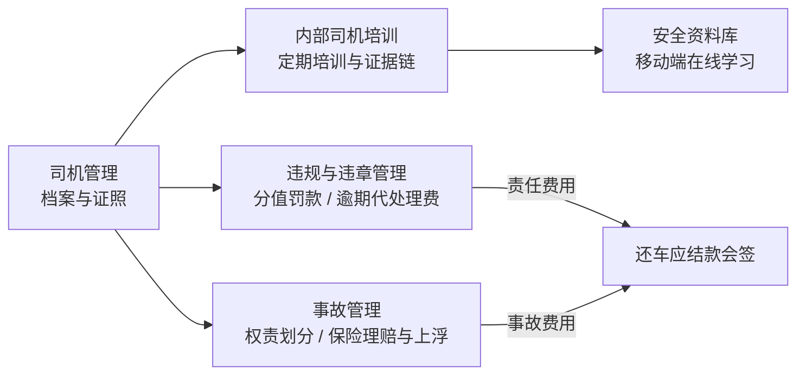
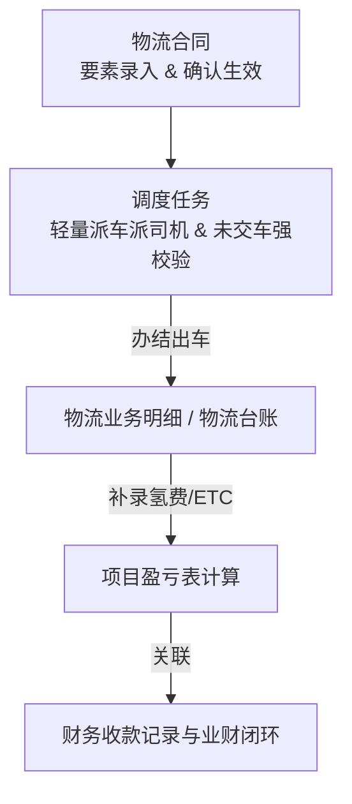

# ONE-OS 统一运营管理平台 · 中期版本需求与架构梳理说明（全条线对齐）

| 项 | 内容 |
|---|---|
| 文档名称 | ONE-OS 中期版本业务架构与需求梳理说明 |
| 文档状态 | AutoPRD · 架构与需求定稿 baseline |
| 对齐基准 | 原型「业务条线说明」（`lease-business-line-overview` / `lines.ts`） |
| 覆盖范围 | 5 大业务条线闭环 + 3 大数据底座 + 业财一体化演进 + 全量原型映射 |
| 终极目标 | 明确「文档/流程图/关系图梳理 -> 原型生成」的标准研发路径，保持中期版本方向不偏离 |

---

## 1. 一句话与中期版本大方向

### 1.1 一句话定义
**ONE-OS** 是集 **租赁、能源、运维、安全、物流** 5 大业务条线闭环于一体，以 **车辆资产、条线盈亏、里程履约** 3 大数据底座为支撑，并逐步打通 YS 财务系统与外部生态（e 签宝、PLC、银企直联）的氢能车统一运营管理平台。

### 1.2 中期版本核心大方向（不可偏离）
1. **业务闭环优先**：每个业务模块必须具备明确的**责任部门、前置条件（起点）、标准化流转（怎么运作）、明确终点（闭环）**，禁止存在无法结算或无法归档的断头流程。
2. **遵循「先梳理、再原型」原则**：按照「产品需求确认 -> 设计方案确认 -> 原型实现」的流水线，所有新原型或功能微调均需基于本需求说明书与流程图展开。
3. **业财一体化演进**：由现阶段「业务驱动、财务手工维护」逐步过渡至「业务单据与财务『收款记录』/『付款记录』双向联动、自动对账核销」。
4. **数据同源与一车一档**：以「车辆资产台账」为中心，贯通采购入库、租赁履约、加氢能源、故障维保、违章事故与报废处置的全生命周期数据。

---

## 2. 全局系统关系图与架构大图

### 2.1 全局五大条线与三大底座关系图

```mermaid
flowchart TD
    subgraph CoreFoundations [三大数据底座]
        VA[车辆资产台账<br/>一车一档 / 状态 / 证照 / 里程]
        PL[条线盈亏表<br/>项目级 / 部门级收入与成本]
        MP[里程履约看板<br/>阶段任务 / 计划 vs 实测]
    end

    subgraph Line1 [1. 租赁业务条线 (Lease)]
        L1[客户管理] --> L2[标准合同模板]
        L2 --> L3[租赁合同]
        L3 --> L4[提车应收款]
        L4 --> L5[租赁业务台账]
        L5 --> L6[还车应结款]
    end

    subgraph Line2 [2. 能源业务条线 (Energy)]
        E1[供应商管理] --> E2[加氢站管理]
        E2 --> E3[加氢订单主动/PLC]
        E3 --> E4[车辆氢费明细]
        E4 --> E5[氢费账户与对账]
        E5 --> E6[上下游扩展]
    end

    subgraph Line3 [3. 运维管理条线 (Ops)]
        O1[采购/三方合同] --> O2[验车入库]
        O2 --> O3[上牌与证照]
        O3 --> O4[备车与交还车]
        O4 --> O5[故障与维保]
        O5 --> O6[异动/调拨/处置出库]
    end

    subgraph Line4 [4. 安全管理条线 (Safety)]
        S1[司机管理与培训] --> S2[安全资料库]
        S2 --> S3[违规与违章记录]
        S3 --> S4[事故定责与保险]
    end

    subgraph Line5 [5. 物流业务条线 (Logistics)]
        F1[物流合同] --> F2[轻量调度派车]
        F2 --> F3[物流业务明细/台账]
    end

    subgraph FinIntegration [业财一体化集成层]
        YS[YS 财务系统 / 银企直联]
        PR[收款记录 / 付款记录]
        ES[e 签宝电子签]
    end

    %% 跨条线与底座勾连
    Line1 -->|写入车辆履约态| VA
    Line3 -->|更新车辆全生命周期| VA
    Line2 -->|能源成本回填| PL
    Line3 -->|维保/异动成本| PL
    Line5 -->|物流营收与成本| PL
    Line1 -->|首期与周期账单| PR
    Line2 -->|预付款与充值| PR
    S4 -->|责任费用| L6
    O4 -->|交还车里程| MP
    FinIntegration <-->|双向核销与状态回写| PR
```

---

## 3. 五大业务条线详细闭环流程图

### 3.1 租赁业务条线闭环 (Lease Business Line)



### 3.2 能源业务条线闭环 (Energy Business Line)

```mermaid
flowchart TD
    E_Supp[供应商管理<br/>结算要素与资质] --> E_Site[加氢站管理<br/>签约站 vs 非签约站]
    
    subgraph 签约站路径 (主动/PLC)
        E_Site -->|分配账号| E_Order[加氢订单 H5 / PC / PLC]
        E_Order -->|主动上报 / PLC自动采集| E_Rec1[加氢记录<br/>自动入库]
    end

    subgraph 非签约站路径 (手工补录)
        E_Site -->|线下加氢| E_Fee[车辆氢费明细]
        E_Fee -->|能源部人工补录| E_Rec2[加氢记录<br/>OCR/围栏辅助]
    end

    E_Rec1 --> E_Reconcile[能源部对账与标记已对账]
    E_Rec2 --> E_Reconcile

    E_Reconcile --> E_Acct[客户氢费账户与对账单]
    E_Acct -->|关联财务收款记录| E_Fin[财务实收核销]
    E_Fin -->|回写| E_Done[加氢记录标记『已付款』闭环]
```

### 3.3 运维管理条线闭环 (Ops Business Line)



### 3.4 安全管理条线闭环 (Safety Business Line)



### 3.5 物流业务条线闭环 (Logistics Business Line)



---

## 4. 当前项目原型与 5 大业务条线映射矩阵

下表梳理了当前 codebase (`src/prototypes/`) 中主要可运行原型与 5 大业务条线模块的对应关系、需求覆盖情况及后续优化动作：

| 业务条线 | 步骤/模块 | 当前映射原型 ID (`/prototypes/`) | 对应原型名称 | 状态/需求完整度 | 核心优化与下一步动作 |
|---|---|---|---|---|---|
| **租赁条线** | 1. 客户管理 | `customer-management` | 客户管理 | 已对齐 (v1.2) | 支持三部门评级联动及非标流程触发标识 |
| | 2. 标准合同 | `contract-template-management` | 标准合同管理 | 已对齐 (v2.0) | Docx 忠实度渲染、风控红线与锁定区判定 |
| | 3. 租赁合同 | `lease-contract-management` | 租赁合同 | 已对齐 (v2.1) | 支持标准/非标/禁止三路径与续签/变更 |
| | 4. 提车应收 | `vehicle-pickup-receivable` | 提车应收款 | 已对齐 (v1.5) | 实收关联对齐、触发运维交车任务生成 |
| | 5. 租赁台账 | `lease-business-ledger` / `lease-business-detail` | 租赁业务台账 | 已对齐 (v1.6) | 周期账单自动计算、溢出款抵扣下期算法 |
| | 6. 还车应结 | `vehicle-return-settlement` | 还车应结款 | 已对齐 (v1.3) | 多部门（业管/安全/运维/能源）会签审批 |
| **能源条线** | 1. 供应商 | `supplier-management` | 供应商管理 | 已对齐 (v1.1) | 加氢站/充电站供应商属性绑定与直连 |
| | 2. 加氢站 | `oneos-web-h2-station-site` | 站点信息 | 已对齐 (v1.2) | 签约站/非签约站分类、账号与预付款余额 |
| | 3. 加氢订单 | `oneos-h5-h2-order` | 加氢订单 (H5) | 已对齐 (v1.4) | 签约站主动上报、PLC 自动采集与预约单 |
| | 4. 氢费明细 | `vehicle-h2-fee-ledger` | 车辆氢费明细 | 已对齐 (v1.5) | 非签约站补录、系统级 OCR 与围栏提示 |
| | 5. 氢费账户 | `payment-records` | 收款记录 / 账户 | 已对齐 (v1.2) | 客户预付款账户对账单与 YS 收款关联 |
| **运维条线** | 1~2. 采购/三方 | `vehicle-purchase-contract` | 车辆采购合同 | 已对齐 (v1.3) | 采购合同关联付款与验车任务下发 |
| | 3. 验车入库 | `vehicle-inspection` | 验车入库 | 已对齐 (v1.2) | 现场验车核对、验完自动标记库存 |
| | 4~9. 运维综合 | `oneos-web-ops` | 车辆运维综合 | 已对齐 (v2.0) | 覆盖上牌/证照/备车/交还车/替换/年审/调拨 |
| | 10. 故障处置 | `vehicle-fault-handling` | 故障处置 | 已对齐 (v1.4) | AI 微信报修助手、证据链与处置时限告警 |
| | 12. 维保明细 | `vehicle-maintenance-ledger` | 车辆维修明细 | 已对齐 (v1.1) | 维修保养费用录入与单车盈亏分摊 |
| | 15. 资产处置 | `vehicle-management` | 车辆资产 | 已对齐 (v2.2) | 出售/过户/报废审批及一车一档全景 |
| **安全条线** | 1~6. 安全综合 | `vehicle-management` / 扩展 | 车辆资产 & 安全 | 建设中 | 整合司机档案、培训证据链、违章事故定责 |
| **物流条线** | 1. 物流合同 | `self-operated-contract` | 物流合同 | 已对齐 (v1.2) | 生效后可派车提示与调度勾连 |
| | 2. 调度任务 | `self-operated-dispatch-task` | 调度任务 | 已对齐 (v1.3) | 轻量派车派司机、未交车强校验、办结落账 |
| | 3. 物流台账 | `self-operated-business-ledger` / `business-dept-ledger` | 物流业务明细 / 项目盈亏 | 已对齐 (v1.6) | 办结落账、氢费/ETC 补录与项目盈亏表 |
| **数据底座** | 底座 1 | `oneos-h5-vehicle-assets` | 车辆资产 H5 | 已对齐 (v1.3) | 移动端只读查车、里程任务进度与异常角标 |
| | 底座 2 | `business-dept-ledger` | 项目盈亏情况 | 已对齐 (v1.6) | 跨板块业绩、成本与盈亏钻取大表 |
| | 平台能力 | `message-center` | 消息中心 | 已对齐 (v1.2) | 5 端路由解析、多源通道与触达状态 |
| | 平台能力 | `oneos-web-workbench-new` | 全新工作台 | 已对齐 (v2.1) | 角色视角（高管/业管/运维/财务/安全/加氢站）切换 |

---

## 5. 核心业财一体化集成与数据流架构

系统演进的关键在于打通业务单据与财务系统，实现「数据同源、自动核销、状态回写」。

```
[业务单据生成]                     [资金与账单匹配]                   [财务闭环核销]
+----------------------+         +------------------------+        +----------------------+
| 租赁合同 (首期应收)  | ------> | 提车应收款 (待关联)    | ------> | 财务收款记录 (YS)    |
| 租赁台账 (周期账单)  |         | 客户对账单 (氢费/物流) |        | 银企直联对账流水     |
+----------------------+         +------------------------+        +----------------------+
                                             |                                |
                                             +<======= 双向核销与标记 ========+
                                             |
                                             v
                                 +------------------------+
                                 | 账单/加氢记录回写已付款 |
                                 +------------------------+
```

1. **收款流**：租赁提车应收、租期周期账单、加氢对账单、物流应收款 -> 关联 `收款记录` -> 财务到账确认 -> 状态回写为「已实收/已付款」。
2. **付款流**：采购合同付款、加氢站预付款、还车应结退款、供应商付款 -> 关联 `付款记录` -> 财务出账确认 -> 状态回写为「已完成」。

---

## 6. 需求梳理成果与后续原型生成标准 SOP

基于用户提供的指令要求：**「先通过文档、流程图或关系图等梳理需求，然后再生成原型」**，后续所有研发与需求迭代严格遵循以下标准 SOP：

```
+-----------------------------------------------------------------------------------+
| 步骤 1：需求与关系梳理 (Requirement & Diagram Phase)                            |
|  - 更新本文档或对应原型 `.spec/requirements-prd.md`                               |
|  - 绘制完整业务流程图 (Mermaid) 与模块关系图                                        |
|  - 明确：责任部门、起点、怎么运作、闭环条件                                           |
+-----------------------------------------------------------------------------------+
                                        |
                                        v
+-----------------------------------------------------------------------------------+
| 步骤 2：产品需求对齐 (PM Alignment Gate)                                           |
|  - 呈现文档与流程图摘要，由产品经理（王冕）确认业务边界与逻辑                           |
|  - 确保不偏离「业务条线说明」的中期版本大方向                                         |
+-----------------------------------------------------------------------------------+
                                        |
                                        v
+-----------------------------------------------------------------------------------+
| 步骤 3：原型生成与同步 (Prototype Implementation & AutoPRD Sync)                    |
|  - 依据对齐的方案编写/更新 `src/prototypes/<prototype-id>/` 页面                    |
|  - 同步更新 `annotation-source.json` 原型标注目录                                   |
|  - 发布原型至 S3 对象存储（统一格式：`{baseUrl}/{prototype-id}/index.html`）         |
+-----------------------------------------------------------------------------------+
```

---

## 7. 开放问题与建议行动项

1. **安全条线原生独立原型整合**：目前安全管理条线（司机培训证据链、违章代处理费用自动生成、事故费用联动还车应结款）分散在车辆资产与运维模块中，建议后续推出专门的 `safety-management` 原型。
2. **YS 财务系统接口规范预演**：在原型层已有 `payment-records`（收款记录/付款记录）的基础上，进一步预演 YS 系统异步推单与银企直联流水匹配机制。
