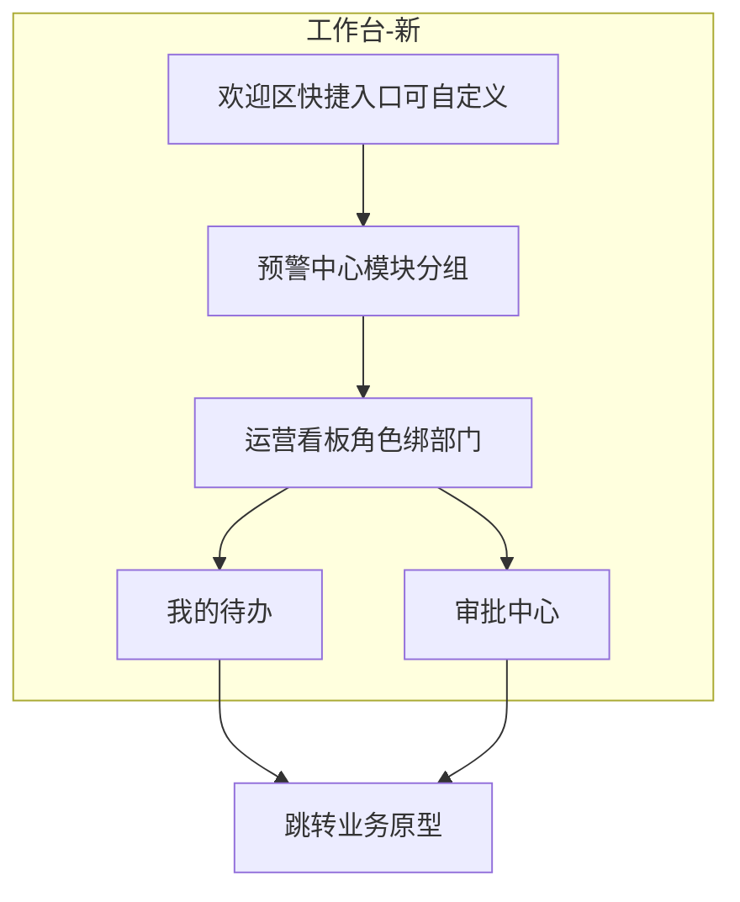
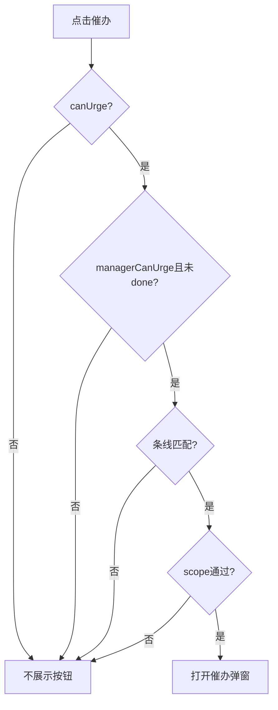

# 工作台-新 · 产品需求文档（PRD）

> 原型 ID：`oneos-web-workbench-new`  
> 文档口径：**以当前可运行原型为准（as-built）**  
> 数据：本地种子 + localStorage；**未接真实 API**  
> 关联规格：[role-visibility.md](./role-visibility.md) · [todo-biz-admin.md](./todo-biz-admin.md) · [urge-channels.md](./urge-channels.md) · [role-insights.md](./role-insights.md) · [approval-embed.md](./approval-embed.md) · [payment-unlinked-kpi.md](./payment-unlinked-kpi.md) · [notice-center.md](./notice-center.md) · [release-notes-popup.md](./release-notes-popup.md)

---

## Problem Statement

各部门主管与业务人员每天要在多个系统之间切换，才能看到「本角色该跟的预警、待办、审批与经营指标」。缺少一个**按角色聚合**的开工首页时：

- 紧急预警与未完成待办容易漏看；
- 审批与待办割裂，无法在同一屏推进；
- 多角色人员（如同时兼业管与总经理视角）无法一次看到应合并的预警；
- 催办只能线下沟通，缺少统一入口与演示闭环。

需要一个「工作台-新」页面，让用户登录后立刻按角色看到预警 → 看板 → 待办/审批，并完成办理跳转、催办演示与通知阅知。

---

## Solution

提供 **轻量个人台** 工作台页面（无 A/B/C 布局切换）：

1. **欢迎区**：问候、演示角色切换；常用快捷入口（快速发起 + 功能入口）支持自定义钉选  
2. **预警中心**：按功能模块分组的高密指标条（十余项），点击开明细  
3. **运营看板**：`角色 → 绑定部门 → 部门看板模板`；多角色 Tab 切角色（同部门共用看板）；绑定关系由若依角色管理维护，原型用 `boundDeptId` 演示  
4. **主焦点双栏**：左侧「我的待办」（逾期优先→创建时间倒序）、右侧「审批中心」（含抄送内容与发起人催办）  
5. **通知中心**：工作台内不展示铃铛；嵌入「原型外壳演示」时同步外壳顶栏  

直链打开 `/prototypes/oneos-web-workbench-new` **不带** OneOS 侧栏/顶栏；带外壳浏览请走「原型外壳演示」。

---

## 页面信息架构

```text
欢迎区（问候 · 演示角色 · 快捷入口可自定义）
预警中心（模块分组高密指标条）
运营看板（角色 Tab → 绑定部门模板）
我的待办 | 审批中心
通知/版本更新：外壳顶栏（工作台内不展示）
浮层：预警明细 · 任务详情 · 催办弹窗 · 快捷入口编辑 · 版本日志
```



---

## 角色与演示身份（as-built）

| RoleId | 展示名 | 演示登录人名 | 催办 |
|--------|--------|--------------|------|
| bizAdmin | 业务管理部 | 王冕 | 本部门 · lease/self |
| bizEnergy | 业务管理部-能源组 | 周凯 | 本部门 · energy |
| bizSales | 业务部 | 王磊 | 本部门 · lease/self |
| ops | 运维部 | 刘洋 | 本部门 · ops/lease |
| procurement | 采购部 | 黄倩 | **无催办** |
| safety | 安全部 | 孙敏 | 本部门 · safety |
| finance | 财务部 | 陈静 | 本部门 · lease/energy |
| legal | 法务部 | 赵律师 | 本部门 · lease/self |
| gm | 总经理 | 王冕 | 仅 high 风险 · 全条线 |

**多角色演示**：登录人「王冕」映射角色集合 `['bizAdmin','bizEnergy','ops']`（业管 / 能源组绑同一部门「业务管理部」共用看板；运维绑运维部）。

- 预警 KPI：取该集合各角色 KPI **并集**（总经理专属卡与业管卡可同时出现）  
- 运营看板：可在看板内切换本人角色（业管 / 总经理 / 运维）查看不同指标块；**兼岗切换不更换登录人**，切换条保持可见  
- 兼岗看运维看板：不在运维编制名单时按**主管口径**看全部地区，并可按人筛选  
- 待办 / 通知 / 快捷入口：仍按**当前选中的演示角色**过滤  
- 顶栏「模拟」切到其它单角色岗位时，才切换为该岗位默认演示登录人  

角色选择持久化：`localStorage` key `oneos-wb-new-role-v1`。

---

## 功能规格摘要

### 1. 预警中心（KPI）

- 展示：等分等高瓦片；指标名 + 条数；无左侧「合计大块」  
- 标题栏元信息：共 N 项 / 合计 / 紧急项数（如有）  
- 规则说明：指标名旁帮助图标悬停提示  
- 点击：打开 KPI 明细抽屉，可「去处理 / 打开模块」跳转  
- 过滤：`kpisForRole` / `kpisForRoles`；总经理单角色时仅专属汇总卡；多角色并集  
- 业管/业务部含「收款未关联」等关联类预警，口径见 [payment-unlinked-kpi.md](./payment-unlinked-kpi.md)

### 2. 快速入口

- 位置：欢迎区卡片右上角「常用快捷入口」按钮，点击展开/收起快捷链  
- 分区：快速发起（`action` 固定）+ 功能模块（`link`，可按角色自定义）  
- 自定义：候选池 = 当前角色有权限的 link；记忆 key `oneos-wb-new-quick-links-v1`  
- 发起确认后 Toast，并跳转对应原型（合同/退车/保险/充值/交车等）

### 3. 运营看板

- 标题固定「运营看板」  
- 内容随角色变化（合同/氢费/运维/保险/财务/安全/法务/经营总览等种子块）  
- 多角色用户可在看板工具条右侧横排切换本人角色（`shortLabel`，不占额外垂直空间）  
- 业管三列筛选总览仪表盘：客户交车（租赁合同）/ 车型业务 / 省·省市分布；占比两位小数；看板本身不滚动  
- 运维四列看板：近 3 月年审执行率（本月/下月/下下月年审到期标签含总数·已执行·执行率，点击切换左侧百分比与进度条）、车辆状态（租赁/在库）、交还车任务（默认地区总量、主管按人筛选）、故障登记（总数/闭环/闭环率，**同源故障处置模块**）；主管看全部，普通运维仅本地区/本人；详见 [role-insights.md](./role-insights.md)  
- 运维预警 KPI 另含：临 7 天未归档故障、已超 30 天未归档故障、待处理故障积压（跳转 `/prototypes/vehicle-fault-handling`）  
- **展示形态**：指挥台式长卡（渐变描边 / 网格与光晕动效）+ 顶栏工具条；详见 [role-insights.md](./role-insights.md)  
- **业管三列**：`layout: tri-columns` → `BizAdminCockpit`（卡片右上角**自定义下拉**筛选 + Bullet KPI 占比 + 双 KPI；非系统原生 select）  
- **运维四列**：`layout: ops-cockpit` → `OpsCockpit`

### 4. 我的待办

- 列表仅展示「未完成」任务（见 `isTodoIncomplete`）  
- 筛选（标题右侧双选择器，`V2Select`）：  
  - **紧急程度**（单选）：全部 / 正常 / 逾期  
  - **业务类型**（多选 + 搜索）：空=全部类型；选项随当前角色待办聚合；切换角色时筛选复位  
- 业管五条线字段与生成/闭环：见 [todo-biz-admin.md](./todo-biz-admin.md)  
- 行操作：详情抽屉 / 去处理（跳转 href）/ 催办（权限见下）

### 5. 审批中心

- 四 Tab：待办 / 发起 / 已办 / 抄送 + 徽标  
- **发起/已办徽标**：仅计「当前发起人发起且流程未完成/未终止/未驳回」的单据（演示发起人与审批种子一致）  
- 卡片：无左侧色条；按 Tab 显示去处理 / 催办 / 查看  
- 底栏横向时间轴；并行网关折叠；**标题后标签**展示当前节点停留（`N天M小时`，四 Tab 一致）；过长流程窗口约 4 节点  
- 发起 Tab 含被驳回 / 被终止样例  
- 详见 [approval-embed.md](./approval-embed.md)

### 6. 通知中心

- 工作台内**不**展示通知铃铛或通知卡片  
- **嵌入「原型外壳演示」**：通过 postMessage 同步未读与列表到外壳顶栏消息（与消息中枢同一数据源）  
- 内容：仅未读；催办类型优先，再按时间近→远；全已读空态「暂无新消息」  
- **查看全部**：进入独立「消息中心」页（不全屏弹层列已读/未读）  
- 点击通知先看详情，「去处理」再跳转业务页或打开版本更新（`n-release-notes`）  
- 详见 [notice-center.md](./notice-center.md)

### 6.1 版本更新日志（首次进入弹框）

| 项 | 说明 |
|----|------|
| 触发 | 未阅当前发布版时，进入工作台自动弹 Modal，**仅展示最新版**（如 V1.1.5），不含历史版本切换 |
| 已阅 | `localStorage` `oneos-wb-release-seen-v1`（按演示登录人）；确认后同版本不再自动弹 |
| 通知 | 同步系统通知 `n-release-notes`；弹框确认同时标已读 |
| 历史 | 「原型外壳演示」顶栏「版本更新」图标打开；工作台内不再单独放入口按钮 |
| 演示 | 未阅时顶栏图标有角点；首次进入自动弹框，确认后同版本不再自动弹 |
| 规格全文 | [release-notes-popup.md](./release-notes-popup.md) |

### 7. 催办（演示）

判定入口：`roleCanUrgeTask`（优先级表见 [urge-channels.md](./urge-channels.md)）。

确认后 **as-built** 行为：

1. Toast：`已通过{通道}催办「{责任人}」（演示 {时间}）`（多选时通道名用顿号拼接）  
2. 埋点：`urge_sent`（含 channel；多选为拼接字符串）  
3. **不**新增通知中心未读消息（当前原型未写 notices）  
4. **不**真实发送邮件/短信/微信  

通道：邮件 / 短信 / 转发到微信；**支持多选**，打开弹窗时**默认勾选邮件**；至少保留 1 种方可发送。详见 [urge-channels.md](./urge-channels.md) §3.1。

### 8. 已下线模块（勿再验收）

- 主区「任务流转」泳道看板  
- 布局方案 A/B/C 切换  
- 主区绩效/埋点分析看板（`AnalyticsBoard` 未挂载；埋点事件仍可能写入 localStorage）

---

## User Stories

1. As a 业务管理部用户, I want 打开工作台即看到业管相关预警 KPI, so that 我能优先处理超期账单与应收。  
2. As a 业务管理部用户, I want 在待办中按「租赁合同 / 提车应收 / 租赁账单 / 还车应结(部门) / 还车应结」查看字段, so that 列表信息与业务单据一致。  
3. As a 业务管理部用户, I want 提车应收与租赁账单在未收齐时一直留在待办, so that 部分收款不会误关单。  
4. As a 业务管理部用户, I want 还车应结(部门)在提交后从待办消失, so that 我知道本部门段已完成。  
5. As a 业务管理部用户, I want 四部门都提交后才看到最终还车应结待办及应补/应退, so that 我只处理可汇总的结算。  
6. As a 多角色登录人（王冕）, I want KPI 同时展示业管与总经理预警, so that 我不必反复切换角色扫预警。  
7. As a 多角色登录人, I want 在运营看板内切换业管/总经理指标, so that 我能分别看部门与经营视角。  
8. As a 部门主管, I want 对待办中可催办的任务选择邮件/短信/微信催办, so that 我能演示催办动作。  
9. As a 采购部用户, I want 待办上不出现催办按钮, so that 符合采购无催办权限的设定。  
10. As a 总经理, I want 只能对高风险任务催办, so that 催办范围聚焦重大风险。  
11. As a 任意角色用户, I want 点击待办「去处理」跳到对应业务原型, so that 我能继续办理。  
12. As a 任意角色用户, I want 用紧急程度筛选逾期待办, so that 我先清超期项。  
13. As a 任意角色用户, I want 用业务类型多选筛选条线, so that 我只看相关任务。  
14. As a 任意角色用户, I want 在审批中心四 Tab 间切换并看到徽标, so that 我知道各队列数量。  
15. As a 发起人, I want 发起/已办徽标在流程完成后消失, so that 徽标只代表进行中的单。  
16. As a 审批用户, I want 在卡片标题后看到当前节点停留时长标签（N天M小时）, so that 四 Tab 都能一眼判断卡多久。  
16b. As a 审批用户, I want 在卡片上看到横向时间轴与并行网关提示, so that 我理解当前卡在哪一步。  
17. As a 任意角色用户, I want 通过铃铛只看未读通知且催办优先, so that 重要提醒不被淹没。  
18. As a 任意角色用户, I want 读通知或去处理后未读数下降, so that 我知道已处理。  
19. As a 嵌入「原型外壳演示」的用户, I want 通知出现在外壳顶栏消息, so that 与 OneOS 产品形态一致且工作台主区不被铃铛打扰。  
20. As a 评审人员, I want 通过「原型外壳演示」查看通知与版本更新, so that 入口与正式产品顶栏一致。  
21. As a 任意角色用户, I want 用快速入口发起合同/退车/保险等, so that 高频动作少跳转。  
22. As a 任意角色用户, I want 自定义功能模块入口并记住选择, so that 快捷区符合个人习惯。  
23. As a 演示用户, I want 切换演示角色后 KPI/待办/通知/快捷入口一起变化, so that 可评审各角色视图。  
24. As a 演示用户, I want 角色选择刷新后仍保留, so that 评审过程不被重置。  
25. As a 测试人员, I want 在无真实 API 的种子数据下稳定复现条线与闭环规则, so that 可编写用例。  
26. As a 产品经理, I want 主区不再出现已下线的任务流转看板, so that 评审焦点不被旧模块干扰。  
27. As a 法务/财务/安全/运维/能源等角色用户, I want 只看本角色 KPI 与待办, so that 信息不串岗。  
28. As a 用户, I want KPI 规则通过帮助图标悬停查看, so that 列表更干净仍可理解口径。  
29. As a 用户, I want 欢迎区看到人情化随机提示, so that 开工体验更友好。  
30. As a 用户, I want 催办后看到 Toast 与演示时间戳, so that 我确认操作已触发（即使未真实发送）。
31. As a 任意角色用户, I want 系统更新后首次进入工作台时看到更新日志弹框, so that 我不会错过关键变更。
32. As a 任意角色用户, I want 确认更新日志后刷新不再自动弹出, so that 不被重复打断。
33. As a 任意角色用户, I want 从快速入口再次打开更新日志, so that 我能事后查阅。
34. As a 演示/测试人员, I want 从「原型外壳演示」顶栏打开版本更新日志并切换过往版本, so that 可反复查阅变更说明。

---

## 正向流程

### F1 开工扫视（主路径）


| 步骤 | 用户动作 | 系统响应 |
|------|----------|----------|
| 1 | 打开页面（直链或「原型外壳演示」嵌入） | 加载种子；恢复 localStorage 角色；未阅版本则弹更新日志 |
| 2 | （可选）确认更新日志 | 写入已阅并标系统通知已读 |
| 3 | （可选）切换演示角色 | 刷新 KPI/待办/通知/快捷入口；待办筛选复位 |
| 4 | 查看 KPI | 按角色或并集展示瓦片 |
| 5 | 查看运营看板 | 展示当前角色洞察；多角色可切 |
| 6 | 筛选并处理待办 | 列表按未完成+筛选更新；去处理跳转 |
| 7 | 处理审批 Tab | 徽标与列表随 Tab 变化 |
| 8 | 打开铃铛 | 仅未读；可已读/去处理 |

### F2 业管待办闭环（提车应收 / 租赁账单）

| 步骤 | 说明 |
|------|------|
| 生成 | 单据创建后任务进入待办（种子已存在） |
| 在办 | `received < receivable` → 未完成 |
| 关闭 | `received ≥ receivable` 或 `flowStatus=done` → 不再计入未完成 |

### F3 催办演示

| 步骤 | 用户动作 | 系统响应 |
|------|----------|----------|
| 1 | 对可催办任务点「催办」 | 打开三通道弹窗；默认勾选邮件 |
| 2 | 多选通道并确认 | Toast（通道名顿号拼接）+ `urge_sent` 埋点；关闭弹窗 |
| 3 | — | 不发真实消息；不写新通知 |

### F4 快速发起

| 步骤 | 用户动作 | 系统响应 |
|------|----------|----------|
| 1 | 打开快速入口 → 选发起类动作 | 确认弹窗 |
| 2 | 确认 | Toast → 跳转目标原型 |

### F5 版本更新日志（首次进入）

| 步骤 | 用户动作 | 系统响应 |
|------|----------|----------|
| 1 | 打开工作台（直链或嵌入外壳） | 若当前登录人未阅 `CURRENT_RELEASE` 且受众匹配 → 弹出更新日志 |
| 2 | 点「知道了」或关闭 | 写入已阅版本；系统通知 `n-release-notes` 标已读；同版本不再自动弹 |
| 3 | （可选）快速入口 → 更新日志 | 再次打开 Modal（不依赖未阅） |
| 4 | （可选）顶栏点「版本更新」图标 | 打开更新日志弹框，可切换过往版本查阅 |

---

## 逆向 / 异常 / 边界流程

| ID | 场景 | 期望 |
|----|------|------|
| R1 | 采购角色打开待办 | 任意任务均无「催办」 |
| R2 | 总经理对非 high 风险任务 | 无「催办」 |
| R3 | 任务 `managerCanUrge=false` | 无「催办」 |
| R4 | 任务已 `done` | 不在未完成列表；无催办 |
| R5 | 提车应收部分收款 | 仍在待办，未收金额 > 0 |
| R6 | 还车应结(部门) `submitted=true` | 不算未完成 |
| R7 | 通知全部已读 | 铃铛无闪烁气泡；空态「暂无新消息」 |
| R8 | 业务类型多选为空 | 视为全部条线 |
| R9 | 业务类型恰选 1 条 | 专用列表列；选多条或全部 → 通用列 |
| R10 | 角色切换 | 紧急程度/业务类型筛选复位为默认 |
| R11 | 自定义快捷模块勾选失效 id | 自动剔除；若全空则回退该角色全部 link |
| R12 | KPI 当前角色为空 | 空态「当前角色暂无预警」 |
| R13 | 待办当前筛选无数据 | 空态「当前分类暂无待办」 |
| R14 | 去处理无 href | Toast 提示暂无跳转，可打开详情 |
| R15 | 采购角色通知种子为空 | 通知池可为空（演示数据缺口，验收时注明） |
| R16 | 任意打开方式 | 工作台内不显示浮动铃铛；嵌入外壳时由顶栏消息展示通知 |
| R17 | 已阅当前版本后刷新 | 不再自动弹出更新日志 |
| R18 | 同登录人切换角色（王冕业管↔总经理） | 已阅共享，不重复弹 |
| R19 | 切换到未阅的其他登录人 | 可再次自动弹出 |
| R20 | 仅从铃铛读系统通知、未写已阅 | 刷新后仍可能再弹更新日志（已阅以 release-seen 为准） |



---

## Implementation Decisions

1. **页面模块**：欢迎（KPI+快速入口）、运营看板、待办、审批、通知入口；任务流转与绩效看板不挂主区。  
2. **角色模型**：角色配置含 `canUrge` / `urgeScope` / `urgeLines` / `scopeDepts` / `businessLines`；与 `isManager` 解耦。  
3. **多角色 KPI**：`roleIdsForOperator` → `kpisForRoles` 并集；待办仍按当前 `roleId`。  
4. **待办未完成**：统一 `isTodoIncomplete`（done 优先；应收类看金额；部门还车看 submitted）。  
5. **催办**：`roleCanUrgeTask` 为唯一权限判定入口；确认仅 Toast + 埋点。  
6. **通知**：主区不占栏；直链铃铛 / 嵌入同步外壳。  
7. **审批徽标**：发起/已办仅统计进行中的「我发起」单据。  
8. **持久化**：角色 `oneos-wb-new-role-v1`；快捷模块 `oneos-wb-new-quick-links-v1`；埋点 `oneos-wb-new-analytics-v1`；更新已阅 `oneos-wb-release-seen-v1`（按演示登录人）。  
9. **跳转**：统一导航助手；发起类动作映射固定原型路径。  
10. **外壳**：本页不内嵌侧栏顶栏；演示外壳为独立原型。  
11. **版本更新弹框**：种子 `CURRENT_RELEASE`；确认写已阅并标系统通知已读；快速入口可重开；详见 release-notes-popup。

业管待办 `todoDetail` 判别（原型决策摘要）：

```text
isTodoIncomplete:
  if flowStatus == done → false
  if pickup-receivable | lease-bill → received < receivable
  if return-settle-dept → !submitted
  else → true（未 done）
```

---

## Testing Decisions

### 什么是好的测试

- 只断言**外部行为与规则结果**（是否展示、是否计入未完成、过滤集合、徽标数字），不绑定 CSS class 或组件内部 state。  
- 优先测纯函数 seams，再补关键路径的界面验收清单。

### 必测 seams（已确认，不含外壳导航）

| Seam | 覆盖点 |
|------|--------|
| 角色可见性 | `roleIdsForOperator`、`kpisForRole(s)`、`tasksForRole`、消息中枢 `listForRole`、`insightsForRole`、角色快捷入口集合 |
| 待办未完成与业管闭环 | `isTodoIncomplete`、`resolveTaskTodoLine`、`dueDayStatus`、`finalSettleSummary`、未收金额 |
| 催办权限 | `roleCanUrgeTask` 全部分支（采购关、总经理仅 high、条线/部门不匹配、done、managerCanUrge=false） |
| 审批徽标 | `approvalCounts` / `isApprovalBadgeActive`（完成/终止/驳回不计） |

### 界面验收（手工 / E2E）

- 布局顺序与双栏；角色切换后数据联动  
- 待办两筛选组合与空态  
- KPI 点击明细与帮助悬停  
- 催办 Toast；采购无按钮  
- 通知未读/已读/空态；直链铃铛可见  
- 快速入口自定义记忆  
- 未阅版本首次进入弹更新日志；确认后刷新不弹；顶栏版本更新图标可查阅并切换过往版本  

### 先验

- 同类规则测试可参考租赁明细字段校验类规格的「判定表 + 优先级」写法。

---

## 验收清单（产品 / 测试）

1. 9 角色可切换；采购无催办；王冕多角色（业管/总经理/运维）KPI 并集；看板内切运维后切换条仍在、登录人仍为王冕。  
2. KPI 等分瓦片；无左侧合计大块；帮助悬停；可点明细。  
3. 运营看板标题正确；多角色横排切换；业管三列：客户/车型/区域自定义下拉筛选 + 总览仪表盘（占比两位小数）；运维四列：年审到期切换 / 车辆状态 / 交还车 / 故障；看板不滚动。  
4. 待办筛选与业管五类列/闭环符合 todo-biz-admin。  
5. 审批四 Tab、徽标口径、时间轴与终态样例符合 approval-embed。  
6. 通知入口符合直链/嵌入两种形态；主区无通知卡片。  
7. 催办通道可多选（默认邮件）仅 Toast+埋点；不发真实消息、不写新通知。  
8. 快速入口发起跳转与自定义模块记忆可用。  
9. 无任务流转看板；无布局 A/B/C 切换。  
10. 直链无侧栏顶栏；右上角铃铛可用。  
11. 未阅新版本首次进入弹出更新日志；确认后刷新不再自动弹；顶栏「版本更新」图标可查阅并切换过往版本；嵌入外壳行为一致。

---

## Out of Scope

- 真实登录鉴权、权限中心、工单/审批 BPMN、报表 API  
- 真实邮件 / 短信 / 企微发送  
- 生产埋点 SDK  
- 收款流水与待办金额的实时联动（种子演示）  
- 恢复任务流转主区看板、多布局对比、主区绩效看板  
- 本 PRD 不覆盖「原型外壳演示」菜单与 iframe 路由（独立原型 `oneos-prototype-demo`）  
- 版本更新发布后台、强制阅读、多端已阅 API、灰度定向（见 release-notes-popup P2）

---

## Further Notes

- 演示发起人（审批徽标）与工作台演示登录人可能不是同一人名，以审批种子规则为准验收徽标。  
- 部分 KPI `value` 与明细条数可不一一相等（演示密度），明细以抽屉列表为准。  
- 采购部可无通知种子；验收「空通知」为可接受演示状态。  
- 埋点事件目前主要落 `task_opened` / `task_viewed` / `urge_sent`；其它事件类型以代码实际调用为准，不强制验收未挂载的分析看板。

---

## 文档维护

| 变更类型 | 需同步 |
|----------|--------|
| 角色/催办/KPI 过滤 | 本文 + role-visibility + urge-channels |
| 业管待办字段/闭环 | 本文 + todo-biz-admin |
| 运营看板 / 多角色切换 | 本文 + role-insights |
| 审批徽标/时间轴 | 本文 + approval-embed |
| 通知入口/排序 | 本文 + notice-center |
| 版本更新弹框/已阅 | 本文 + release-notes-popup |

---

## 10. 功能变更记录

> 产品经理原型发版记录。仅记功能与业务逻辑变更；不含样式/UI/表结构。

### 定稿 · 2026-07-21（首版定稿）

- 「多角色登录人」：王冕兼业管 / 总经理 / 运维；看板内切换本人角色时登录人不变，切换条保持可见；顶栏「模拟」切到其它岗位才换演示登录人  
- 「运营看板」：按角色绑定部门渲染部门模板（业管三列 / 运维四列 / 财务双列 / 通用）；多角色 Tab 切角色；客户交车卡展示在租/租赁数量与占比；**不展示 TOP 排名列表**；绑定部门能力归属若依角色管理  

- 「运营看板 · 运维」：四列（近 3 月年审执行率可按本月/下月/下下月切换、车辆状态租赁/在库、交还车任务、故障登记闭环率）；主管看全部并可按人筛，普通运维仅本地区/本人；兼岗无编制按主管口径  
- 「版本更新日志」：未阅当前版首次进入自动弹最新版说明；确认后同版本不再自动弹；可主动查阅并切换过往版本摘要  
- 「工作台主结构」：欢迎区（KPI + 快速入口）→ 运营看板 → 待办 | 审批；通知不占主区卡片（直链铃铛 / 嵌入外壳同步）
