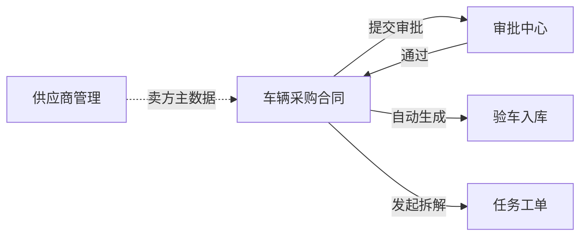

# 车辆采购合同 · 产品需求说明

| 项 | 内容 |
|---|---|
| 模块名称 | 车辆采购合同 |
| 所属系统 | ONE-OS（PC） |
| 交互原型 | `/prototypes/vehicle-purchase-contract` |
| 业务条线 | 运维管理条线 · 采购入口 |
| 文档状态 | AutoPRD · 首版 |

---

## 1. 一句话与目标

**一句话**  
采购员与车企签订车辆采购合同后，录入关键信息与附件并完成审批；通过后自动生成验车任务，并可拆解多部门任务工单。

**要解决的问题**  
- 车辆采购无标准合同模板，需兼容关键信息登记与附件留痕  
- 大额采购需走更长审批链  
- 审批通过后验车任务与多部门协同任务需要可追溯入口  

**本期目标**  
1. 采购合同列表 / 新建 / 编辑 / 查看  
2. 按金额阈值自动判定正常 / 非正常审批  
3. 审批通过后自动生成验车任务  
4. 可发起任务工单，按业务 / 运维 / 业管批量拆解  
5. 对齐 LNGD 类合同：三方主体、分期付款计划、交付/增资前提、配置/担保附件  

**非目标**  
- 标准合同 Word 模板拼装  
- 真实审批引擎 / 真实 E签宝签采购合同正文  
- 增资协议全量管理（仅记录挂钩说明与付款前提）  

---

## 2. 模块边界

---

## 3. 用户与故事

| 角色 | 故事 |
|------|------|
| 采购员 | 起草合同、上传扫描件、提交审批；通过后查看验车任务并发起工单拆解 |
| 审批人 | 在审批中心处理正常 / 非正常采购审批 |
| 业管 | 通过任务工单承接付款等协同事项 |

**用户故事（起点 → 运作 → 闭环）**  
1. 采购员新建合同并上传附件 → 系统按金额判定审批类型 → 提交进入审批中心  
2. 审批通过 → 系统自动生成一条验车任务（应验台数=采购数量）→ 合同状态变为已生成验车任务  
3. 采购/业管点击「发起任务工单」→ 预填付款 / 验车协同 / 商务条款等多条任务 → 在任务工单中发布给各部门  

---

## 4. 关键业务逻辑

### 4.1 审批分流

详见 `.spec/approval-rules.md`。

| 优先级 | 条件 | 结果 |
|--------|------|------|
| 1 | 合同总金额 ≥ 500 万（可配置） | 非正常审批 |
| 2 | 其他 | 正常审批 |

### 4.2 验车任务生成

- 粒度：1 合同 → 1 条验车任务  
- 初始无 VIN；带入约定地点、日期、车型、应验台数  

### 4.3 任务工单拆解

- 协作方式：多条工单（同一合同号），非单工单多执行人  
- 有分期计划时：按期次拆付款工单；另拆验车/签收协同、关联协议跟进  

### 4.4 LNGD 类合同字段

详见 `.spec/lngd-contract-alignment.md`。

---

## 5. 验收重点

1. 无模板也可完成合同登记与附件上传  
2. 金额超阈值时表单提示非正常审批节点  
3. LNGD 样例展示四期付款、增资前提、三方角色与正确总价（约 9588 万）  
4. 模拟审批通过后出现验车任务（大数量按到车追加，不一次铺 136 行）  
5. 发起工单后按分期拆出多条付款任务  

## 6. 假设与依赖

- 原型本地种子 + localStorage；未接真实 API  
- 审批中心样例类型：`vehicle_procurement`  
