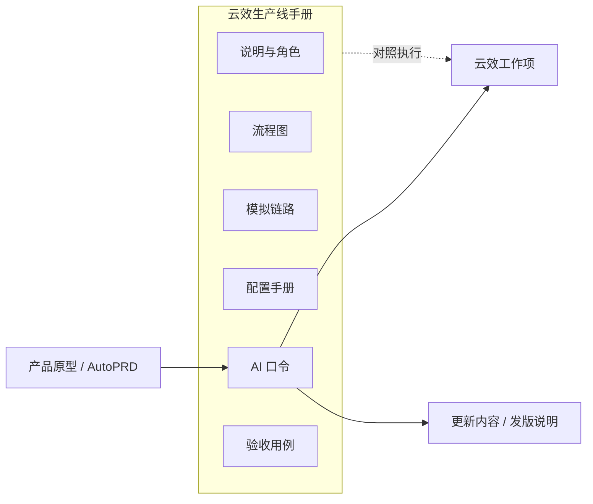
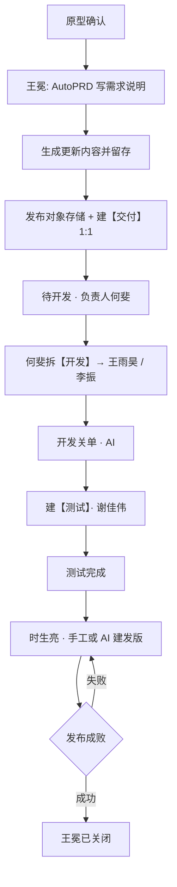

# 云效生产线手册 · 产品需求说明（全模块）

## 1. 一句话与目标

**一句话**  
给统一运营管理平台 PC 端团队一本可演示、可对照执行的「云效 × AI」生产线说明：讲清谁做什么、怎么挂链、怎么用口令推进，并从建需求到关闭有完整模拟存档。

**要解决的问题**  
- 产品/研发/测试对「1 需求 : 1【交付】」与过程拆分理解不一致  
- 建需求时描述质量参差，更新内容事后难对照  
- 新人缺少端到端样例与可复制口令  

**本期目标**  
1. 六章节手册：说明、流程图、模拟链路、配置手册、AI 口令、验收用例  
2. 产品建需求强制走 AutoPRD 写需求说明，并留存更新内容历史  
3. 产品建需求强制走 AutoPRD 写需求说明，并留存更新内容历史  
4. 研发示例姓名统一为王雨昊、李振；发版对接人时生亮（测试完成后手工或 AI 建发版）  

**非目标（本期不做）**  
- 不替代真实云效配置后台操作台  
- 不对接真实云效 API 写单（模拟链路为演示存档）  
- 不实现团队权限系统本身  

## 2. 模块边界（最重要）

| 业务线 / 子域 | 做什么 | 不做什么 |
|---------------|--------|----------|
| 协作约定 | 角色、挂链硬规则、状态主链 | 不规定组织人事编制 |
| 模拟存档 | 车辆资产全过程演示 | 不当作真实单据系统 |
| 口令与配置 | 可复制口令、配置摘要与下载 | 不自动改云效租户配置 |

**外部依赖（产品口径）**  

| 依赖方 | 交互方式 | 产品要求 |
|--------|----------|----------|
| AutoPRD | 产品建/改需求时调用 | 生成可评审的产品需求说明并写入云效描述 |
| 更新日志格式 | 建单与发版汇总 | 只要内容段、不要更新时间；完善时历史留存 |
| 对象存储发布 | 建单时写入原型链接 | 标准发布 URL，可供评审打开 |
| 云效 | 工作项状态与关联 | 关联须在详情页可见 |

**关键约束**  
- 最终靠拢：1 需求 : 1【交付】主任务  
- 凡新建【开发】/【测试】/【发版】必须正式关联需求，并挂同链相关任务  
- 开发示例负责人：王雨昊、李振；测试：谢佳伟；发版对接人：时生亮；产品：王冕；技术经理：何斐  
- **发版时机**：谢佳伟测试完成后，时生亮可**手工**或经 **AI 口令**创建【发版】任务  

## 3. 用户与角色

| 角色 | 主要目标 |
|------|----------|
| 王冕（产品） | 用 AutoPRD + 更新内容建单，快轨待开发交何斐；迭代关联；验收关闭 |
| 何斐（技术经理） | 拆【开发】并指派王雨昊/李振，保证挂链 |
| 王雨昊 / 李振（研发） | 分支与合并请求挂任务，通知 AI 关单 |
| 谢佳伟（测试） | 测试计划、【测试】挂链与用例判定；测完交棒发版 |
| 时生亮（发版对接人） | 测试完成后手工或 AI 建【发版】、提交发布与成败回写 |
| 项目经理 / 配置员 | 对照配置手册与验收用例落工作流 |

## 4. 用户故事与故事点（业务条线说明口径）

> 合计约 **21 SP**（可按团队基准调整）。

### Epic A · 手册阅读与导航（约 5 SP）

#### A1 · 六章节切换与深链
- **角色**：全员  
- **起点**：打开手册页  
- **怎么运作**：
  1. 在总览卡片或粘性导航选择章节  
  2. 可用键盘切换章节；地址栏 hash 对应章节  
  3. 正文平滑滚入视口  
- **关键结果**：`可`一键回到说明；`禁止`无选中态  
- **闭环**：当前章节可读、可分享链接  
- **排期**：US-01 · S  

#### A2 · 配置手册下载
- **角色**：项目经理 / 配置员  
- **起点**：需要完整配置条文  
- **怎么运作**：在配置章节下载完整 Markdown  
- **闭环**：本地可存档评审  
- **排期**：US-02 · S  

### Epic B · 建需求与描述质量（约 8 SP）

#### B1 · 产品建需求调用 AutoPRD
- **角色**：王冕  
- **起点**：原型已确认，准备进云效  
- **怎么运作**：
  1. 使用建单口令，显式调用 AutoPRD  
  2. 将产品需求说明写入云效「需求说明」区（可评审、无实现细节）  
  3. 同步发布对象存储链接、建唯一【交付】、快轨待开发、负责人何斐  
- **关键结果**：`禁止`跳过需求说明只写更新内容  
- **闭环**：需求待开发且描述含说明 + 链接 + 更新内容  
- **排期**：US-10 · M  

#### B2 · 更新内容留存与完善
- **角色**：王冕  
- **起点**：口径/原型变更，需完善需求  
- **怎么运作**：
  1. 用完善口令重跑 AutoPRD 覆盖需求说明  
  2. 重写当前「更新内容」；旧段移入「更新内容·历史」（倒序追加、不删）  
  3. 不擅自改状态/负责人/关联  
- **闭环**：当前内容可发版汇总；历史可对照完善过程  
- **排期**：US-11 · M  

### Epic C · 拆分、开发与模拟对齐（约 8 SP）

#### C1 · 何斐拆开发指派王雨昊 / 李振
- **角色**：何斐  
- **起点**：需求已待开发  
- **怎么运作**：按口令拆【开发】，每条关联需求+【交付】，示例指派王雨昊、李振  
- **闭环**：需求进入开发中，关联可见  
- **排期**：US-20 · M  

#### C2 · 车辆资产全链路模拟存档
- **角色**：培训 / 评审  
- **起点**：需要对照真实节奏  
- **怎么运作**：逐步查看 S01–S12；「写入需求的描述」区上方为 AutoPRD 需求说明，下方为更新内容  
- **闭环**：终态看板与关联图谱可讲清 1:1 收口  
- **排期**：US-21 · L  

## 5. 功能模块说明（正向 / 逆向）

### 5.1 说明与角色

**正向**  
1. 展示挂链硬规则表与检查清单  
2. 展示对象模型与四人角色职责（研发具名王雨昊/李振）  

**逆向 / 边界**  
- 不在本页改真实云效权限  

### 5.2 流程图

**正向**  
1. 宽屏横向主链；窄屏纵向时间轴  
2. 首节点标明 AutoPRD + 更新内容留存  

**逆向 / 边界**  
- 分支说明仅文字提示，不做可编辑流程设计器  

### 5.3 模拟链路

**正向**  
1. 步骤列表 + 进度条 + 详情卡 + 上/下一步  
2. 「写入需求的描述」：**上方**标注 AutoPRD 生成的需求说明，**下方**为更新内容（可留存历史）  
3. S01 体现 AutoPRD 与更新内容留存；开发关单步骤演员为王雨昊、李振  

**逆向 / 边界**  
- 编号/MR 均为模拟；页脚明确非真实云效  

### 5.4 配置手册

**正向**  
页内分期摘要 + 规则索引 + 完整文档下载  

**逆向 / 边界**  
下载失败时按钮恢复可重试（本机生成文件）  

### 5.5 AI 快速口令

**正向**  
1. 输入单个或多个云效需求编号，按产品经理 / 开发 / 测试查看各阶段口语化口令并自动生成  
2. 单条复制（含项目行）或一键复制本角色全部  
3. 正式技能口令（C01…）折叠区保留  

**逆向 / 边界**  
- 未填编号时展示占位模板；查询类口令不改云效  

### 5.6 验收用例

**正向**  
含 V01（AutoPRD 建单）、V01b（完善留存）、V03（指派王雨昊/李振）等  

## 6. 关键业务逻辑（必须对齐）

| 优先级 | 规则 | 说明 |
|--------|------|------|
| 1 | 1 需求 : 1【交付】 | 最终收口；过程可拆派生任务 |
| 2 | 创建即挂链 | 【开发】挂需求+交付；【测试】挂需求+交付（+开发）；【发版】挂迭代+范围内需求 |
| 3 | 建需求先 AutoPRD | 产品可读需求说明写入描述；禁止只写技术实现 |
| 4 | 更新内容留存 | 完善时当前段替换，旧段进「更新内容·历史」，发版汇总用当前段 |
| 5 | 阶段真相=需求状态 | 任务状态镜像或 AI 桥接，开发不手改需求阶段 |

**前置条件**  
- 快轨：原型已确认（原型即设计）才可直达待开发  

**数据源**  
- 手册文案与模拟为本地种子；口令执行依赖真实云效与技能环境  

## 7. 总览流程图

## 8. 验收清单

- [ ] 发版对接人为时生亮；谢佳伟测试完成后可手工或 AI 建【发版】  
- [ ] 模拟链路「写入需求的描述」上方为 AutoPRD 需求说明、下方为更新内容  
- [ ] 角色与口令中开发姓名为王雨昊、李振（无张三/李四）  
- [ ] C01 明确调用 AutoPRD；描述含需求说明 + 更新内容  
- [ ] C01b 可将旧更新内容留存到历史段  
- [ ] 流程图首节点与模拟 S01 体现上述规则  
- [ ] V01 / V01b 验收用例可见  
- [ ] 六章节可切换；`#sim` 可打开车辆资产全过程  
- [ ] 配置手册可下载；口令可复制  

## 9. 交付口径

本模块交付的是**可运行的生产线手册页**：团队按说明与口令在云效落地协作；产品建需求必须先走 AutoPRD 写清需求说明，并用更新内容（含历史留存）支撑后续完善与发版汇总；研发示例人员为王雨昊、李振；发版对接人为时生亮（谢佳伟测试完成后可手工或 AI 建发版）。模拟链路仅作培训与评审对照，不代表已写入真实云效。
