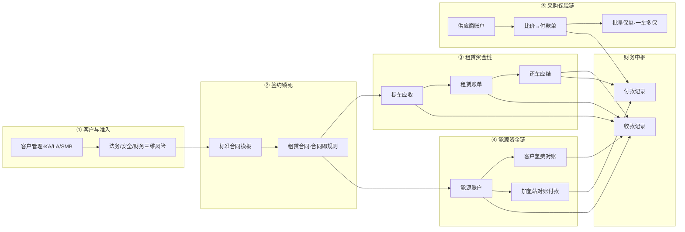
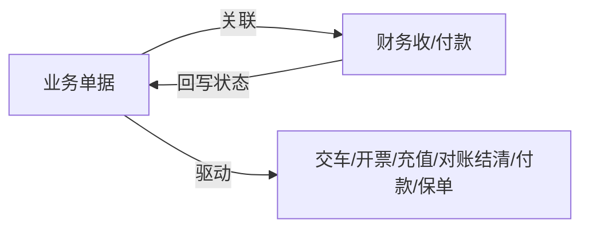
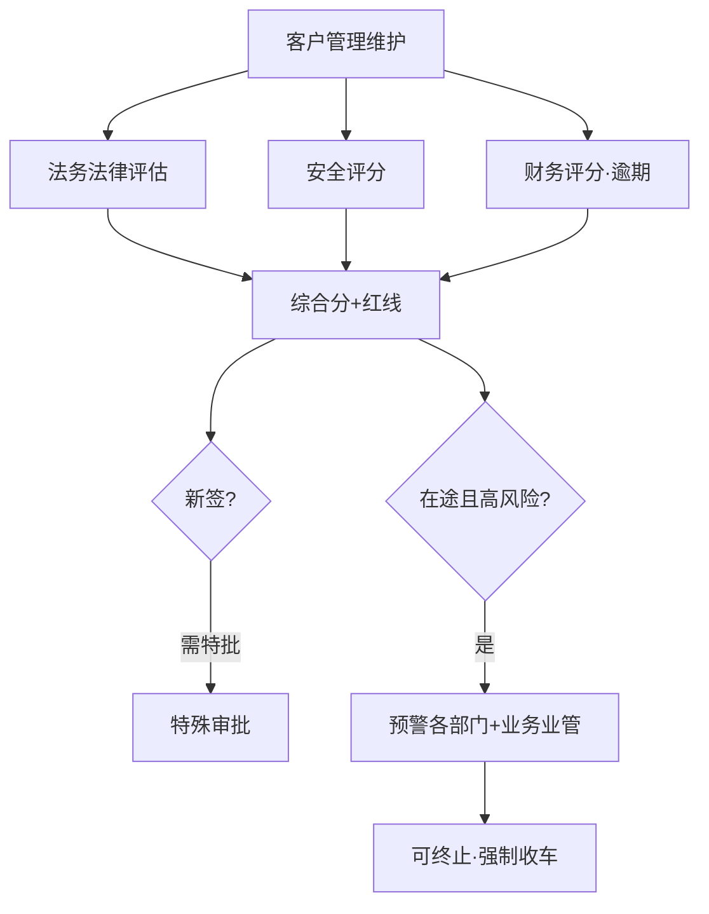
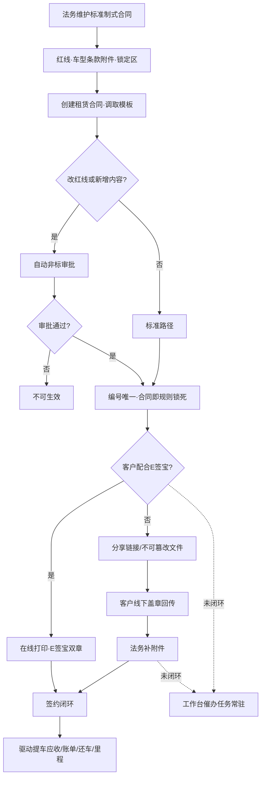
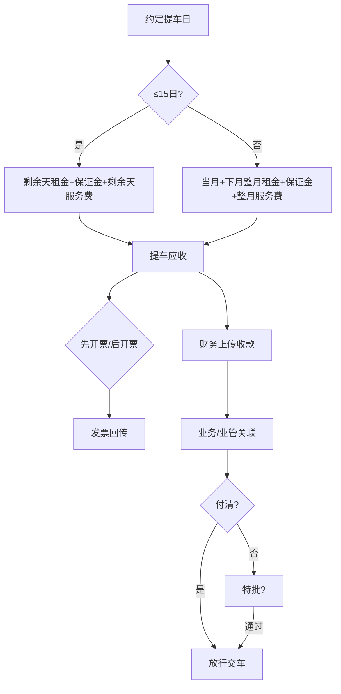
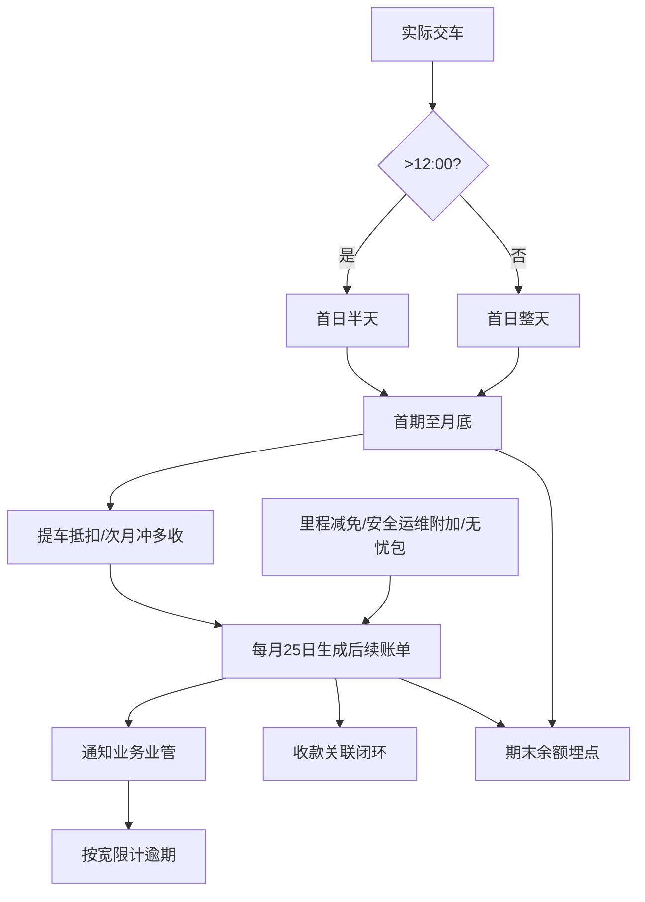
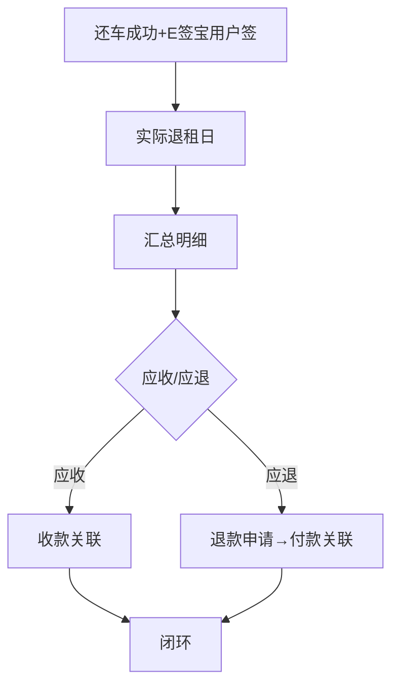
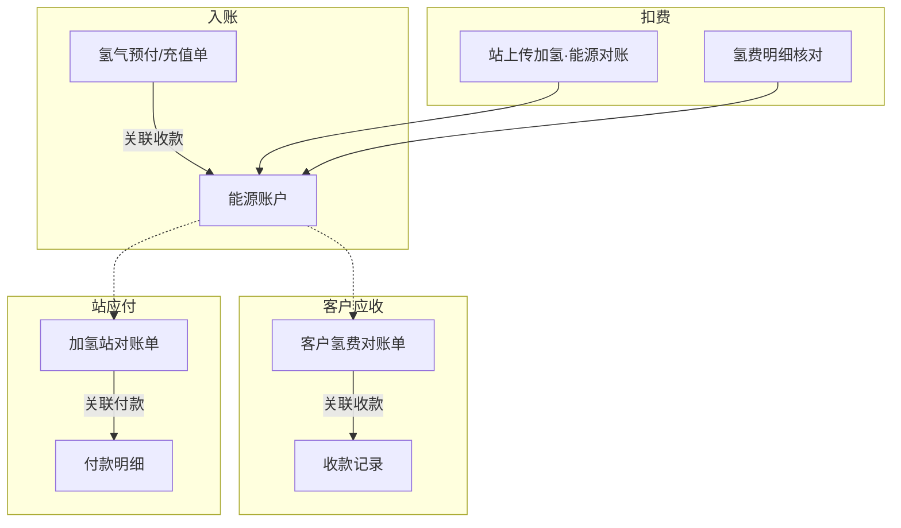
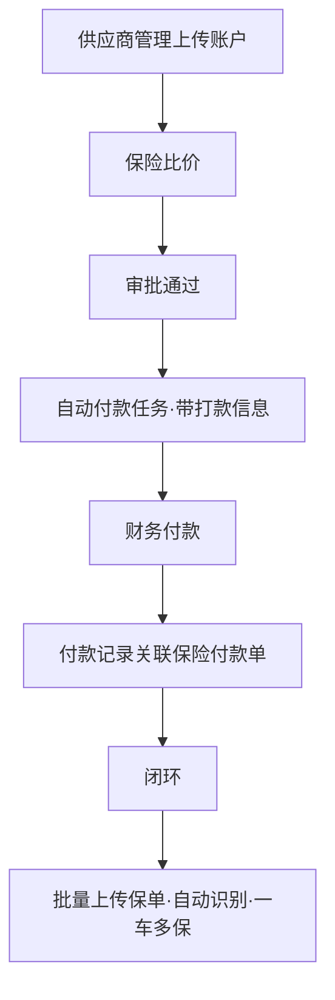
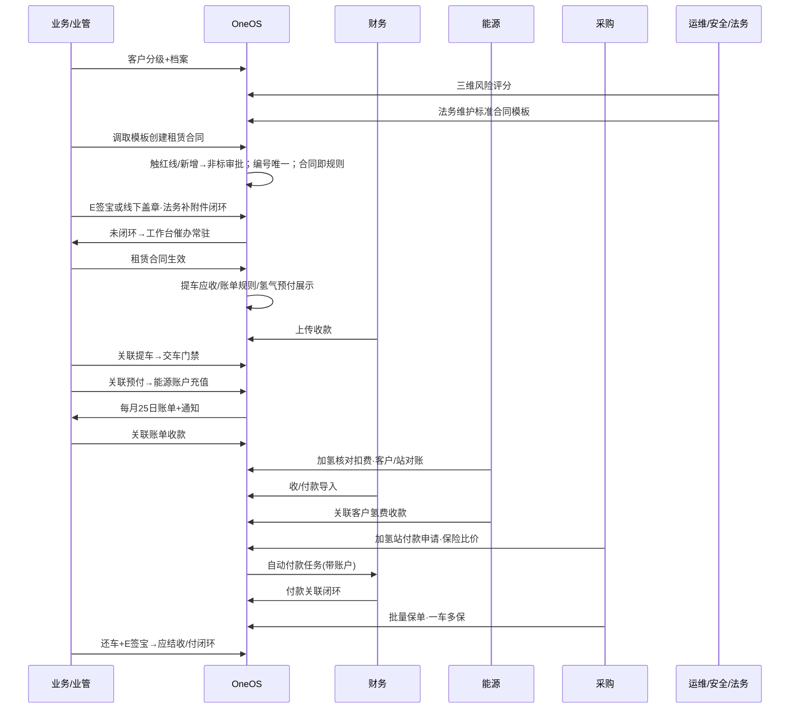

# OneOS 业财一体化全链条方案（汇报稿）

> **汇报对象**：业务管理组主管、分管领导、财务部总经理  
> **汇报目的**：对齐租赁 → 能源 → 采购（保险）全链条如何实现「业务单据 ↔ 财务收/付款」一体化闭环  
> **文档结构**：先给**简要（可照着讲）**，再给**详细（可对照答疑）**，关键节点配**流程图**  
> **知识库入库**：已写入 OneOS KB 底座 [`oneos-knowledge-base/foundations/biz-finance-integration.md`](./oneos-knowledge-base/foundations/biz-finance-integration.md)（机读 `machine/rules/biz-finance-integration.json`），作为王冕数字分身 / AI 检索 / 原型设计 / 规划边界基准。

---

# 第一部分 · 汇报简要（建议 8～12 分钟）

## 0. 开场结论（先扔手榴弹）

**业财一体化不是多建几个报表，而是把「该收/该付」和「实收/实付」用关联钉死，回写业务状态，驱动交车、开票、催款、退租结算、氢费对账、加氢站付款、保险付款与保单归档。**

一句话公式：

```text
业务单据（应收/应付）  ←关联→  财务收/付款记录（实收/实付）  →  状态回写 + 动作放行
```

| 谁干什么 | 一句话 |
|----------|--------|
| **财务** | 钱进系统（收款/付款导入上传）、开票、付款执行、提供期末余额初值、算财务评分 |
| **业务 / 业管 / 能源 / 采购** | 出单、对账、**主动关联**收付款、解释业务状态 |
| **系统** | 自动算应收、宽限逾期、账户扣充、审批后自动出付款任务、埋点推算余额 |

---

## 1. 全链条一张图（汇报主图）



**讲法**：准入控风险 → **标准合同锁规则** → 租赁收租 → 能源管氢电 → 采购管保费；资金箭头进财务中枢。

---

## 2. 七条业务链 · 一句话速记

| # | 链条 | 简要 |
|---|------|------|
| 1 | **客户风险** | KA/LA/SMB 宽限；法务/安全/财务三维评分；红线或综合分＜10 预警；新签可特批；可强制收车 |
| 2 | **标准合同 → 租赁合同** | 法务制式模板（红线/车型条款/锁定区）→ 调取模板签约；改红线或新增内容进非标审批；合同=规则一对一锁死；编号唯一；E 签宝或线下盖章回传闭环（未闭环工作台催办常驻） |
| 3 | **提车应收** | 按 15 号前后规则自动出应收 → 先/后开票 → 收款关联付清才交车（不足走特批） |
| 4 | **租赁账单** | 按实际交车计费；25 日生成；KA15/LA10/SMB6 宽限；附加费滚下期；收款关联闭环；埋点推算期末余额 |
| 5 | **还车应结** | E 签宝用户签 = 退租日；算应收或应退；明细含 ETC/氢差/运维/安全未结；收或付关联闭环 |
| 6 | **能源** | 预付/充值关联收款入账 → 核对后扣费；客户月结收款关联；加氢站审批付款关联 |
| 7 | **保险采购** | 供应商先上传账户 → 比价通过自动出付款任务（带打款信息）→ 付款关联闭环 → 批量保单·一车多保 |

---

## 3. 收/付款单据对照（给财务总看）

**收款闭环（客户 → 公司）**

| 业务单据 | 闭环动作 |
|----------|----------|
| 提车应收款 | 关联收款；付清可交车 |
| 租赁账单 | 关联收款；更新账单状态 |
| 还车应结（应收） | 关联收款 |
| 能源充值 / 氢气预付款 | 关联收款 → 自动充入能源账户 |
| 客户氢费对账单 | 能源关联收款 → 已付清/部分/未收 |

**付款闭环（公司 → 外部）**

| 业务单据 | 闭环动作 |
|----------|----------|
| 还车应结（应退） | 退款申请 → 付款记录关联 |
| 加氢站对账单 | 付款明细关联 → 已付款 |
| 保险付款单 | 付款记录关联 → 闭环后上传保单 |

---

## 4. 明天建议拍板的四件事 + 一条纪律

**纪律**：无关联，不得假性结清 / 已充值 / 已付款 / 可交车；**合同未签章闭环，工作台催办不得消。**

**待拍板**：

1. ETC 卡/设备损坏：还车检查归**业管**还是**运维**  
2. 广告损坏丢失：能否定**固定价格表**  
3. 风险触红线后**强制收车**：标准合同怎么改、最终解释权怎么写  
4. **合同编号唯一**：历史重复怎么治、新号怎么发  

---

# 第二部分 · 详细方案（答疑与落地方案）

## A. 业财一体化原则与财务中枢

### A.1 简要

业务出「该收该付」，财务录「实收实付」，条线人员做「关联」，系统做「回写与门禁」。

### A.2 详细

**收款来源**：客户向公司打款 → 财务上传/导入收款记录 → 业务/业管/能源主动关联业务单据。

租赁相关收款主场景：提车应收、租赁账单、还车应结（应收）；另含能源充值/氢气预付、客户氢费月结对账单。

**付款去向**：公司账户支付 → 导入付款记录/付款明细 → 关联还车应退、加氢站对账单、保险付款单等。

**通用闭环**：

```text
业务单据金额/状态
    ↕ 关联
财务收/付款记录
    → 回写：付清/部分/未收、已付款、账户余额、可否交车、可否上传保单等
```



---

## B. 客户准入与风险（租赁前置）

### B.1 简要

客户分级决定账单宽限；三维风险决定能不能签、签了要不要预警、能不能强制收车。

### B.2 详细

**客户分类（业管在客户管理维护，执行集团管理制度）**

| 类型 | 定义 | 账单宽限 |
|------|------|----------|
| KA | 政府/国企/央企/世界500强等；或战略客户 | 15 日 |
| LA | 大中型；租赁/运营车辆 ≥ 10 台 | 10 日 |
| SMB | 中小型；车辆 ＜ 10 台 | 6 日 |

**三维评估**

| 评估 | 责任 | 方式 |
|------|------|------|
| 法律风险 | 法务 | 每 3 个月系统自动生成 |
| 安全评分 | 安全 | 按违规自动计算 |
| 财务评分 | 财务 | 按逾期自动计算 |

**业务影响**：综合评分 + 是否触红线 → 新签可走特殊审批；综合分＜10 或触红线 → 在途合同风险预警（短信/邮件/微信通知法务、安全、财务及业务/业管）→ 可终止合作并强制收车（需改标准合同并保留最终解释权）。



---

## C. 标准合同与租赁合同（签约 = 规则锁死）

### C.1 简要

法务维护标准制式合同（红线、车型可见条款/附件、锁定区）→ 租赁合同调取模板；动红线或加内容即非标审批；**合同即规则**，一对一锁死提车应收/账单/还车应结/里程等；编号系统唯一；线上 E 签宝或线下盖章回传闭环，未闭环工作台催办常驻。

### C.2 详细

#### C.2.1 前置：标准合同管理

来源：法务形成的**标准制式化合同**。可维护：

| 能力 | 说明 |
|------|------|
| **风控红线** | 触及或改动即触发非标路径 |
| **条件可见条款/附件** | 按部分**品牌、车型**控制可见的条款与附件 |
| **锁定区域** | 不可由业务随意修改的正文区域 |

#### C.2.2 创建租赁合同

1. 调取对应**标准合同模板**；
2. 在模板框定的红线、车型条件条款、锁定区域内履约填写；
3. **改动风控红线**或**新增合同内容** → **自动进入非标审批**；
4. **编号自动化**：系统生成唯一合同编号（规划须消除现存编号重复问题）；
5. **合同即规则 · 一对一锁死**：合同全部条款与标准合同锁死；提车应收款、租赁账单、还车应结款、里程要求等关键要素均由本合同规则驱动，不可另起一套口径。

#### C.2.3 签章与归档闭环

| 路径 | 流程 | 闭环 |
|------|------|------|
| **线上（默认）** | 支持在线打印；**E 签宝**在线自动签章；客户登录 E 签宝自动签客户章 | 双章完成即签约闭环 |
| **线下（客户不愿线上签）** | 生成**分享链接**或**不可篡改文件**发给客户 → 客户线下盖章 → 回传**公司法务** → 法务补充附件 | 附件齐备形成闭环 |

**未闭环**：在**工作台**形成**催办任务**，任务**持续存在**，提醒对应人员及时处理（直至闭环办结）。



---

## D. 租赁条线①：提车应收款

### D.1 简要

合同约定提车 → 自动算应收 → 开票（先/后）→ 收款关联付清 → 交车；不足金额必须特批。

### D.2 详细

**应收计算（标准合同）**

| 约定提车时点 | 租金 | 保证金 | 服务费 |
|--------------|------|--------|--------|
| ≤ 当月 15 日 | 当月剩余天数 | 一次性 | 按剩余天数 |
| ＞ 当月 15 日 | 当月 + 下个自然月整月 | 一次性 | 整月 |

**开票**

| 模式 | 审批 | 闭环 |
|------|------|------|
| 先开票 | 要 | 审批通过→财务开票上传→业务下载交客户 |
| 后开票 | 不要 | 先关联收款→通知财务开票上传 |

**交车门禁**：财务上传收款 → 业务/业管关联 → 实收=应收方可交车；实收不足须特批。



---

## E. 租赁条线②：租赁账单

### E.1 简要

按**实际交车**起算；首期到月底；二期起自然月、每月 25 日生成并通知；按客户类型宽限判逾期；里程可减免；附加费滚下期；收款关联；埋点算期末余额催款。

### E.2 详细

**计费**

- 交车成功时间起算；当日 **12:00 后**交车 → 首日只计**半天**。
- **首期**：交车成功 → 当月月底（剩余天费用）。
- **第二期起**：自然月；每月 **25 日固定生成**；通知业务+业管（短信/邮箱/站内信/微信服务号）。
- **逾期**：超 KA/LA/SMB 宽限即逾期。

**与提车应收抵扣**

- 提车应收含首月应付；多收部分（如 15 日后预收下月）在**次月账单自动抵扣**，客户付抵扣后金额。

**里程减免**

- 达合同里程要求 → 次月自动减免约定金额。
- 车机+GPS 均无数据 → 人工提报 + 里程表照 + 车牌照（含水印：时间、地址）。

**附加进账单**

- 安全：保险上浮、违规罚款、违章待处理等 → 下期账单。
- 运维：维修客户承担部分 → 下期账单。
- 无忧包（易损保/轮胎保/养护保）：按合同与运维最新规则自动计费；运维测试里程从其他业务登记扣除。

**期末余额**

- 提车应收、租赁账单埋点汇总期末余额。
- 初期无准确余额：以财务提供的期末余额+截止时间为准，其后业务自动推算实时期末余额。

**业财**：打款 → 财务上传收款 → 业务/业管关联账单 → 闭环。



---

## F. 租赁条线③：还车应结款

### F.1 简要

还车成功 + E 签宝用户签字 = 实际退租日 → 算应收或应退 → 收款或付款关联闭环；明细由业管/能源/运维/安全自动或半自动汇总。

### F.2 详细

**退租与资金方向**

| 结果 | 流程 |
|------|------|
| 应收 | 客户付款 → 财务上传收款 → 关联还车应结/尾期 |
| 应退 | 还车退款申请 → 财务支付 → 导入付款 → 关联应结单 |

预付款模式客户常提前付下月款，**提前还车**易多收，需退还。

**明细构成**

| 来源 | 项目 | 规则要点 |
|------|------|----------|
| 业管 | ETC 费用 | 可登记或按交还车时段自动取；**ETC 卡/设备损坏责任部门待拍板** |
| 能源 | 氢量差补缴 | 还车氢＜交车氢 → 差量×合同单价 |
| 运维 | 未结保养 | 里程/保养时间孰先 |
| 运维 | 未结维修 | 工单客户承担且尾期未付 |
| 运维 | 工具/证照丢失 | 交有还无；证照按公司文件 |
| 运维 | 广告损坏 | **单价待定** |
| 运维 | 送/接车服务费 | 交还车是否填写自动取 |
| 运维 | 轮胎磨损 | 胎纹深度差×每毫米单价 |
| 安全 | 违章违约金/上浮等 | 账单已收款闭环的不再收；未付并入还车应结 |



---

## G. 能源条线

### G.1 简要

能源账户管氢/电预充与扣费；客户月结走收款；加氢站走付款；明细同源（已核对氢费）。

### G.2 详细

**账户与充值**

- 按客户+项目；加氢/充电核对后自动扣余额。
- 合同氢气预付款展示在能源账户充值；关联收款后入账；无账户则自动建户再充入。
- 可单独发起充值单，同样收款关联入账。

**扣费来源**

1. 加氢站上传 → 能源对账完成 → 扣账户  
2. 能源维护车辆氢费明细并核对 → 扣账户  

**客户氢费月结（合同约定月结算时）**

能源发起客户对账单 → 选时段汇总已核对明细 → 导出确认 → 生成正式单 → 客户打款 → 财务上传收款并通知 → 能源关联 → 状态：已付清 / 部分收款 / 未收款。

**加氢站付款**

采购发起站对账单 → 汇总已核对明细 → 站确认 → 上传开票金额/发票/开票时间/盖章对账单 → 付款申请审批至财务 → 付款后付款明细关联 → 标记已付款。

> 客户承担氢费由客户对账；公司与站结算由采购+财务付款。



---

## H. 采购条线：保险 + 供应商账户

### H.1 简要

供应商先建账户 → 比价审批通过自动出付款任务（带打款信息）→ 财务付款关联闭环 → 批量上传保单、一车多保。

### H.2 详细

**供应商管理（前置）**

- 保险公司等后续需**自动生成付款任务**的主体，须在供应商管理上传**收款账户信息**。
- 付款任务自动带出账户，告知财务打款信息。
- 账户未完善：建议禁止自动出付款任务（或标红阻断）。
- 加氢站等应付供应商可复用同一规则。

**保险流程**

1. 比价与保单材料可并行准备；  
2. 比价审批通过 → **自动生成**保险付款申请/付款任务（带账户）；  
3. 财务付款 → 导入付款记录 → 关联保险付款单 → 闭环；  
4. 闭环后采购批量上传该批次保单 → 系统自动识别 → **一车多保**。



---

## I. 端到端时序（全链条协作）



---

## J. 部门协作总表（RACI 简表）

| 环节 | 业务/业管 | 财务 | 能源 | 采购 | 运维 | 安全 | 法务 |
|------|:---------:|:----:|:----:|:----:|:----:|:----:|:----:|
| 客户分级/宽限 | R | C | | | | | |
| 三维风险 | C | R评分 | | | | R评分 | R评估 |
| 标准合同模板 | C | | | | | | R |
| 租赁合同/非标/签章 | R | | | | | | C线下附件·催办 |
| 提车应收/开票/交车 | R | R收票付 | | | | | |
| 租赁账单/催款余额 | R | C余额初值 | | | C维修 | C上浮罚款 | |
| 还车应结 | R汇总 | R收付 | R氢差 | | R点检工单 | R未结费用 | |
| 能源账户/客户氢费 | C预付关联 | R收款 | R | | | | |
| 加氢站付款 | | R付款 | C明细 | R对账申请 | | | |
| 保险付款/保单 | | R付款 | | R比价保单账户 | | | |

> R=主责执行；C=配合提供。

---

## K. 验收检查清单（会上可逐项勾）

| # | 检查项 | 通过标准 |
|---|--------|----------|
| 1 | 标准合同 | 法务制式；红线/车型条款附件/锁定区可配置 |
| 2 | 租赁合同 | 调取模板；改红线或新增进非标；编号唯一；合同即规则锁死应收/账单/还车/里程 |
| 3 | 签章闭环 | E 签宝双章，或线下盖章→法务补附件；未闭环工作台催办常驻 |
| 4 | 提车 | 关联收款且付清（或特批）才交车 |
| 5 | 开票 | 先开票有审批+发票；后开票有关联+发票 |
| 6 | 账单计费 | 实际交车起算；12 点后半天；首期至月底；25 日生成 |
| 7 | 减免/抵扣 | 里程达标减免；无数据人工+水印照；提车多收次月抵 |
| 8 | 逾期 | KA15/LA10/SMB6 |
| 9 | 附加费 | 安全/运维客户承担滚下期；无忧包按规则 |
| 10 | 期末余额 | 埋点；初期财务截止值后向后推算 |
| 11 | 还车 | E 签宝定退租日；应收/应退分走收付关联 |
| 12 | 风险 | 三维评估；红线或分＜10 预警；可特批/强制收车 |
| 13 | 能源 | 关联收款入账；核对后扣费；客户对账/站付款双闭环 |
| 14 | 保险 | 供应商账户→自动付款任务→关联闭环→批量保单一车多保 |
| 15 | 纪律 | 无关联不假性结清 |

---

## L. 待拍板事项（必须带走结论）

| # | 事项 | 建议拍法 |
|---|------|----------|
| 1 | ETC 卡/设备损坏检查责任 | 业管 / 运维 / 主检+会签 |
| 2 | 广告损坏能否固定价 | 定价格表 或 个案估价流程 |
| 3 | 强制收车与合同解释权 | 法务牵头改标准合同 |
| 4 | 合同编号去重与唯一生成规则 | 系统强制唯一；历史重复数据治理方案 |

---

# 第三部分 · 汇报话术建议（可选）

1. **先讲公式**：业务单据 ↔ 财务收付款 ↔ 状态回写。  
2. **再甩主图**：租赁收租、能源氢电、采购保险，全进财务中枢。  
3. **按七条链各一分钟**：风险、标准合同/租赁合同、提车、账单、还车、能源、保险。  
4. **强调门禁**：交车付清；合同即规则锁死；签章未闭环催办常驻；保单须付款闭环后；供应商账户不全不出自动付款任务。  
5. **收口拍板**：ETC 责任、广告定价、强制收车合同、合同编号唯一。  

---

*本汇报稿综合本轮产品口述整理，供管理沟通与方案对齐；落地以实现与会上拍板为准。详细条文底稿见 `business-finance-closed-loop-briefing.md`。*
